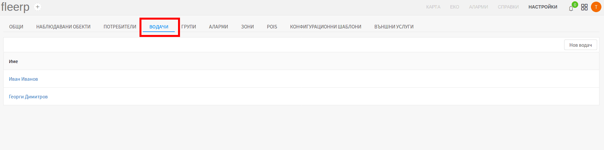
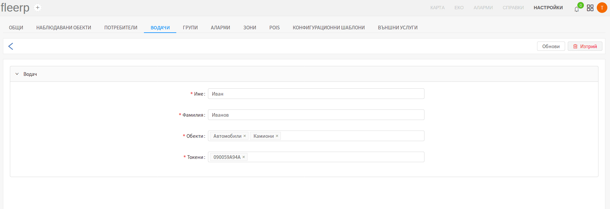
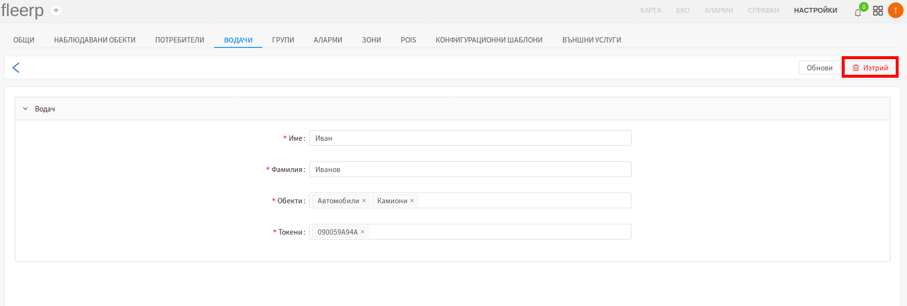

# Водачи

Системата предоставя възможност за дефиниране на водачи на наблюдаваните обекти от тип превозни средства.
Раздел "Водачи" служи за преглед, създаване, редактиране и изтриване на водачи. За да може да се използват
многобройните функционалности свързани с водачи, които системата предлага, е необходимо в допълнение към
GPS устройството, клиентът да закупи:

- токен четци, които да бъдат инсталирани в наблюдаваните обекти; 
- токен чипове, които да бъдат дадени на водачите, чрез които те ще се идентифицират;

Идентификацията се осъществява при всяко запалване на превозното средство, чрез доближаване на токен чипа
към токен четеца. Някои от функционалностите, до които се предоставя достъп само чрез идентификация на водачи
са следните:

- еко показатели за водач - поведение на пътя;
- следване на водач както на картата, така и извличане на подробни справки за всички негови пътувания;
- дефиниране на аларми, свързани с водачи - "Смяна на водача", "Идентификация на водача", "Неидентифициран водач" и др;

### Списък на водачи

Потребителят може да види всички създадени водачи в списъка на водачите:

 
---

### Създаване/редактиране на водач

Създаване на нов водач се осъществява чрез бутон "Нов водач", редактиране - чрез клик върху името на вече съществуващ.

 
---

Тъй като страниците за създаване и редакция са аналогични, за целта на тази статия е избрана тази за редакция.

 
---

Страницата съдържа четири полета:

- име на водача;
- фамилия на водача;
- обекти, към които водачът ще има право да се идентифицира - селекцията в полето може да бъде група от обекти или
конкретен обект;
- номер на токен чипа на водача;

### Изтриване на водач

Потребителят има възможност да изтрие даден водач, чрез предвидения за целта бутон:

