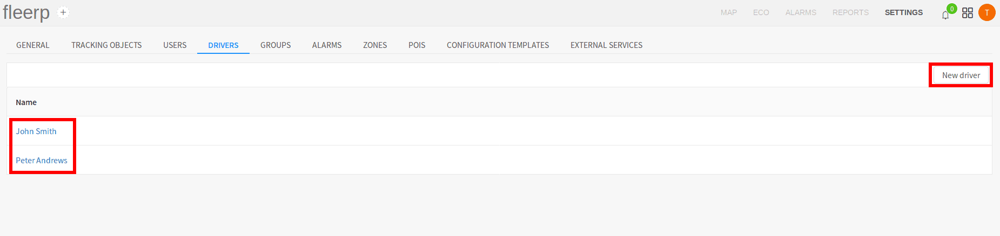
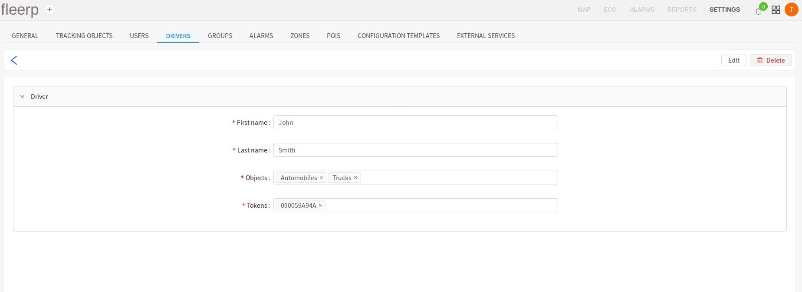
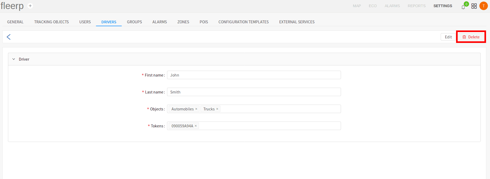

# Drivers

The system provides functionality, to create drivers which to be assigned to different tracking objects. "Drivers"
section allows the user to list, create, edit and delete drivers. In order for the many driver-related functionalities
that the Fleerp system offers to be used,  in addition to the GPS devices, it is necessary that the customer purchase
the following:

- token readers to be installed in the tracking object;
- token chips to be given to the drivers;

The identification is done every time the vehicle is started, by touching the token chip to the token reader. Some of
the functionalities that unlock by using driver identification are:

- ecodriving - driver behaviour on the road;
- following a driver on the map, as well as generating many useful reports about all the trips he has made;
- defining of several driver-related alarms as: "Driver change", "Driver identification", "Unidentified driver";

### Drivers list

The user can view all created drivers in the driver list:

 
---

### New/Edit driver

Creation of new driver is accessed through the "New driver" button, driver edit - through clicking on the name of
already existing driver.

 
---

As the pages for creation and edit are analogous, the page for editing is chosen for the purpose of the example.

 
---

The page contains four fields:

- driver first name;
- driver last name;
- tracking objects, in which the driver is allowed to identify - the selection in the field can be a group,
multiple groups or concrete tracking object;
- driver token chip number;

### Deleting a driver

The user can delete a given driver by the provided button:

