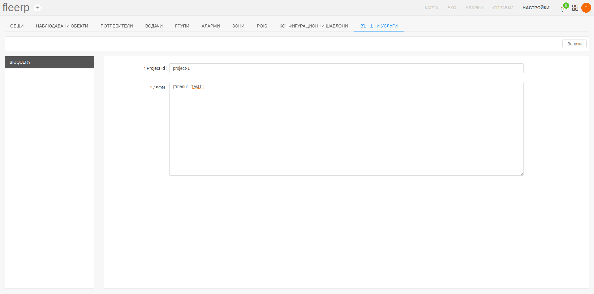

# Външни услуги

Секцията за външни услуги предоставя интеграция на системата Fleerp с услуги, предлагани от трети страни.
Това предоставя повече гъвкавост на потребителя при взаимодействието му със системата.

Налични външни услуги:

- Big Query - възможност за експортиране на потребителски данни;

