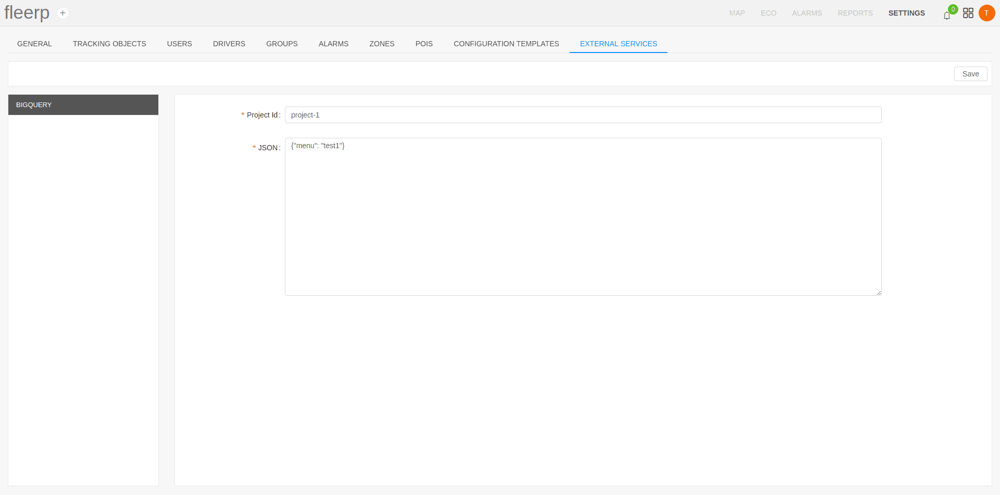

# External services

The "External services" section provides integration of the system Fleerp with third party services.
This gives more flexibility to the user when interacting with the system.

Available external services:

- Big Query - possibility to export user data;

