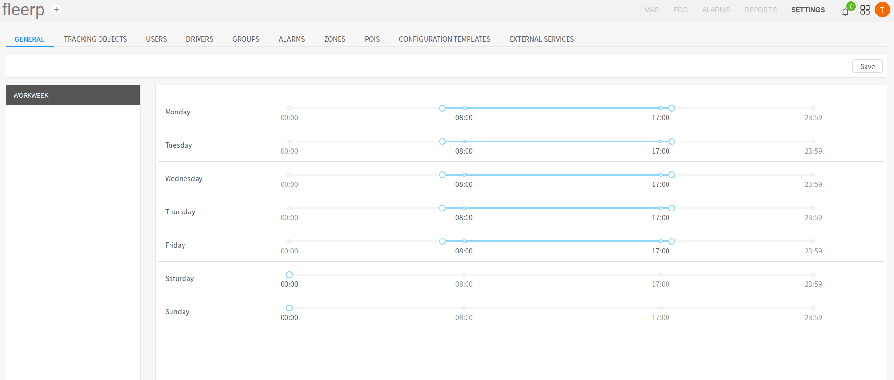

# General settings

This section of the settings is intended for setting company-wide work time. It must be noted that the work time
set here is being used in **ALARMS** section, e.g. in alarm of type "Usage out of permitted period".

