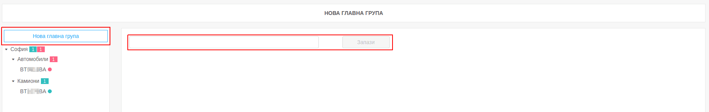
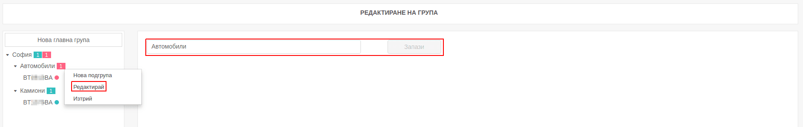
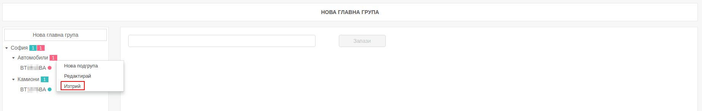
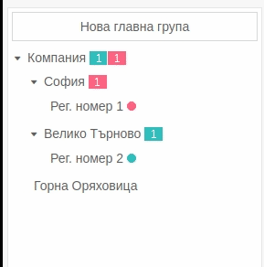

# Групи

В тази секция има подробна информация как се работи с групите в приложението Fleerp.

### Основни функции

- създаване на нова група;
- създаване на нова подгрупа;
- редактиране на  група;
- изтриване на група;
- преместване на проследяващ обект;

### Създаване на нова група

Създаването на "Нова главна група" се извършва от бутона в страничната лента. В основния екран се визуализира поле,
с което се именува новата група. 

---

### Съдаване на нова подгрупа

Всяка група може да съдържа подгрупа. Подгрупа се създава, след като се кликне с десен бутон върху групата и се избере 
"Нова подгрупа". След това трябва да се въведе името на новата подгрупа и да се избере "Запази".

---

### Редактиране на група

Вече създадена група може да бъде редактирана, след като се кликне с десен бутон върху желаната група и се
избере "Редактиране", а полето в основния прозорец се промени. 

---

### Изтриване на група

Изтриването на определена груп е възможно с кликване на десен бутон върху групата, която трябва да бъде изтрита
и се избере "Изтрий".

#### Важно:
Няма възможност да се изтрива група, която съдържа подгрупи и проследяващи обекти. Системата не позволява изтриването
и извежда съобщение.

---

### Преместване на проследяващ обект

Възможно е преместване на проследяващи обекти от една група в друга. Преместването става чрез провлачване на обекта. 

