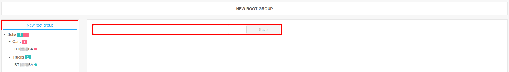
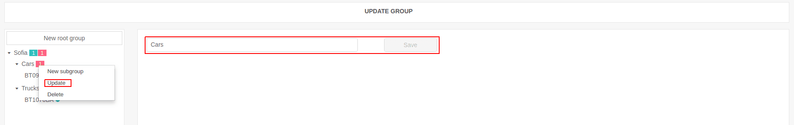
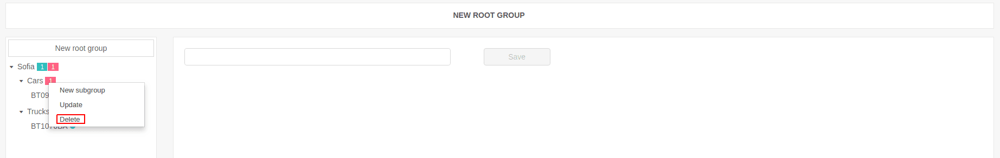
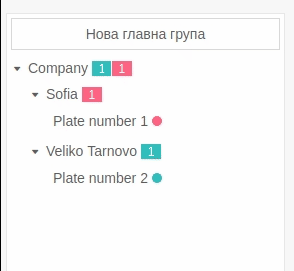

# Groups

This section contains detailed information, how to work with groups in the Fleerp system.

### Basic functions

- create a new group;
- create a new subgroup;
- edit group;
- delete group;
- move tracking object from one group to another;

### Create a new group

Create a new group with click on the button "New root group" in the sidebar.
The main screen will display a field that is used for naming.

---

### Create a new subgroup

Each group may contain a subgroup. Create a new subgroup by a right-clicking on a group and select "New subgroup".
Then enter the name of the new subgroup and select "Save".

---

### Edit group

An already created group can be edited after right-clicking to the desired group and selecting "Edit"
and then changes the group name in the main screen.

---

### Delete group

Deleting a certain group is possible by right-clicking on the group and selecting "Delete".

#### Important:

It is not allowed to delete a group that contains subgroups and tracking objects.
The system doesn't allow deletion and displays a message.

---

### Move tracking object from one group to another

It is possible to move tracking objects from one group to another. Moving is done by dragging the object.

