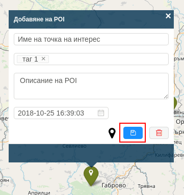

# Точки на интерес (POIs)

Понятието "Точка на интерес" (Point of Interest) се отнася до местоположението на различни места или обекти, от значение за потребителя. Това могат да бъдат както населени места, така и обекти като хотели, ресторанти, бензиностанции и др.

В системата Fleerp е възможно потребителят да създаде аларма, която възниква когато даден проследяващ обект пресече точка на интерес с определен таг.

След кликването върху меню "POIs" в секцията за настройки в системата Fleerp, ще бъде визуализиран екран, показващ всички налични точки на
интерес.

### Основни функции

- създаване на нова точка на интерес;
- добавяне на множество точки на интерес (импортиране);
- редактиране на точка на интерес;
- изтриване на точка на интерес;
- търсене на дадена точка на интерес по тагове;

# Създаване на точка на интерес

За да се създаде нова точка на интерес, потребителят трябва да кликне с мишката върху изобразената карта.

Ако потребителят прецени, че указаното място на точката на интерес трябва да се промени, това може да стане по два начина:
- клик с мишката на различно място върху картата;
- провлачване на иконката до желаното място;

Потребителят може да предостави следната информация за новата точка на интерес: 
- име на точката на интерес;
- тагове - това могат да бъдат произволно именовани от потребителя категории (например "хотели");
- описание - кратко текстово описание на точката на интерес;
- валиден до - определена дата, след която дадената точка на интерес няма да съществува повече;

С цел по-добро описание на точката на интерес е възможна промяна на предоставената иконка през указания бутон.

Ако потребителят прецени, че желае да откаже въвеждането на нова точка на интерес, това може да се случи чрез бутона за изтриване.

След като е попълнена необходимата информация, за да се създаде желаната точка на интерес, трябва да се кликне върху бутона за съхранение.

