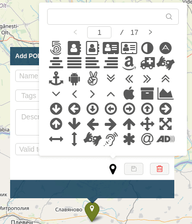

# Create a point of interest

To create a new point of interest, the user must click on the map.

If the user thinks that specified location of given point of interest needs to be changed, this can be done in two ways:
- click on a different place on the map;
- drag the icon to the desired location;

The user could provide the following information for the new point of interest:
- name of the point of interest;
- tags - this can be arbitrarily named by the user, categories (for example "hotels");
- description - short text description of the point of interest;
- valid to - specified date after which the point of interest will no longer exist;

In order to better describe the point of interest, it is possible to change the provided icon through the specified button.

The user can cancel the creation of a new point of interest trough the delete button.

Once the required information has been filled in, to create the desired point of interest, the user must click on the save button.

