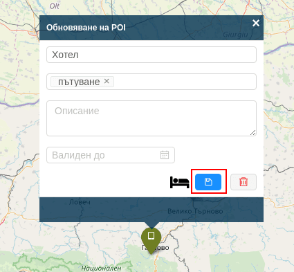

# Редактиране на точка на интерес

При необходимост, редакцията на точка на интерес може да се извърши по следните начини:
- кликване върху вече съществуваща точка на интерес, редактиране на желаните полета и последващо съхранение;

- промяна на местоположението на точката на интерес чрез провлачване с мишката;

