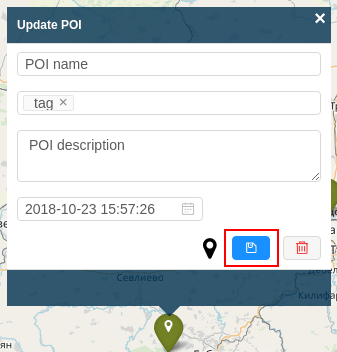

# Edit point of interest

If it's necessary to edit given point of interest this can be done in the following ways:

- clicking on an existing point of interest, editing desired fields, and then save;

- changing the location of the point of interest by dragging it with the mouse;

