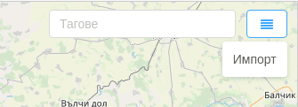
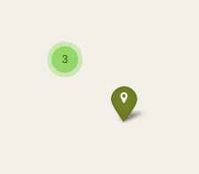

# Добавяне на множество точки на интерес (импортиране)

При наличието на голям брой точки на интерес, които е необходимо да бъдат въведени в системата, това може да се извърши
чрез функцията за импорт.

За целта е необходимо информацията да бъде описана в json файл под формата на обект от следния вид:

```
{
    "type": "FeatureCollection",
    "features": [
        {
            "type": "Feature",
            "geometry": {
                "type": "Point",
                "coordinates": [25.617918, 43.074920]
            },
            "properties": {
                "name": "Офис на компанията",
                "tags": ["офис"],
                "refs": [],
                "marker": {},
                "address": "булевард „Никола Габровски“ 41, Велико Търново",
                "description": "Офис на компанията"
            }
        }
    ]
}
```

Всички точки на интерес трябва да бъдат попълнени като обекти в масива "features".

Формат на обект от масива: 
- "type" - поле със стойност "Feature";
- "geometry" - обект, посочващ тип и координати;
- "properties" - обект, посочващ допълнителна информация: 
  - "name" - наименование на точката на интерес;
  - "tags" - масив със стойности, посочващи таговете за точката на интерес;
  - "refs" -  масив с id стойности за връзка с външни системи;
  - "marker" - обект с мета информация за изобразявания маркер върху картата;
  - "address" - поле, посочващо адреса на точката на интерес;
  - "description" - поле, посочващо описание на точката на интерес;
  
Импортването на файла може да се извърши през добавения бутон.



При наличието на много на брой точки на интерес върху картата е възможно представяне във вида на отделни групи,
обединяващи точките в близост една до друга. Мащаба на визуализация може да се променя със скрол с мишката.


