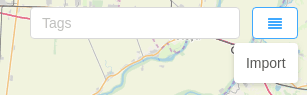

# Addition of multiple points of interest (import)

When there are a large number of points of interest that need to be entered into the system, this can be done through the point of interest import function.

For this purpose, it is necessary to describe the information in a json file in the form of an object with the following structure:

```
{
    "type": "FeatureCollection",
    "features": [
        {
            "type": "Feature",
            "geometry": {
                "type": "Point",
                "coordinates": [25.617918, 43.074920]
            },
            "properties": {
                "name": "Company office",
                "tags": ["office"],
                "refs": [],
                "marker": {},
                "address": "41 Nikola Gabrovski Boulevard, Veliko Tarnovo",
                "description": "company office"
            }
        }
    ]
}
```

All points of interest must be filled in as objects in the "features" array.

Structure of an array object: 
- "type" - a field with "Feature" value;
- "geometry" - an object specifying type and coordinates;
- "properties" - an object specifying additional information: 
  - "name" - name of the point of interest;
  - "tags" - an array of values indicating the points of interest tags;
  - "refs" -  an array with id values for connection to external systems;
  - "marker" - an object with meta information about the map marker displayed on the map;
  - "address" - a field specifying the address of the point of interest;
  - "description" - a field specifying a description of the point of interest;
  
Import of the file can be done through the following button:



If there are large number of points of interest on the map it is possible their representation to be in the form of clusters,
which combine points that are close one to another. The scale of visualization can be changed with the mouse scroll.


