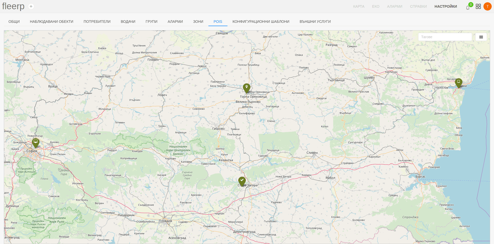

# Точки на интерес (POIs)

Понятието "Точка на интерес" (Point of Interest) се отнася до местоположението на различни места или обекти, от значение за потребителя. Това могат да бъдат както населени места, така и обекти като хотели, ресторанти, бензиностанции и др.

В системата Fleerp е възможно потребителят да създаде аларма, която възниква когато даден проследяващ обект пресече точка на интерес с определен таг.

След кликването върху меню "POIs" в секцията за настройки в системата Fleerp, ще бъде визуализиран екран, показващ всички налични точки на
интерес.

### Основни функции

- създаване на нова точка на интерес;
- добавяне на множество точки на интерес (импортиране);
- редактиране на точка на интерес;
- изтриване на точка на интерес;
- търсене на дадена точка на интерес по тагове;
