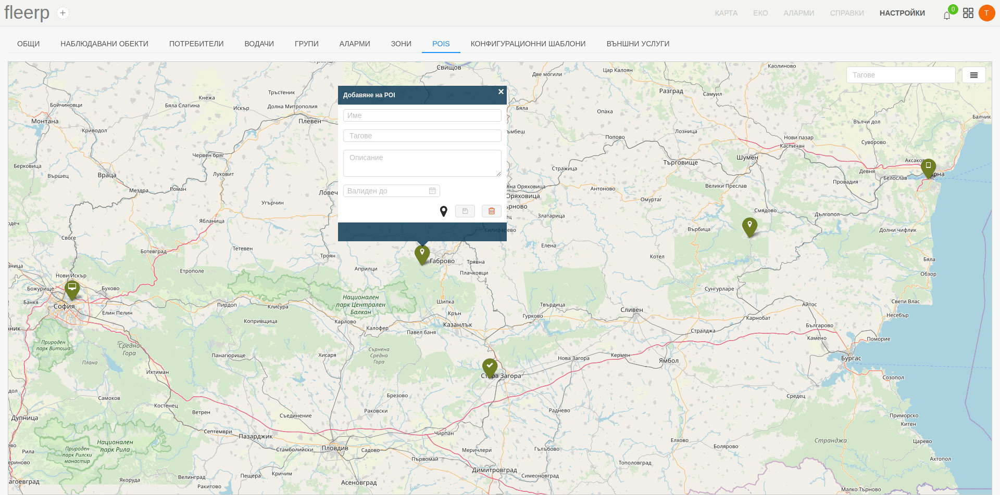
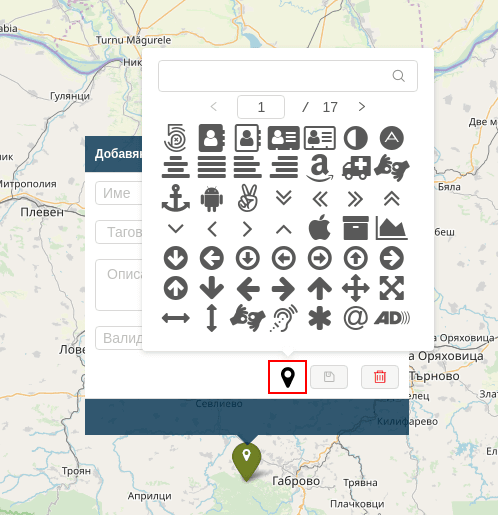
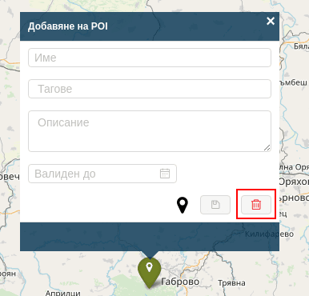
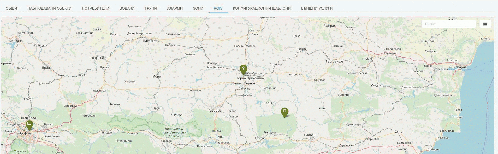

# Точки на интерес (POIs)

Понятието "Точка на интерес" (Point of Interest) се отнася до местоположението на различни места или обекти, от значение за потребителя. Това могат да бъдат както населени места, така и обекти като хотели, ресторанти, бензиностанции и др.

В системата Fleerp е възможно потребителят да създаде аларма, която възниква когато даден проследяващ обект пресече точка на интерес с определен таг.

След кликването върху меню "POIs" в секцията за настройки в системата Fleerp, ще бъде визуализиран екран, показващ всички налични точки на
интерес.


### Основни функции

- създаване на нова точка на интерес;
- добавяне на множество точки на интерес (импортиране);
- редактиране на точка на интерес;
- изтриване на точка на интерес;
- търсене на дадена точка на интерес по тагове;

# Създаване на точка на интерес

За да се създаде нова точка на интерес, потребителят трябва да кликне с мишката върху изобразената карта.



Ако потребителят прецени, че указаното място на точката на интерес трябва да се промени, това може да стане по два начина:
- клик с мишката на различно място върху картата;
- провлачване на иконката до желаното място;

Потребителят може да предостави следната информация за новата точка на интерес: 
- име на точката на интерес;
- тагове - това могат да бъдат произволно именовани от потребителя категории (например "хотели");
- описание - кратко текстово описание на точката на интерес;
- валиден до - определена дата, след която дадената точка на интерес няма да съществува повече;

С цел по-добро описание на точката на интерес е възможна промяна на предоставената иконка през указания бутон.



Ако потребителят прецени, че желае да откаже въвеждането на нова точка на интерес, това може да се случи чрез бутона за изтриване.



След като е попълнена необходимата информация, за да се създаде желаната точка на интерес, трябва да се кликне върху бутона за съхранение.


# Добавяне на множество точки на интерес (импортиране)

При наличието на голям брой точки на интерес, които е необходимо да бъдат въведени в системата, това може да се извърши
чрез функцията за импорт.

За целта е необходимо информацията да бъде описана в json файл под формата на обект от следния вид:

```
{
    "type": "FeatureCollection",
    "features": [
        {
            "type": "Feature",
            "geometry": {
                "type": "Point",
                "coordinates": [25.617918, 43.074920]
            },
            "properties": {
                "name": "Офис на компанията",
                "tags": ["офис"],
                "refs": [],
                "marker": {},
                "address": "булевард „Никола Габровски“ 41, Велико Търново",
                "description": "Офис на компанията"
            }
        }
    ]
}
```

Всички точки на интерес трябва да бъдат попълнени като обекти в масива "features".

Формат на обект от масива: 
- "type" - поле със стойност "Feature";
- "geometry" - обект, посочващ тип и координати;
- "properties" - обект, посочващ допълнителна информация: 
  - "name" - наименование на точката на интерес;
  - "tags" - масив със стойности, посочващи таговете за точката на интерес;
  - "refs" -  масив с id стойности за връзка с външни системи;
  - "marker" - обект с мета информация за изобразявания маркер върху картата;
  - "address" - поле, посочващо адреса на точката на интерес;
  - "description" - поле, посочващо описание на точката на интерес;
  
Импортването на файла може да се извърши през добавения бутон.


При наличието на много на брой точки на интерес върху картата е възможно представяне във вида на отделни групи,
обединяващи точките в близост една до друга. Мащаба на визуализация може да се променя със скрол с мишката.


# Редактиране на точка на интерес

При необходимост, редакцията на точка на интерес може да се извърши по следните начини:
- кликване върху вече съществуваща точка на интерес, редактиране на желаните полета и последващо съхранение;


- промяна на местоположението на точката на интерес чрез провлачване с мишката;



# Изтриване на точка на интерес

След клик върху дадена точка на интерес, изтриването може да се извърши от указания бутон.


# Търсене на точка на интерес

При наличието на много на брой точки на интерес, намирането на определени точки може да бъде трудно.
За да се направи този процес по-удобен е налична функцията за филтриране точки на интерес по тагове.
Резултатът ще визуализира само тези точки на интерес, които съдържат въведените тагове.


