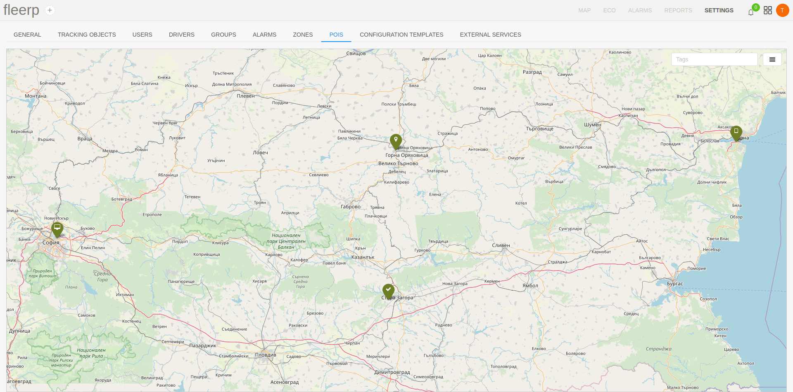
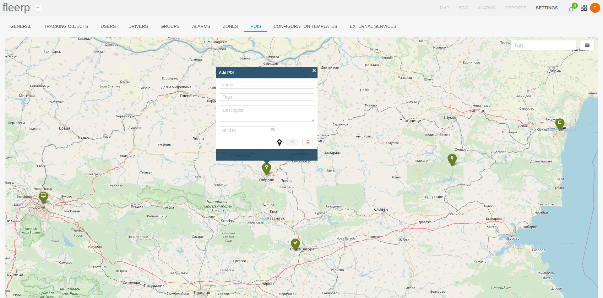
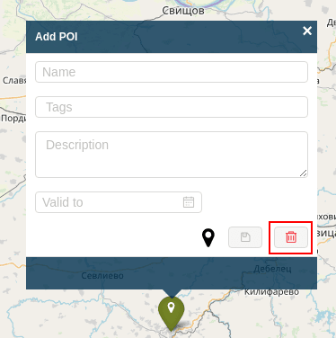
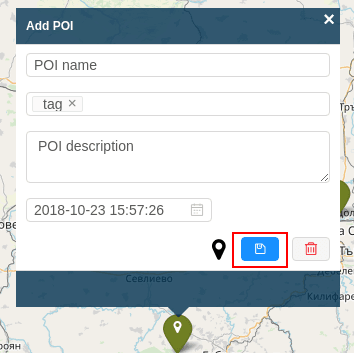

# Points of interest (POIs)

The term Point of Interest refers to the location of different places or sites of interest to the user. These can be places such as hotels, restaurants, gas stations and others.

In the Fleerp system, the user may create an alarm that occurs when a tracking object intersects a point of interest with given tag.

After clicking on the "POIs" menu in the settings section of the system Fleerp, a screen showing all available POIs will be displayed.



### Main features

- create new point of interest;
- adding multiple points of interest (import);
- edit existing point of interest;
- delete point of interest;
- search for point of interest by tags;

# Create a point of interest

To create a new point of interest, the user must click on the map.



If the user thinks that specified location of given point of interest needs to be changed, this can be done in two ways:
- click on a different place on the map;
- drag the icon to the desired location;

The user could provide the following information for the new point of interest:
- name of the point of interest;
- tags - this can be arbitrarily named by the user, categories (for example "hotels");
- description - short text description of the point of interest;
- valid to - specified date after which the point of interest will no longer exist;

In order to better describe the point of interest, it is possible to change the provided icon through the specified button.


The user can cancel the creation of a new point of interest trough the delete button.



Once the required information has been filled in, to create the desired point of interest, the user must click on the save button.



# Addition of multiple points of interest (import)

When there are a large number of points of interest that need to be entered into the system, this can be done through the point of interest import function.

For this purpose, it is necessary to describe the information in a json file in the form of an object with the following structure:

```
{
    "type": "FeatureCollection",
    "features": [
        {
            "type": "Feature",
            "geometry": {
                "type": "Point",
                "coordinates": [25.617918, 43.074920]
            },
            "properties": {
                "name": "Company office",
                "tags": ["office"],
                "refs": [],
                "marker": {},
                "address": "41 Nikola Gabrovski Boulevard, Veliko Tarnovo",
                "description": "company office"
            }
        }
    ]
}
```

All points of interest must be filled in as objects in the "features" array.

Structure of an array object: 
- "type" - a field with "Feature" value;
- "geometry" - an object specifying type and coordinates;
- "properties" - an object specifying additional information: 
  - "name" - name of the point of interest;
  - "tags" - an array of values indicating the points of interest tags;
  - "refs" -  an array with id values for connection to external systems;
  - "marker" - an object with meta information about the map marker displayed on the map;
  - "address" - a field specifying the address of the point of interest;
  - "description" - a field specifying a description of the point of interest;
  
Import of the file can be done through the following button:


If there are large number of points of interest on the map it is possible their representation to be in the form of clusters,
which combine points that are close one to another. The scale of visualization can be changed with the mouse scroll.


# Edit point of interest

If it's necessary to edit given point of interest this can be done in the following ways:

- clicking on an existing point of interest, editing desired fields, and then save;


- changing the location of the point of interest by dragging it with the mouse;


# Delete point of interest

After clicking on given point of interest, the user can delete it via provided button.


# Search for a point of interest

With many available points of interest, finding certain points can be difficult.
To make this process more convenient, the point of interest filtering by tags feature is available.

The result will visualize only those points of interest that contain the specified tags.


