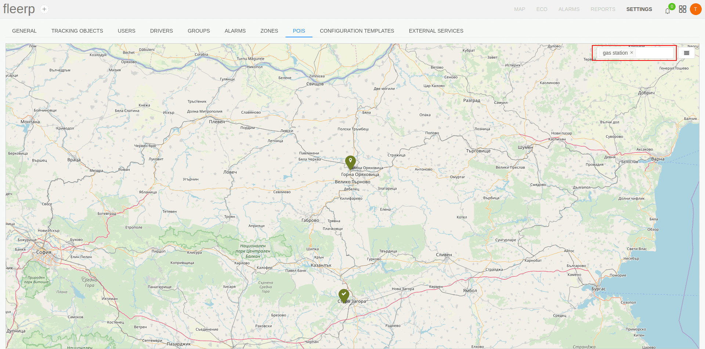

# Search for a point of interest

With many available points of interest, finding certain points can be difficult.
To make this process more convenient, the point of interest filtering by tags feature is available.

The result will visualize only those points of interest that contain the specified tags.

