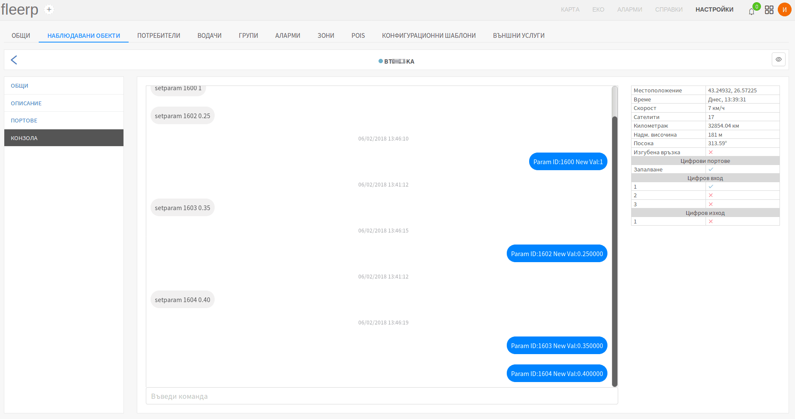
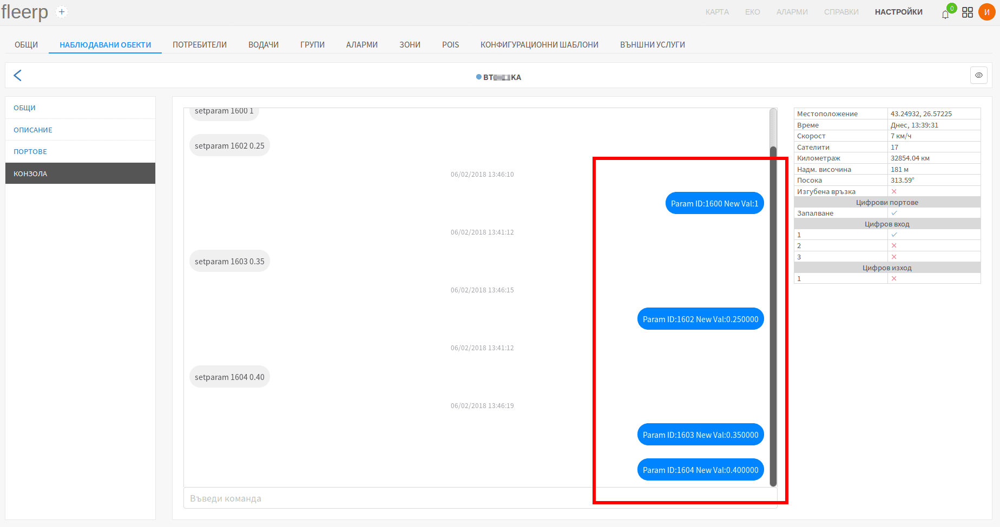
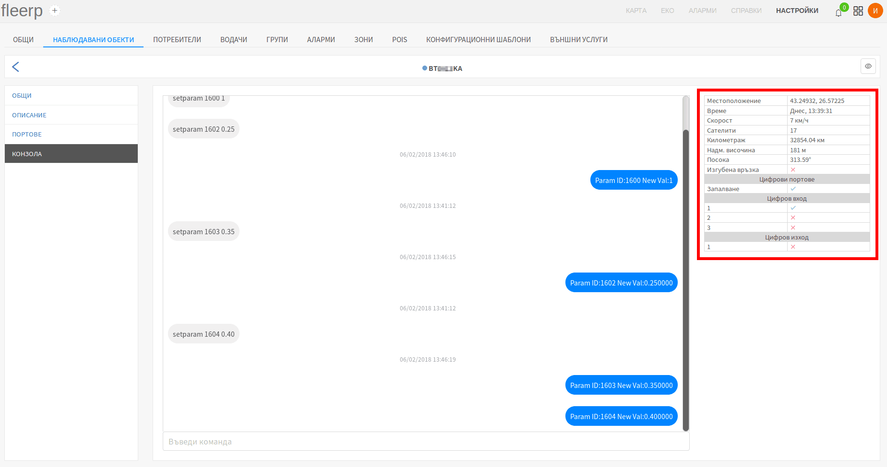

# Конзола

Конзолата дава възможност чрез редица команди, специфични за всяко устройство, потребителят дистанционно да променя
неговите настройки. GPRS команди не могат да бъдат изпращани ако устройството е в режим "Deep sleep" т.е. ако
проследяваният обект е с изключен контактен ключ (в контекста на автомобил). За тази цел е разработена функционалност
за кеширане на командите, които ще бъдат изпратени веднага след като връзката с устройството бъде възстановена.

Бутонът в главната лента, активира режима за "Наблюдаване".
Този режим служи за улесняване на процеса по активация на устройство.

#### Важно:
Когато дадено устройство е в режим на "Наблюдаване", всички записи ще бъдат обработени незабавно.  
Този режим ще бъде активен един час.

Конзолата е разделена на два основни компонента:

- прозорец за команди;
- таблица с данни в реално време;

## Прозорец за команди

Прозорецът за команди представлява средство както за изпращане на нови, така и за преглед на цялата история на
вече изпратени команди, и техните отговори от устройството. Нормалното поведение на конзолата е: команда - отговор,
команда - отговор и т.н.

В лявата част на прозореца са визуализирани командите, изпратени от потребителя:

В дясната част на прозореца са визуализирани отговорите, върнати от устройството:

Нови команди се въвеждат в предвиденото за това поле:

Ако бъде въведена нова команда, докато устройството е в режим "Deep sleep", то тя ще бъде кеширана и ще влезе в режим
на изчакване. След като устройството възобнови връзката със сървъра, всички кеширани команди биват изпращани. Команди
могат да бъдат изтривани единствено докато са в режим на изчакване. След като командата се изпрати към устройството,
тя не може да бъде изтрита. Изтриването се осъществява чрез червен бутон "X" върху съответната команда.

## Таблица с данни в реално време

Таблицата с данни в реално време е неизменна част от инструментите на всеки техник, инсталиращ GPS устройства.
Тя съдържа важна информация относно текущото състояние на всяко едно устройство.

Чрез нея могат да бъдат следени следните параметри:

- местоположение - географска дължина и ширина;
- времето на последния запис, изпратен от устройството към сървъра;
- текуща скорост;
- текущ брой на сателити в обхват;
- текущ километраж (одометър);
- текуща надморска височина;
- текуща посока на движение (в градуси);
- текущо състояние на връзката;
- текущо състояние на всички конфигурирани цифрови портове;
- текущо състояние на всички физически цифрови входове и изходи на GPS устройството;
