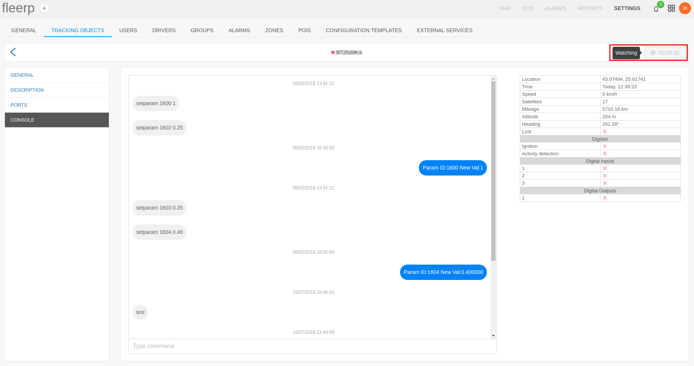
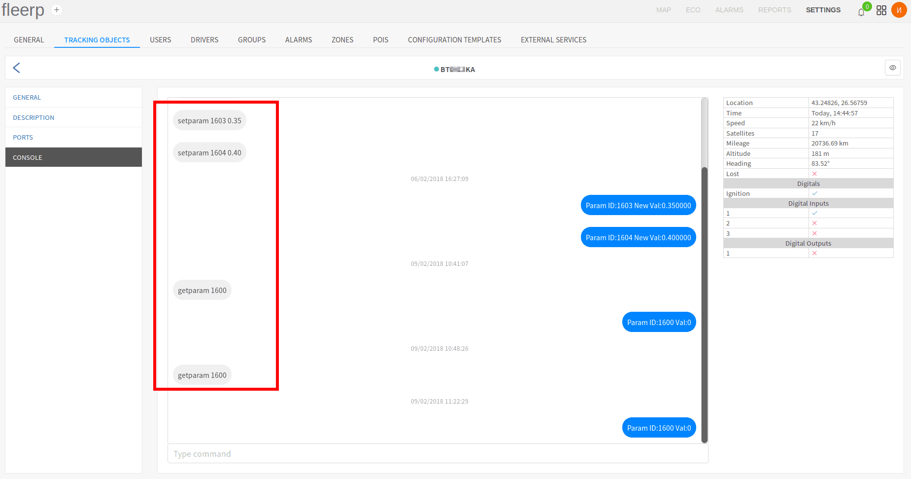
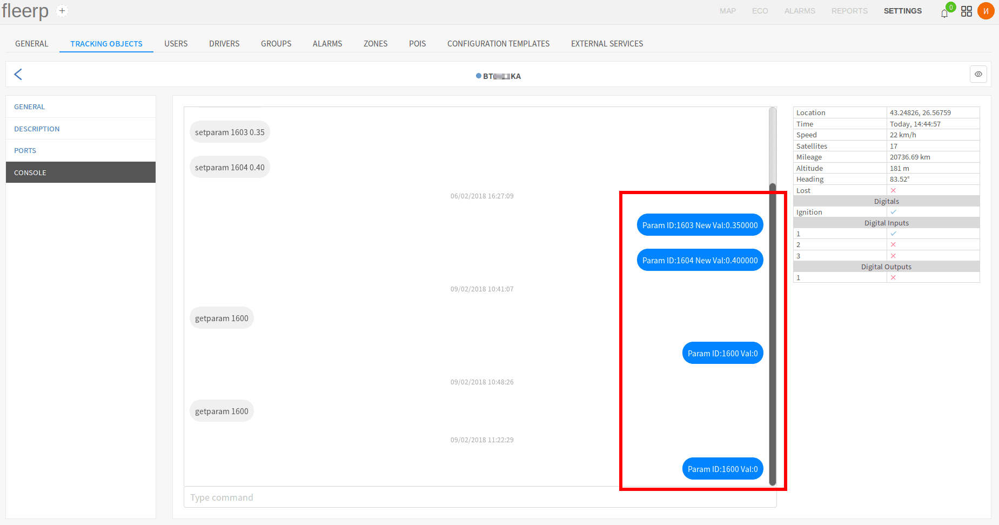
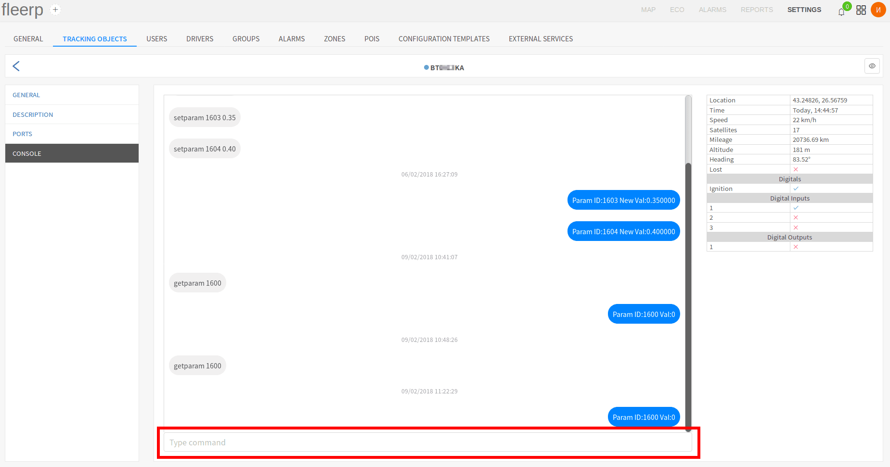
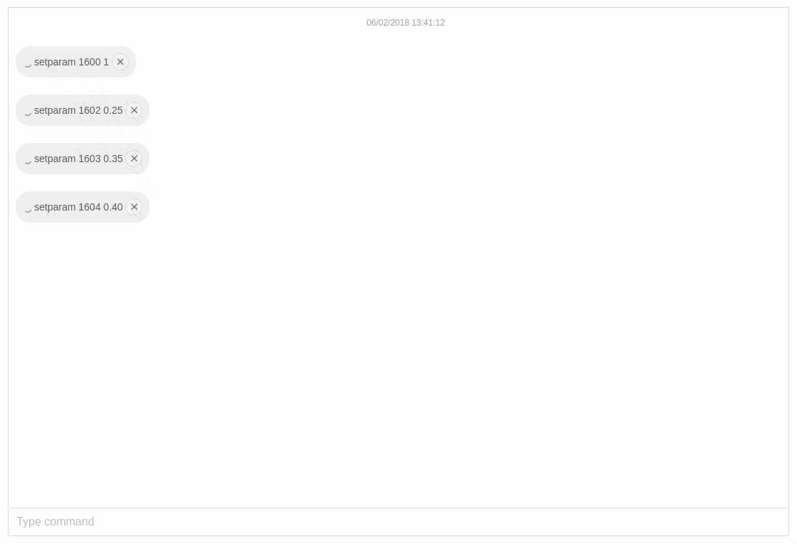

# Console

The console allows the user through a set of commands, specific to every device, to change the device configuration
from a distance. It is important to note that the commands are sent through the already existing GPRS connection with
the device. GPRS commands can not be sent if the device is currently in "Deep sleep" mode, i.e. if the tracking object
is with contact key in off position (in the context of a vehicle). To solve this problem, we have developed functionality
which caches these commands, and sends them as soon as the connection with the device is up.

The button on the main bar activates the "Watching" mode. This mode makes it easier to activate the device.

#### Important:
When a give device is set to 'Watching' mode, then all records will be processed immediately.  
This mode is available for certain period of time а hour.

The console is divided in two key components:

- commands window;
- table with real-time data;

## Commands window

The command window is a tool, which can be used for sending new commands, as well as reviewing the whole command
and response history of the current tracking object. The normal console behaviour is as follows: command - response,
command - response etc...

The commands sent from the user are situated in the left part of the commands window:

The command responses are situated in the right part of the commands window:

New commands are typed in the designated field:

If a new command is sent during "Deep sleep" mode of the device, it will be cached and receive pending status. After
the device has renewed the connection with the server, all pending commands will be sent. Commands can be deleted only
if they are currently pending. Already sent commands can not be deleted. A command can be deleted by the red "X" button.

## Table with real-time data

The table with real-time data is an essential part of the instruments of every technician, who installs GPS devices.
It contains vital information about the current state of every device.

The following parameters can be monitored through it:

- location - geographic longitude and latitude;
- the timestamp of the last record sent from the device to the server;
- current speed;
- count of current locked-in satellites;
- current odometer;
- current altitude;
- current direction of movement (in degrees);
- current state of the connection;
- current state of all configured digital ports;
- current state of all physical digital inputs and outputs on the GPS device;
