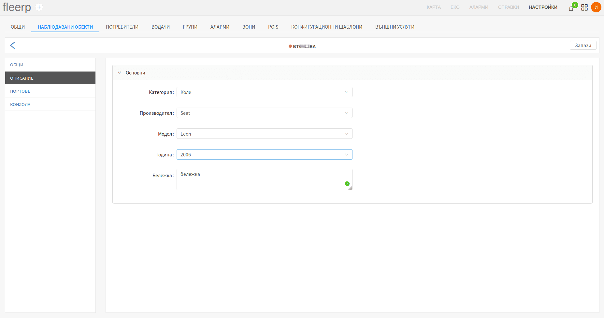

# Описание на наблюдаван обект

Системата предоставя възможност за по-голяма прецизност при работа чрез подробно описание на
наблюдаваните обекти. Имплементирани са следните параметри:

- категория;
- производител;
- модел;
- година;
- допълнителна бележка;

 
---

След промяна на някое от полетата, за да бъдат запазени новите стойности, е нужно да се кликне върху
бутон "Запази".

