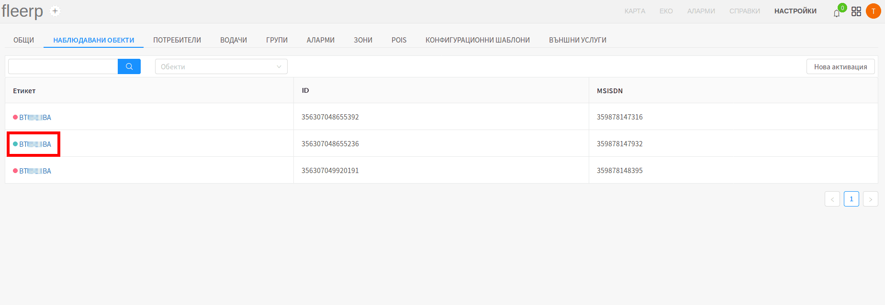

# Настройки на наблюдаван обект

Потребителят има възможност да достъпи настройките на даден наблюдаван обект, чрез клик върху
етикета на избрания обект:

# Общи настройки на наблюдаван обект

Общите настройки на наблюдаван обект, предоставят възможност на потребителя да редактира следните параметри:

- регистрационен номер;
- етикет;
- IMEI номер;
- MSISDN номер;
- километраж;
- група, към която обектът принадлежи;

Редактирането се извърша след клик върху вече запазените стойности:

 
---

Потребителят може да деактивира даден обект чрез бутона "Деактивирай":

#### Важно:
При деактивация на наблюдаван обект, цялата събрана информация относно същия, бива изтрита!

 
---

Редно е да се отбележи, че следните операции се запазват в "История на конфигурациите", и на по-късен етап
могат да бъдат видени от всеки един потребител с нужните права:

- активиране на нов наблюдаван обект;
- смяна на регистрационен номер;
- смяна на етикет;
- смяна на IMEI номер;
- смяна на MSISDN номер;

#### Важно:
Под смяна на IMEI номер, системата разбира, че GPS устройството на наблюдавания обект е сменено с друго, различно от старото!
