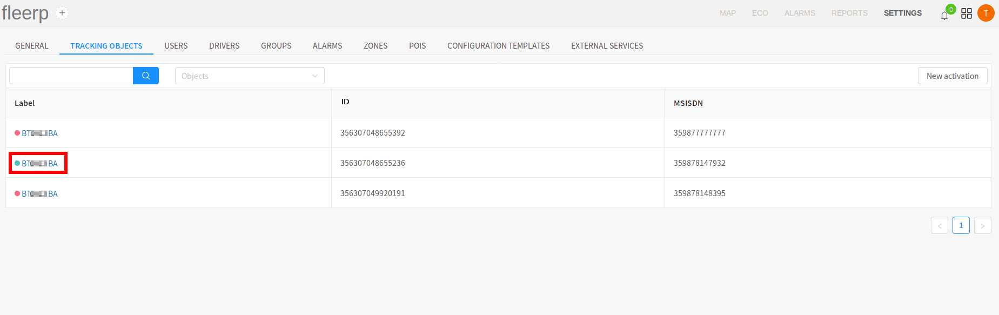
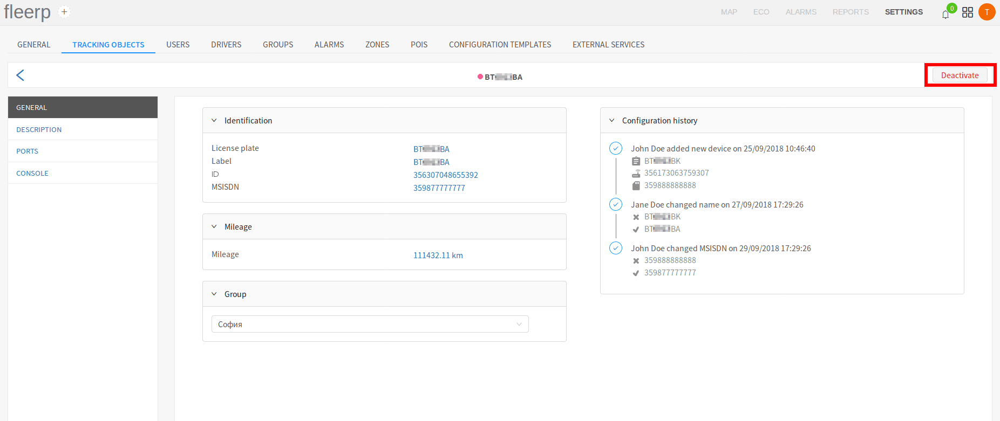

# Tracking object settings

The user can access a tracking object settings by clicking on its label:

# General tracking object settings

The general settings of a tracking object provide the user with possibility to edit the following parameters:

- licence plate;
- label;
- IMEI number;
- MSISDN number;
- odometer;
- group belonging;

The edit is triggered by clicking on the already saved values:

 
---

The user can deactivate given object by the "Deactivate" button:

#### Important:
All the information about the deactivated tracking object is deleted from the system!

 
---

It must be noted that the following operations are saved in "Configuration history", and at a later stage
they can be viewed by every used with the needed viewing rights:

- activation of tracking object;
- change of licence plate;
- change of label;
- change of IMEI number;
- change of MSISDN number;

#### Important:
The system interprets "change of IMEI number" as changing of the GPS device of the tracking object with a new one,
different than the old GPS device.
