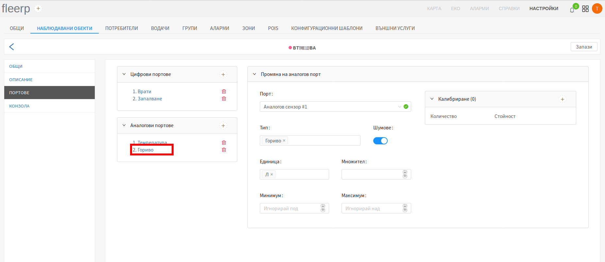
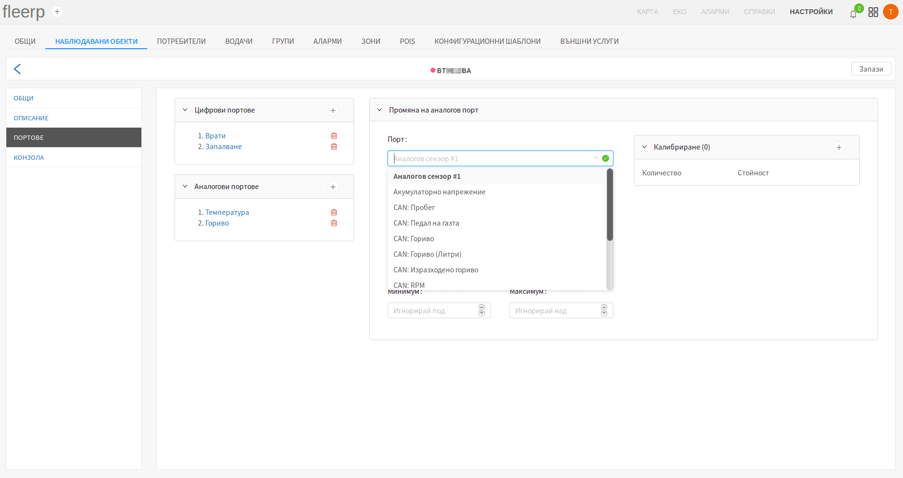
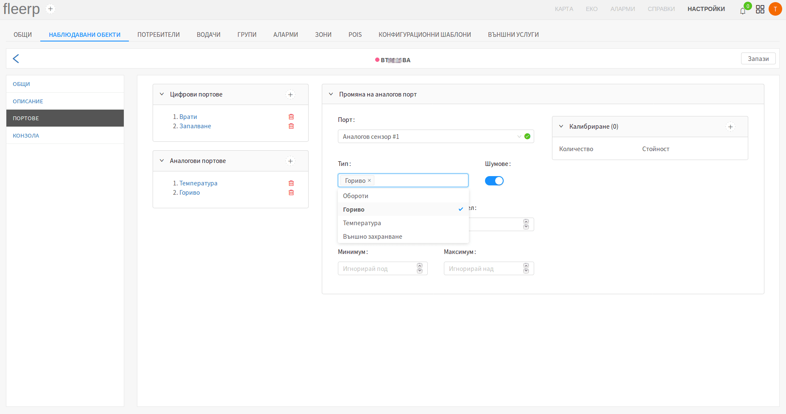
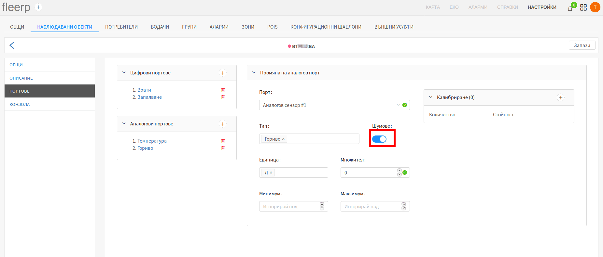
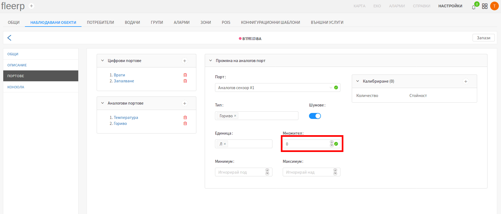
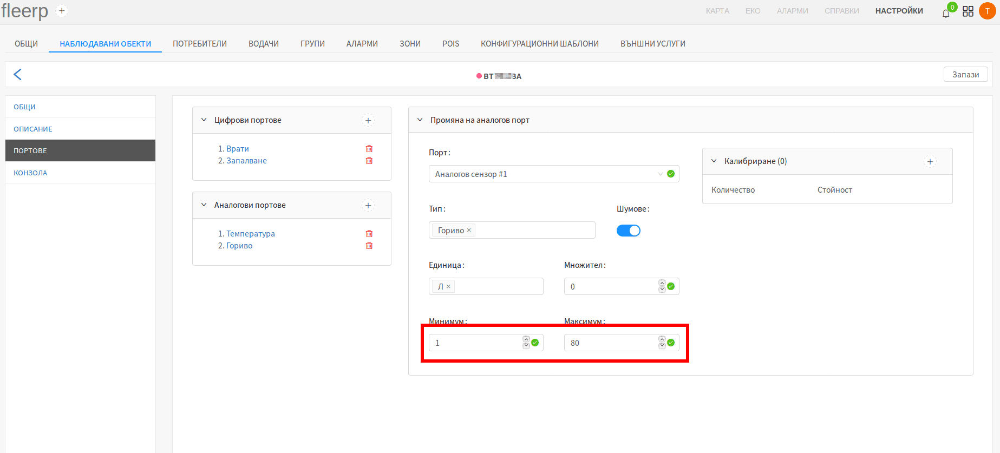

# Създаване/редакция на аналогов порт

Тъй като диалозите "Създаване на аналогов порт" и "Промяна на аналогов порт" са аналогични,
за целта на примера е избрана фукнционалността за промяна.

След клик върху вече съществуващ аналогов порт, се появява диалогът "Промяна на аналогов порт".

Диалогът съдържа седем полета:

- порт;
- тип;
- шумове;
- единица;
- множител;
- минимум;
- максимум;
- калибрация;

За повече информация относно калибрация на аналогов сензор, кликни [_тук_](./analogs/calibration).

 
---

### Порт

Възможните избори на полето "Порт" се попълват автоматично от системата, в зависимост от
модела на устройството, използвано в конкретния наблюдаван обект.

 
---

### Тип

Тип на аналогов порт, може да се тълкува като ресурсът, който портът ще следи, като гориво,
температура, напрежение, обороти и др. В допълнение на предварително зададените такива,
потребителят може да дефинира собствени типове, като в полето въведе желания от него тип,
след което натисне "Enter".

 
---

### Шумове

Бутонът "Шумове" интерполира (изглажда) графиката на даден аналогов сензор. Всички графики могат да бъдат
видени в секция [_справки_](../../../../../web/reports).

 
---

### Единица

Пример:

- единица на аналогов порт за гориво може да бъде: **литър**, **галон** и т.н.;
- единица на аналогов порт за напрежение може да бъде: **миливолт**, **волт** и т.н.;
- единица на аналогов порт за обороти може да бъде: **RPM (оборота в минута)**;
- единица на аналогов порт за температура може да бъде: **целзий** и **фаренхайт**;

В допълнение на предварително зададените такива, потребителят може да дефинира собствени единици,
като в полето въведе желаната от него единица, след което натисне "Enter".

 
---

### Множител

Чрез полето "Множител", потребителят има възможност да умножи върнатия от аналговия сензор
резултат, по стойността, записана в полето.

 
---

### Долна и горна граница

Често някои типове аналогови сензори (като гориво), редом с реалните стойности, връщат единични нереални
стойности (артефакти). Това макар рядко и на пръв поглед безобидно поведение, внася неточности, които могат да
създадат проблеми при представяне на графика пред компетентните органи. Системата Fleerp предоставя
възможност за задаване на долна и горна граница на стойностите, върнати от даден аналогов сензор. Тази
функционалност спомага за получаване на консистенти графики на дадения сензор.

