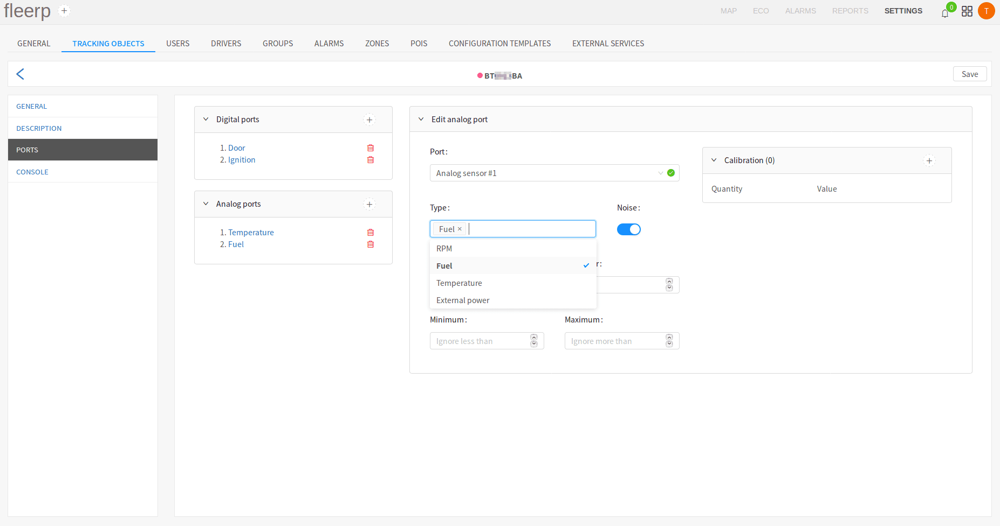
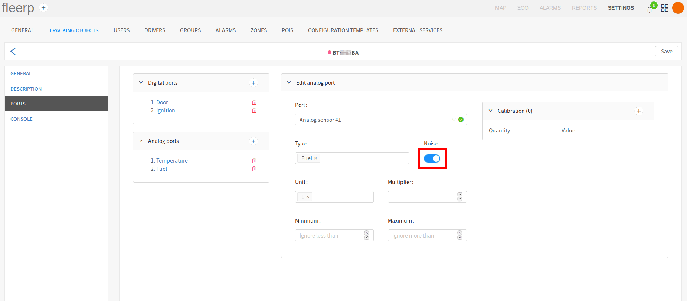
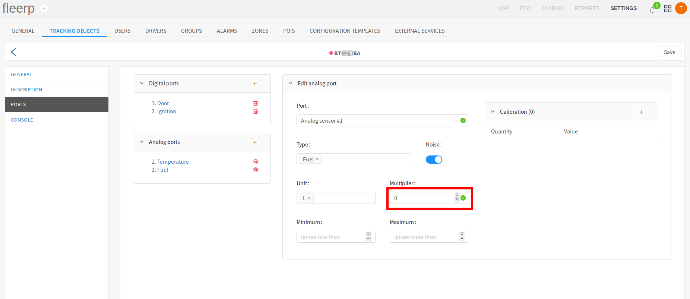
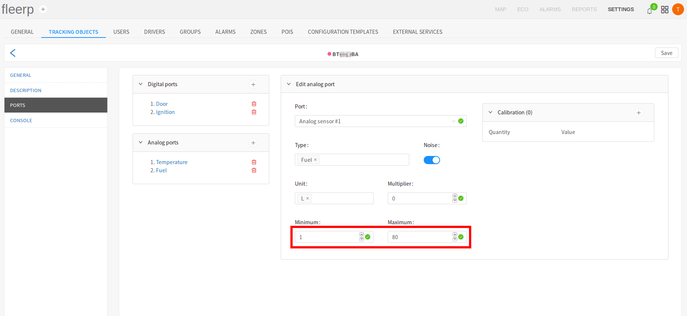

# Create/edit analog port

As the "Create analog port" and "Edit analog port" dialogs are analogous, for the sake
of simplicity, in this example is chosen the edit functionality.

After click on already existing analog port, the "Edit analog port" dialog is shown.

The dialog contains seven fields:

- port;
- type;
- noise:
- unit:
- multiplier;
- minimum;
- maximum;
- calibration;

For additional information about calibration of analog sensor, click [_here_](./analogs/calibration).

 
---

### Port

The possible choices in the "Port" field are inserted automatically by the system, according
to the model of the GPS device, used in the concrete tracking object.

 
---

### Type

Type of analog port, can be interpreted as the resource, which the port will be monitoring,
as fuel, temperature, RPM and others. In addition to the default ones, the user can define
custom port types, by entering them in the type field, followed by "Enter".

 
---

### Noise

The "Noise" button interpolates (smooths out) the line chart of a given analog sensor. All line charts can be seen
in [_reports_](../../../../../web/reports) section.

 
---

### Unit

Example:

- unit of analog port for fuel can be: **liter**, **gallon**, etc;
- unit of analog port for electricity can be: **millivolt**, **volt**, etc;
- unit of analog port for revolutions can be: **RPM (revolutions per minute)**;
- unit of analog port for temperature can be: **celsius** and **fahrenheit**;

In addition to the default ones, the user can define custom port units, by entering them in the unit
field, followed by "Enter".

 
---

### Multiplier

Using the "Multiplier" field, the user can multiply the analog sensor reading by the value in the field.

 
---

### Lower and upper limit

Often some analog sensors (as fuel), along with the real readings, return single unreal readings (artifacts).
This rare and at first sight harmless behaviour can cause problems with presenting a line chart before the
authorities. The Fleerp system provides a way for setting lower and upper limit for the readings,
returned by a given analog sensor. This functionality helps getting consistent line charts for the given sensor.

