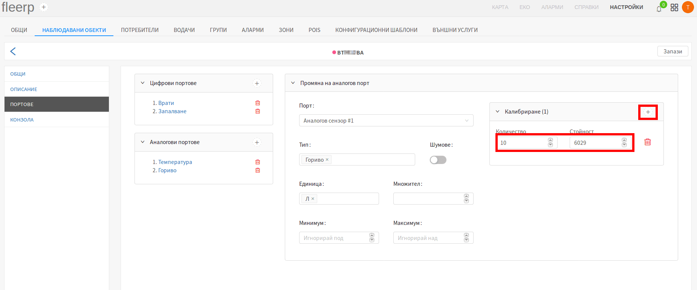
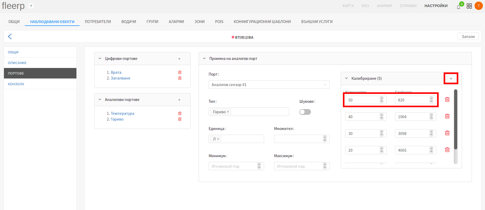

# Калибрация на аналогов сензор

Калибрацията е важна част от конфигурирането на аналогов сензор. Важно е да се
отбележи, че не всички аналогови сензори имат нужда от калибрация.

За целта на статията е използван пример, свързан с калибрация на аналогов сензор за гориво:

- обикновен аналогов сензор за гориво: нуждае се от калибрация;
- аналогов сензор за гориво, използващ CAN порт: не се нуждае от калибрация;

Целта на калибрацията е да се "обучи" системата, съответният волтаж, върнат от аналоговия сензор,
на каква стойност отговаря. В контекста на гориво: на колко литра гориво в резервоара е равен
съответният волтаж.

 
---

Цялостен пример за калибрация на аналогов сензор за гориво, с резервоар от 50 литра и стъпка от 10 литра:

#### Стъпка 1

На празен резервоар се добавят 10 литра гориво, след което стойността на волтажа, върнат от сензора се
записва в полето "Стойност", а литрите се записват в полето "Количество".

Нова стойност се добавя чрез бутона "+" в горната дясна част на прозореца за калибрация.

 
---

#### Стъпка 2

Към резервоара се добавят още 10 литра, и новите стойности се записват в системата. Количеството гориво
в резервоара вече е 20 литра.

 
---

#### Стъпка 3

Към резервоара се добавят още 10 литра, и новите стойности се записват в системата. Количеството гориво
в резервоара вече е 30 литра.

 
---

#### Стъпка 4

Към резервоара се добавят още 10 литра, и новите стойности се записват в системата. Количеството гориво
в резервоара вече е 40 литра.

 
---

#### Стъпка 5 - финална

Към резервоара се добавят последните 10 литра, и новите стойности се записват в системата. Количеството гориво
в резервоара вече е 50 литра - максималното допустимо.

 
---

Колкото по-малка е стъпката, толкова по-точна е калибрацията, т.е. за резервоар от 50 литра,
калибрацията ще е много по-точна ако стъпката е през 5 литра гориво, вместо през 10 литра. За
резервоар от 500 литра, калибрацията ще е по-точна ако се прави през 50 литра, вместо през 100 и т.н.
