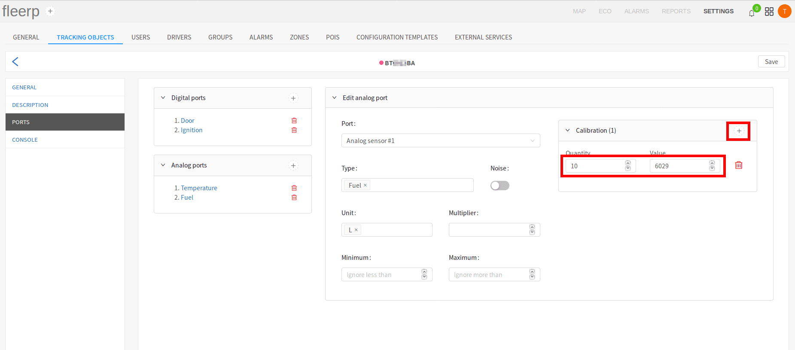
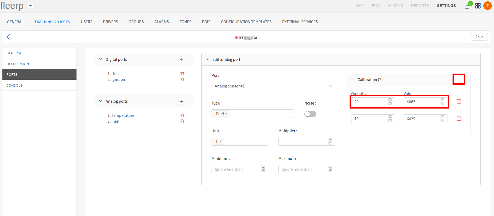

# Calibration of analog sensor

Calibration is an important part of the configuring of an analog sensor. It is important to note
that not all analog sensors need calibration.

The example used in this article contains calibration of analog sensor for fuel:

- generic fuel analog sensor: needs calibration;
- fuel analog sensor that uses CAN port: does not need calibration;

The point of calibration is to train the system, a given voltage read from an analog sensor, to what value
corresponds to. In the fuel context: to what fuel amount (liters, gallons, etc) corresponds given voltage.

 
---

End to end example for calibration of an analog sensor for fuel, with gas tank capacity of 50 liters and
a 10 liter step.

#### Step 1

On an empty tank, add 10 liters of fuel, and enter the corresponding voltage in the "Value" field. The liter
amount must be entered in the "Quantity" field.

New value is added trough the "+" button in the upper right corner of the calibration screen.

 
---

#### Step 2

Add 10 more liters to the gas tank, and then enter the new values in the system. The new fuel amount is 20 liters.

 
---

#### Step 3

Add 10 more liters to the gas tank, and then enter the new values in the system. The new fuel amount is 30 liters.

 
---

#### Step 4

Add 10 more liters to the gas tank, and then enter the new values in the system. The new fuel amount is 40 liters.

 
---

#### Step 5 - final step

Add 10 more liters to the gas tank, and then enter the new values in the system. The new fuel amount is 50 liters -
the maximum for the current tank.

 
---

The smaller the step is, the more accurate the calibration is, e.g. for a 50 liters tank, the calibration
will be much more accurate if the step is 5 liters, instead of 10 liters. For a 500 liter tank, the calibration
will be much more accurate if the step is 50 liters instead of 100, etc.
