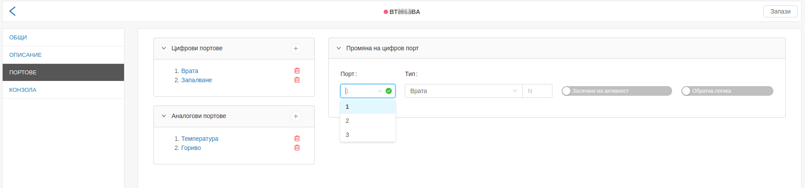
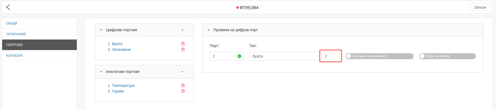
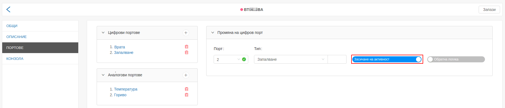

# Създаване/редакция на цифров порт

Тъй като диалозите "Създаване на цифров порт" и "Промяна на цифров порт" са аналогични,
за целта на примера е избрана фукнционалността за промяна.

След клик върху вече съществуващ цифров порт, се появява диалогът "Промяна на цифров порт".

Диалогът съдържа пет полета:

- порт;
- тип;
- индекс на порта;
- засичане на активност;
- обратна логика;

### Порт

Възможните избори на полето "Порт" се попълват автоматично от системата, в зависимост от
модела на устройството, използвано в конкретния наблюдаван обект. Ако моделът на устройството
поддържа 3 цифрови порта, в полето ще се визуализират числата от 1 до 3.

 
---

### Тип

Тип на цифров порт, може да се тълкува като действието, за което портът ще следи, като запалване или
отваряне на врата.

 
---

### Индекс на порта:

Потребителят има възможност да създаде два порта от един и същи тип, но с различен индекс. Тази функционалност е
имплементирана чрез т.нар. "индекс на порта". Едно от приложенията, които намира е: следене за отваряне на повече
от една врата на автомобил.

 
---

### Засичане на активност:

В системата Fleerp проследяваните обекти се визуализират в три цвята *[линк](../../../../../web/map/main/legend)*:

- зелен - когато е активен;
- червен - когато е неактивен;
- сив - когато дълго време не е изпращал данни;

#### Важно:

Само на един от портове трябва да се зададе "Засичане на активност", и така спрямо него приложението ще
визуализира даденият проследявана обект като активен, неактивен или извън линия.

#### Пример:

За този пример ще приемем, че имаме автомобил, на който е поставено проследяващо устойство. При конфигурирането на порт
**Запалване** ще активираме **Засичане на активност**. При това положение, когато даденият обект е със запален двигател,
то той ще се визуализира със зелен цвят, а когато е с изгасен двигател ще се визуализира с червен цвят.

 
---

### Обратна логика

Потребителят има възможност да обърне логиката на зададения порт.

 
---

### Цялостен пример за порт от тип запалване

Ако потребителят желае да конфигурира запалване на автомобил, и на физическото GPS устройство
инсталирано в автомобила, запалването е закачено на физически порт 2, следователно в системата
Fleerp конфигурацията трябва да има следния вид:

- селекцията в поле "Порт" трябва да е "2";
- селекцията в поле "Тип" трябва да е "Запалване";
- останалите 2 полета трябва да бъдат празни;
