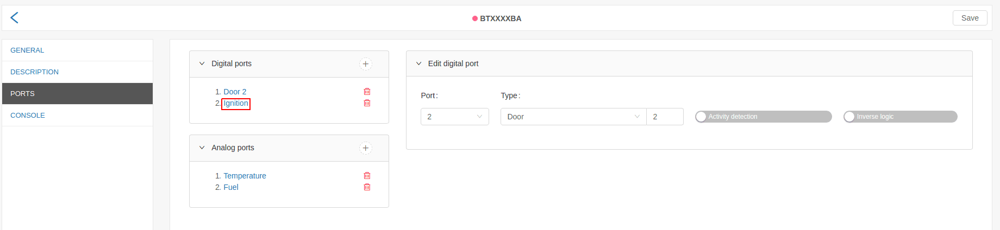
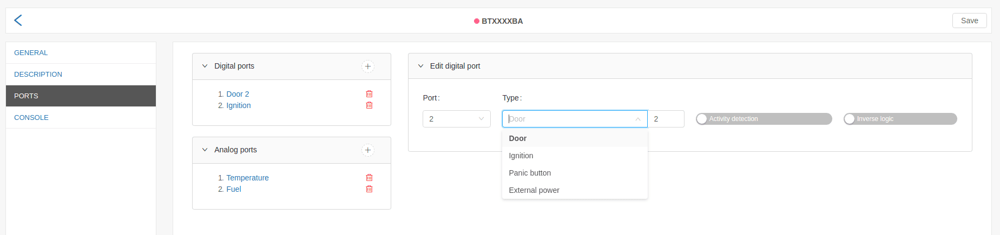
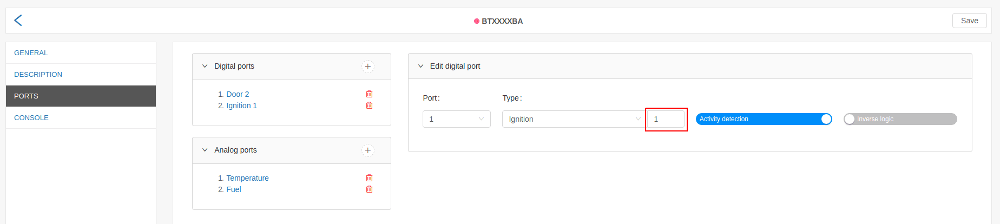

# Create/edit digital port

As the "Create digital port" and "Edit digital port" dialogs are analogous, for the sake
of simplicity, in this example is chosen the edit functionality.

After click on already existing digital port, the "Edit digital port" dialog is shown.

The dialog contains five fields:

- port;
- type;
- port index;
- activity detection;
- inverse logic;

### Port

The possible choices in the "Port" field are inserted automatically by the system, according to
the model of the GPS device, used in the concrete tracking object. If the device model supports
3 digital ports, in the "Port" field will be visualized the number 1 trough 3.

 
---

### Type

Type of digital port, can be interpreted as the action, which the port will be listening for, as turning a vehicle
on or opening of a door.

 
---

### Port index

The user has the possibility to create two ports of the same type, but with different index. This functionality is
implemented trough "Port index". One of the applications it has: listening for open/close event of multiple vehicle
doors. 

 
---

### Activity detection:

In the Fleerp system, tracking objects are visualized in three colors *[link](../../../../../web/map/main/legend)*:

- green - when is active;
- red - when is inactive;
- gray - when it did not send data for a long time;

#### Important:

Only one port must be set to "Activity detection", so the application will
visualizes the tracked object as active, inactive or off-line.

#### Example:

For this example, we will assume that we have a vehicle that has traking device installed.
When configuring a port **Ignition** will activate **Activity detection**.
In this situation, when the object is powered by an engine, it will appear in green,
and when the engine is off, it will appear in red.

 
---

### Inverse logic

The user can inverse the logic of a given digital port.

 
---

### End to end example for port of type "Ignition"

If the user wants to configure vehicle ignition, and on the physical GPS device, installed in the
vehicle, the ignition is placed on port 2, therefore in the system Fleerp the configuration must be
the following:

- the selection in field "Port" must be "2";
- the selection in field "Type" must be "Ignition";
- the rest field must be left empty;
