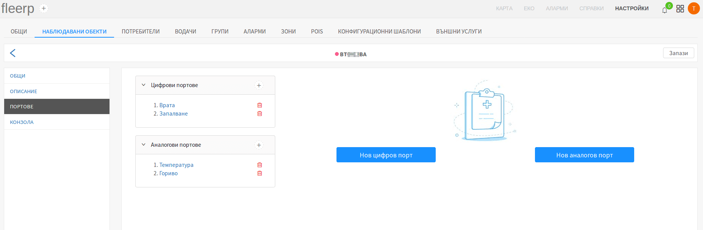
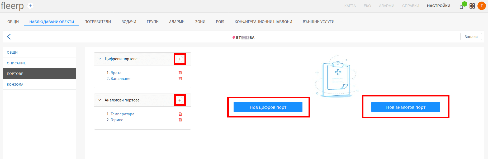

# Портове

Конфигурацията на портове е неизменна част от интеграцията на дадено GPS устройство със системата Fleerp.
Видовете портове биват два:

- цифрови;
- аналогови;

## Цифрови портове

В общия случай цифровите портове се използват за данни, които имат точно две състояния - включено или изключено.

Примерно използване на цифров порт: 

- състояние на контактен ключ на автомобил;
- отворена/затворена врата;
- паник бутон;

За повече информация относно цифровия сигнал, кликни [_тук_](https://bg.wikipedia.org/wiki/%D0%A6%D0%B8%D1%84%D1%80%D0%BE%D0%B2_%D1%81%D0%B8%D0%B3%D0%BD%D0%B0%D0%BB).

## Аналогови портове

От друга страна, аналоговите сензори оперират чрез подаване на волтаж, което означава, че имат почти безкрай състояния.

Примерно използване на аналогов порт:

- отчитане на акумулаторно напрежение;
- отчитане на температура;
- отчитане на гориво;

За повече информация относно аналоговия сигнал, кликни [_тук_](https://bg.wikipedia.org/wiki/%D0%90%D0%BD%D0%B0%D0%BB%D0%BE%D0%B3%D0%BE%D0%B2_%D1%81%D0%B8%D0%B3%D0%BD%D0%B0%D0%BB).

## Имплементация в системата Fleerp

Системата Fleerp разполага с мощен инструмент за конфигурация на цифрови и аналогови портове, както и за калибрация на
аналогови.

## Добавяне на нов порт

Конфигурация на нов цифров или аналогов порт се постига чрез клик върху бутоните "Нов цифров порт" и
"Нов аналогов порт", или върху бутони "+", намиращи се в дясната страна на списъка с вече конфигурирани портове:

## Редакция на порт

Конфигурирани портове могат да бъдат редактирани чрез клик върху типа на порта:

## Изтриване на порт

Конфигурирани портове могат да бъдат изтрити чрез клик върху червеното кошче срещу съответния порт:

## Запазване на промени

За да бъдат запазени промените след добавяне, редакция или изтриване на порт, трябва да се кликне върху бутон "Запази".

