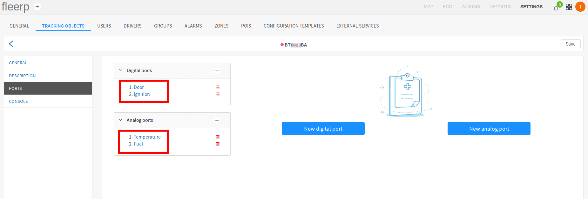

# Ports

Port configuration is a key part of the integration of a GPS device with the Fleerp system.
Port types are as follows:

- digitals;
- analogs;

## Digital ports

Generally digital ports are used for data, with has exactly two states - on or off.

Example use of digital port:

- vehicle key on/off;
- open/closed door;
- panic button;

For additional information about the digital signal, click [_here_](https://en.wikipedia.org/wiki/Digital_signal).

## Analog ports

On the other hand, analog sensors operate by volt supply, which means they have indefinite states.

Example use of analog port:

- recording battery voltage;
- recording temperature;
- recording fuel level;

For additional information about the analog signal, click [_here_](https://en.wikipedia.org/wiki/Analog_signal).

## Implementation in the Fleerp system

The Fleerp system has a powerful tool for configuring of digital and analog ports, as well as calibrating analogs.

## Adding new port

Configuring of new digital or analog port is accomplished by clicking on the buttons "New digital port" and
"New analog port", or on the "+" buttons, located in the right part of the list with already configured ports:

## Editing of a port

Configured ports can be edited by clicking on the port type:

## Deletion of a port

Configured ports can be deleted by clicking on the red trash can next to the desired port:

## Saving of changes

In order for the changes to be saved after adding, editing or deleting a port, the "Save" button must be clicked.

