# Начало

Тази секция от настройките е предназначена за преглед, редактиране и добавяне на наблюдавани обекти.
В централната част на екрана са изброени активираните наблюдавани обекти на организацията, като моментният
статус на конкретен обект е показан чрез цветна точка в ляво от неговия етикет.

Списъкът от активирани наблюдавани обекти е разделен на три колони:

- Етикет: поредица от символи, служещи за идентификация на обекта в системата;
- IMEI: IMEI номерът на проследяващото устройство;
- MSISDN: телефонният номер на SIM картата, поставена в устройството;

Моментният статус на дадедн обект бива представен от точка с три възможни цвята:

- зелен: обектът е активен;
- червен: обектът е неактивен;
- сив: обектът е изгубил GPS сигнал;

Потребителят има възможност да търси обект по етикет или да филтрира по група:

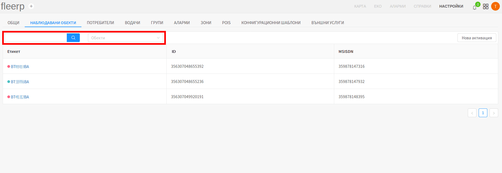

Активиране на нов наблюдаван обект се осъществява чрез бутона "Нова активация":

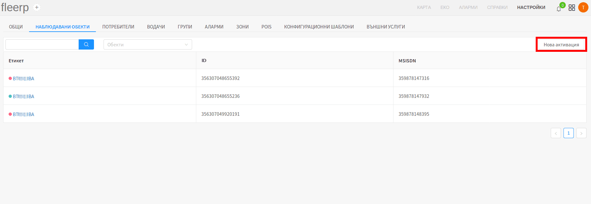

За допълнителна информация относно нова активация, прочети [_тук_](../../../docs/get-started/tracker-activation).

# Настройки на наблюдаван обект

Потребителят има възможност да достъпи настройките на даден наблюдаван обект, чрез клик върху
етикета на избрания обект:

## Общи настройки на наблюдаван обект

Общите настройки на наблюдаван обект, предоставят възможност на потребителя да редактира следните параметри:

- регистрационен номер;
- етикет;
- IMEI номер;
- MSISDN номер;
- километраж;
- група, към която обектът принадлежи;

Редактирането се извърша след клик върху вече запазените стойности:

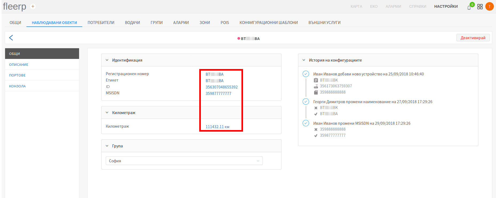

 
---

Потребителят може да деактивира даден обект чрез бутона "Деактивирай":

Важно:
При деактивация на наблюдаван обект, цялата събрана информация относно същия, бива изтрита!

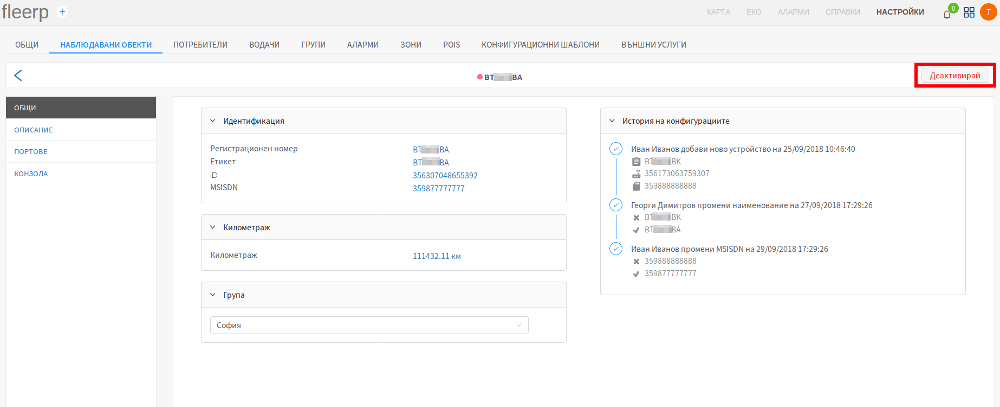

 
---

Редно е да се отбележи, че следните операции се запазват в "История на конфигурациите", и на по-късен етап
могат да бъдат видени от всеки един потребител с нужните права:

- активиране на нов наблюдаван обект;
- смяна на регистрационен номер;
- смяна на етикет;
- смяна на IMEI номер;
- смяна на MSISDN номер;

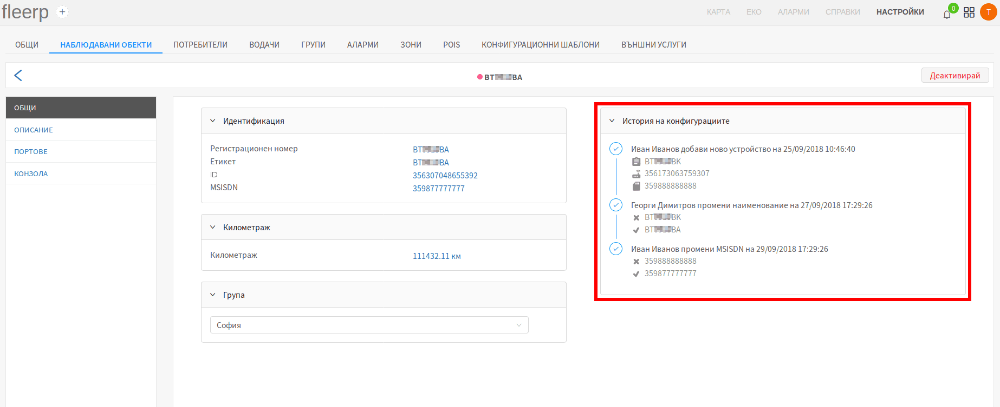

Важно:
Под смяна на IMEI номер, системата разбира, че GPS устройството на наблюдавания обект е сменено с друго, различно от старото!

## Описание на наблюдаван обект

Системата предоставя възможност за по-голяма прецизност при работа чрез подробно описание на
наблюдаваните обекти. Имплементирани са следните параметри:

- категория;
- производител;
- модел;
- година;
- допълнителна бележка;

 
---

След промяна на някое от полетата, за да бъдат запазени новите стойности, е нужно да се кликне върху
бутон "Запази".

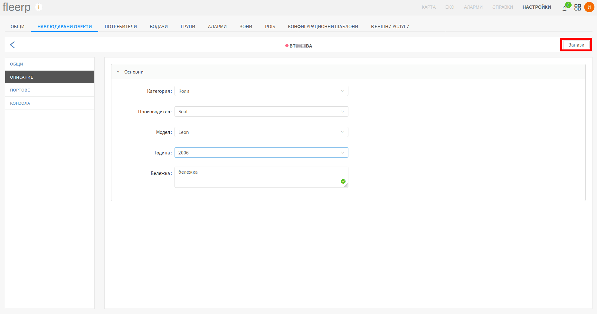

## Конзола

Конзолата дава възможност чрез редица команди, специфични за всяко устройство, потребителят дистанционно да променя
неговите настройки. GPRS команди не могат да бъдат изпращани ако устройството е в режим "Deep sleep" т.е. ако
проследяваният обект е с изключен контактен ключ (в контекста на автомобил). За тази цел е разработена функционалност
за кеширане на командите, които ще бъдат изпратени веднага след като връзката с устройството бъде възстановена.

Бутонът в главната лента, активира режима за "Наблюдаване".
Този режим служи за улесняване на процеса по активация на устройство.

#### Важно:
Когато дадено устройство е в режим на "Наблюдаване", всички записи ще бъдат обработени незабавно.  
Този режим ще бъде активен един час.

Конзолата е разделена на два основни компонента:

- прозорец за команди;
- таблица с данни в реално време;

#### Прозорец за команди

Прозорецът за команди представлява средство както за изпращане на нови, така и за преглед на цялата история на
вече изпратени команди, и техните отговори от устройството. Нормалното поведение на конзолата е: команда - отговор,
команда - отговор и т.н.

В лявата част на прозореца са визуализирани командите, изпратени от потребителя:

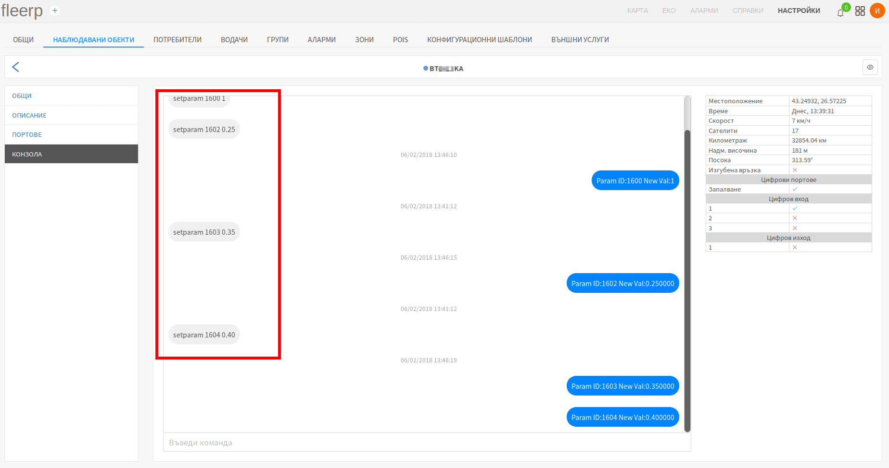

В дясната част на прозореца са визуализирани отговорите, върнати от устройството:

Нови команди се въвеждат в предвиденото за това поле:

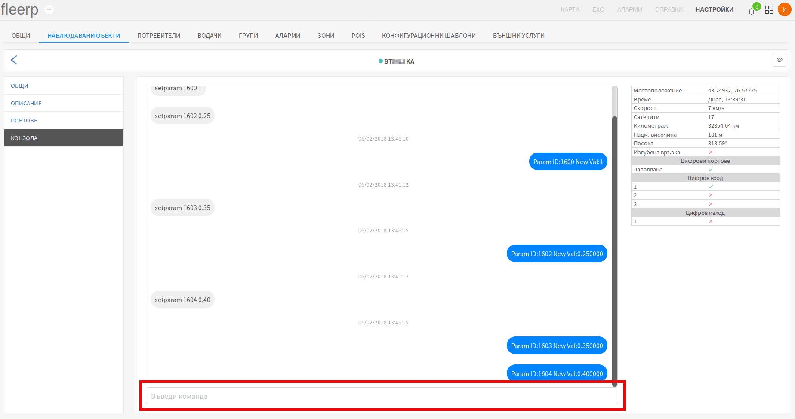

Ако бъде въведена нова команда, докато устройството е в режим "Deep sleep", то тя ще бъде кеширана и ще влезе в режим
на изчакване. След като устройството възобнови връзката със сървъра, всички кеширани команди биват изпращани. Команди
могат да бъдат изтривани единствено докато са в режим на изчакване. След като командата се изпрати към устройството,
тя не може да бъде изтрита. Изтриването се осъществява чрез червен бутон "X" върху съответната команда.

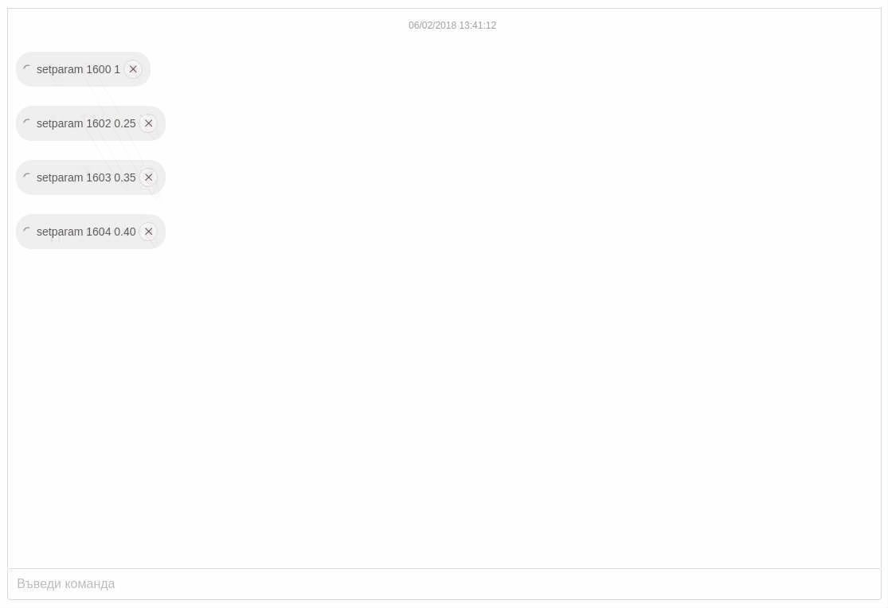

### Таблица с данни в реално време

Таблицата с данни в реално време е неизменна част от инструментите на всеки техник, инсталиращ GPS устройства.
Тя съдържа важна информация относно текущото състояние на всяко едно устройство.

Чрез нея могат да бъдат следени следните параметри:

- местоположение - географска дължина и ширина;
- времето на последния запис, изпратен от устройството към сървъра;
- текуща скорост;
- текущ брой на сателити в обхват;
- текущ километраж (одометър);
- текуща надморска височина;
- текуща посока на движение (в градуси);
- текущо състояние на връзката;
- текущо състояние на всички конфигурирани цифрови портове;
- текущо състояние на всички физически цифрови входове и изходи на GPS устройството;

## Портове

Конфигурацията на портове е неизменна част от интеграцията на дадено GPS устройство със системата Fleerp.
Видовете портове биват два:

- цифрови;
- аналогови;

### Цифрови портове

В общия случай цифровите портове се използват за данни, които имат точно две състояния - включено или изключено.

Примерно използване на цифров порт: 

- състояние на контактен ключ на автомобил;
- отворена/затворена врата;
- паник бутон;

За повече информация относно цифровия сигнал, кликни [_тук_](https://bg.wikipedia.org/wiki/%D0%A6%D0%B8%D1%84%D1%80%D0%BE%D0%B2_%D1%81%D0%B8%D0%B3%D0%BD%D0%B0%D0%BB).

### Аналогови портове

От друга страна, аналоговите сензори оперират чрез подаване на волтаж, което означава, че имат почти безкрай състояния.

Примерно използване на аналогов порт:

- отчитане на акумулаторно напрежение;
- отчитане на температура;
- отчитане на гориво;

За повече информация относно аналоговия сигнал, кликни [_тук_](https://bg.wikipedia.org/wiki/%D0%90%D0%BD%D0%B0%D0%BB%D0%BE%D0%B3%D0%BE%D0%B2_%D1%81%D0%B8%D0%B3%D0%BD%D0%B0%D0%BB).

### Имплементация в системата Fleerp

Системата Fleerp разполага с мощен инструмент за конфигурация на цифрови и аналогови портове, както и за калибрация на
аналогови.

### Добавяне на нов порт

Конфигурация на нов цифров или аналогов порт се постига чрез клик върху бутоните "Нов цифров порт" и
"Нов аналогов порт", или върху бутони "+", намиращи се в дясната страна на списъка с вече конфигурирани портове:

### Редакция на порт

Конфигурирани портове могат да бъдат редактирани чрез клик върху типа на порта:

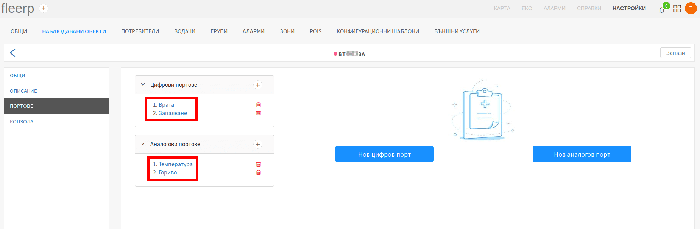

### Изтриване на порт

Конфигурирани портове могат да бъдат изтрити чрез клик върху червеното кошче срещу съответния порт:

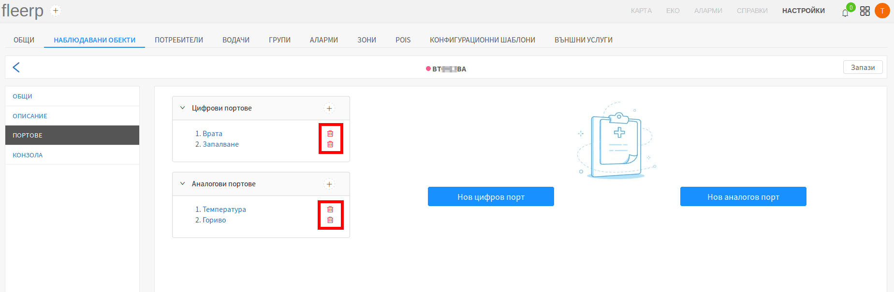

### Запазване на промени

За да бъдат запазени промените след добавяне, редакция или изтриване на порт, трябва да се кликне върху бутон "Запази".

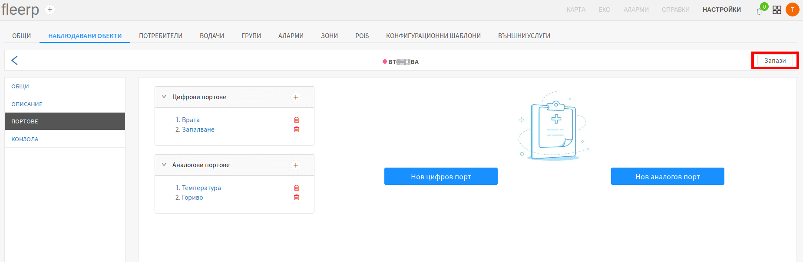

## Създаване/редакция на цифров порт

Тъй като диалозите "Създаване на цифров порт" и "Промяна на цифров порт" са аналогични,
за целта на примера е избрана фукнционалността за промяна.

След клик върху вече съществуващ цифров порт, се появява диалогът "Промяна на цифров порт".

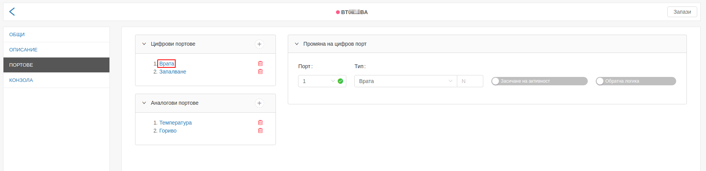

Диалогът съдържа пет полета:

- порт;
- тип;
- индекс на порта;
- засичане на активност;
- обратна логика;

### Порт

Възможните избори на полето "Порт" се попълват автоматично от системата, в зависимост от
модела на устройството, използвано в конкретния наблюдаван обект. Ако моделът на устройството
поддържа 3 цифрови порта, в полето ще се визуализират числата от 1 до 3.

 
---

### Тип

Тип на цифров порт, може да се тълкува като действието, за което портът ще следи, като запалване или
отваряне на врата.

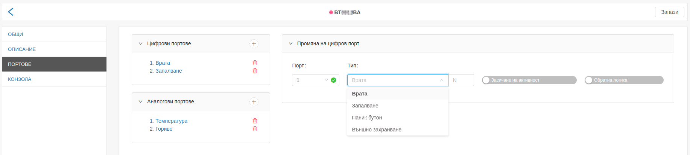

 
---

### Индекс на порта:

Потребителят има възможност да създаде два порта от един и същи тип, но с различен индекс. Тази функционалност е
имплементирана чрез т.нар. "индекс на порта". Едно от приложенията, които намира е: следене за отваряне на повече
от една врата на автомобил.

 
---

### Засичане на активност:

В системата Fleerp проследяваните обекти се визуализират в три цвята *[линк](../../../../../web/map/main/legend)*:

- зелен - когато е активен;
- червен - когато е неактивен;
- сив - когато дълго време не е изпращал данни;

#### Важно:

Само на един от портове трябва да се зададе "Засичане на активност", и така спрямо него приложението ще
визуализира даденият проследявана обект като активен, неактивен или извън линия.

#### Пример:

За този пример ще приемем, че имаме автомобил, на който е поставено проследяващо устойство. При конфигурирането на порт
**Запалване** ще активираме **Засичане на активност**. При това положение, когато даденият обект е със запален двигател,
то той ще се визуализира със зелен цвят, а когато е с изгасен двигател ще се визуализира с червен цвят.

 
---

### Обратна логика

Потребителят има възможност да обърне логиката на зададения порт.

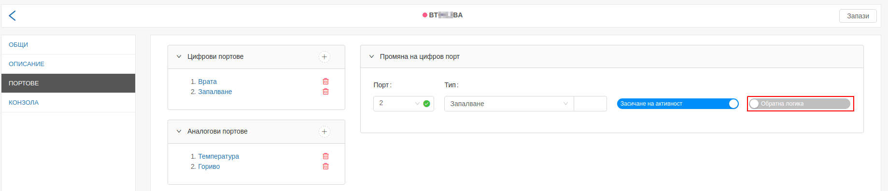

 
---

### Цялостен пример за порт от тип запалване

Ако потребителят желае да конфигурира запалване на автомобил, и на физическото GPS устройство
инсталирано в автомобила, запалването е закачено на физически порт 2, следователно в системата
Fleerp конфигурацията трябва да има следния вид:

- селекцията в поле "Порт" трябва да е "2";
- селекцията в поле "Тип" трябва да е "Запалване";
- останалите 2 полета трябва да бъдат празни;

## Създаване/редакция на аналогов порт

Тъй като диалозите "Създаване на аналогов порт" и "Промяна на аналогов порт" са аналогични,
за целта на примера е избрана фукнционалността за промяна.

След клик върху вече съществуващ аналогов порт, се появява диалогът "Промяна на аналогов порт".

Диалогът съдържа седем полета:

- порт;
- тип;
- шумове;
- единица;
- множител;
- минимум;
- максимум;
- калибрация;

За повече информация относно калибрация на аналогов сензор, кликни [_тук_](./analogs/calibration).

 
---

### Порт

Възможните избори на полето "Порт" се попълват автоматично от системата, в зависимост от
модела на устройството, използвано в конкретния наблюдаван обект.

 
---

### Тип

Тип на аналогов порт, може да се тълкува като ресурсът, който портът ще следи, като гориво,
температура, напрежение, обороти и др. В допълнение на предварително зададените такива,
потребителят може да дефинира собствени типове, като в полето въведе желания от него тип,
след което натисне "Enter".

 
---

### Шумове

Бутонът "Шумове" интерполира (изглажда) графиката на даден аналогов сензор. Всички графики могат да бъдат
видени в секция [_справки_](../../../../../web/reports).

 
---

### Единица

Пример:

- единица на аналогов порт за гориво може да бъде: **литър**, **галон** и т.н.;
- единица на аналогов порт за напрежение може да бъде: **миливолт**, **волт** и т.н.;
- единица на аналогов порт за обороти може да бъде: **RPM (оборота в минута)**;
- единица на аналогов порт за температура може да бъде: **целзий** и **фаренхайт**;

В допълнение на предварително зададените такива, потребителят може да дефинира собствени единици,
като в полето въведе желаната от него единица, след което натисне "Enter".

 
---

### Множител

Чрез полето "Множител", потребителят има възможност да умножи върнатия от аналговия сензор
резултат, по стойността, записана в полето.

 
---

### Долна и горна граница

Често някои типове аналогови сензори (като гориво), редом с реалните стойности, връщат единични нереални
стойности (артефакти). Това макар рядко и на пръв поглед безобидно поведение, внася неточности, които могат да
създадат проблеми при представяне на графика пред компетентните органи. Системата Fleerp предоставя
възможност за задаване на долна и горна граница на стойностите, върнати от даден аналогов сензор. Тази
функционалност спомага за получаване на консистенти графики на дадения сензор.

## Калибрация на аналогов сензор

Калибрацията е важна част от конфигурирането на аналогов сензор. Важно е да се
отбележи, че не всички аналогови сензори имат нужда от калибрация.

За целта на статията е използван пример, свързан с калибрация на аналогов сензор за гориво:

- обикновен аналогов сензор за гориво: нуждае се от калибрация;
- аналогов сензор за гориво, използващ CAN порт: не се нуждае от калибрация;

Целта на калибрацията е да се "обучи" системата, съответният волтаж, върнат от аналоговия сензор,
на каква стойност отговаря. В контекста на гориво: на колко литра гориво в резервоара е равен
съответният волтаж.

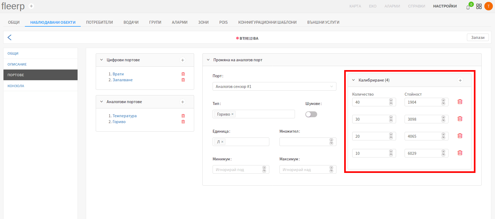

 
---

Цялостен пример за калибрация на аналогов сензор за гориво, с резервоар от 50 литра и стъпка от 10 литра:

#### Стъпка 1

На празен резервоар се добавят 10 литра гориво, след което стойността на волтажа, върнат от сензора се
записва в полето "Стойност", а литрите се записват в полето "Количество".

Нова стойност се добавя чрез бутона "+" в горната дясна част на прозореца за калибрация.

 
---

#### Стъпка 2

Към резервоара се добавят още 10 литра, и новите стойности се записват в системата. Количеството гориво
в резервоара вече е 20 литра.

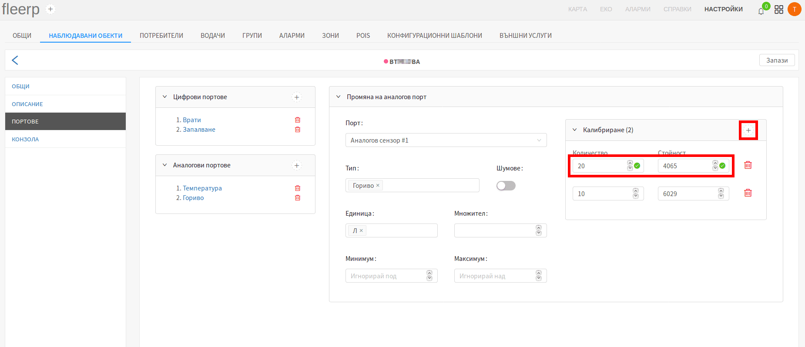

 
---

#### Стъпка 3

Към резервоара се добавят още 10 литра, и новите стойности се записват в системата. Количеството гориво
в резервоара вече е 30 литра.

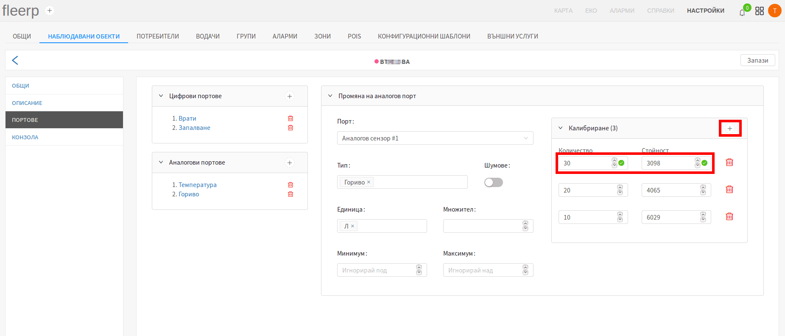

 
---

#### Стъпка 4

Към резервоара се добавят още 10 литра, и новите стойности се записват в системата. Количеството гориво
в резервоара вече е 40 литра.

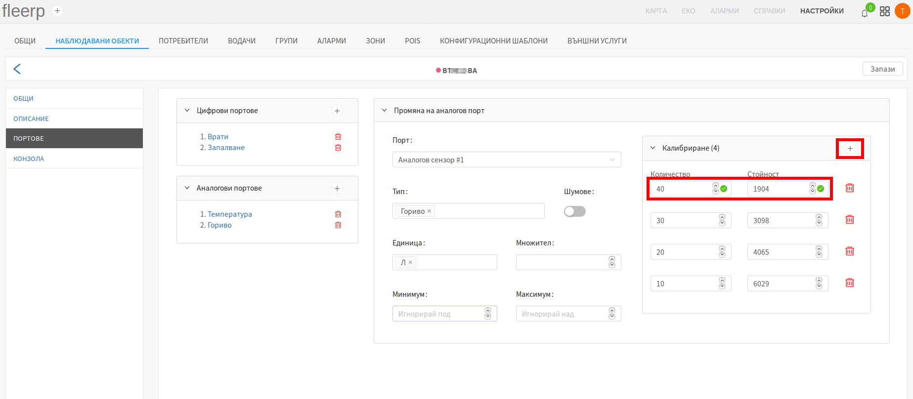

 
---

#### Стъпка 5 - финална

Към резервоара се добавят последните 10 литра, и новите стойности се записват в системата. Количеството гориво
в резервоара вече е 50 литра - максималното допустимо.

 
---

Колкото по-малка е стъпката, толкова по-точна е калибрацията, т.е. за резервоар от 50 литра,
калибрацията ще е много по-точна ако стъпката е през 5 литра гориво, вместо през 10 литра. За
резервоар от 500 литра, калибрацията ще е по-точна ако се прави през 50 литра, вместо през 100 и т.н.
