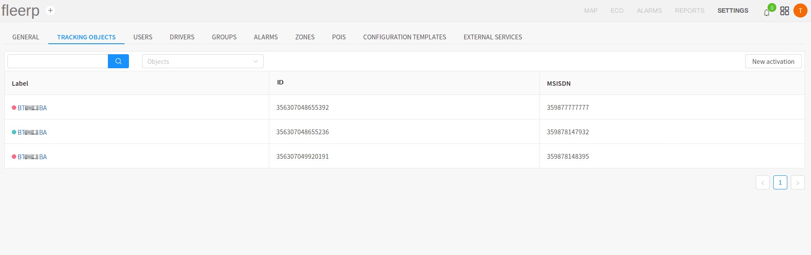

# Tracking objects

This section of the settings is intended for viewing, editing and adding of tracking objects. All activated
tracking objects of the organization are listed in the central part of the screen. The momentary status of
a concrete object is shown by a colored dot to the left of it's label.

The list of activated tracking objects is divided in three columns:

- Label: a series of symbols, used for identification of the object throughout the system;
- IMEI: the IMEI number of the tracking device;
- MSISDN: the number of the SIM card, placed within the tracking device;

The momentary status of a concrete tracking object is represented by a dot with three possible colors.

- green: the tracking object is turned on;
- red: the tracking object is turned off;
- gray: the tracking object is out of GPS coverage;

The used can search for an object by label or filter all object by group:

Activating of a new tracking object is done by the "New activation" button:

For additional information about new activation, read [_here_](../../../docs/get-started/tracker-activation).
