# Introduction

This section of the settings is intended for viewing, editing and adding of tracking objects. All activated
tracking objects of the organization are listed in the central part of the screen. The momentary status of
a concrete object is shown by a colored dot to the left of it's label.

The list of activated tracking objects is divided in three columns:

- Label: a series of symbols, used for identification of the object throughout the system;
- IMEI: the IMEI number of the tracking device;
- MSISDN: the number of the SIM card, placed within the tracking device;

The momentary status of a concrete tracking object is represented by a dot with three possible colors.

- green: the tracking object is turned on;
- red: the tracking object is turned off;
- gray: the tracking object is out of GPS coverage;

The used can search for an object by label or filter all object by group:

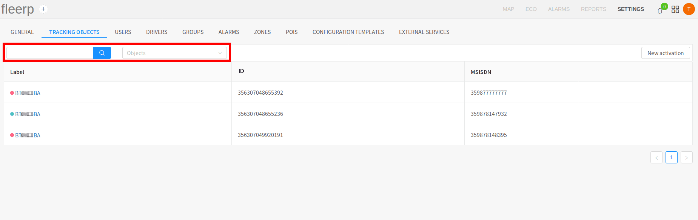

Activating of a new tracking object is done by the "New activation" button:

For additional information about new activation, read [_here_](../../../docs/get-started/tracker-activation).

# Tracking object settings

The user can access a tracking object settings by clicking on its label:

## General tracking object settings

The general settings of a tracking object provide the user with possibility to edit the following parameters:

- licence plate;
- label;
- IMEI number;
- MSISDN number;
- odometer;
- group belonging;

The edit is triggered by clicking on the already saved values:

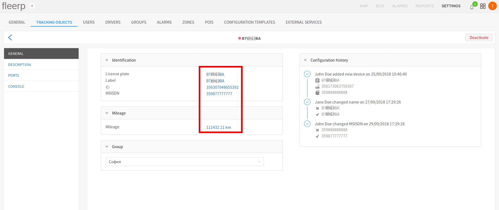

 
---

The user can deactivate given object by the "Deactivate" button:

#### Important:
All the information about the deactivated tracking object is deleted from the system!

 
---

It must be noted that the following operations are saved in "Configuration history", and at a later stage
they can be viewed by every used with the needed viewing rights:

- activation of tracking object;
- change of licence plate;
- change of label;
- change of IMEI number;
- change of MSISDN number;

#### Important:
The system interprets "change of IMEI number" as changing of the GPS device of the tracking object with a new one,
different than the old GPS device.

## Description of a tracking object

The system provides the possibility for a greater precision at work by providing a detailed
description of the tracking objects. The following parameters are implemented:

- category;
- make;
- model;
- year;
- additional note;

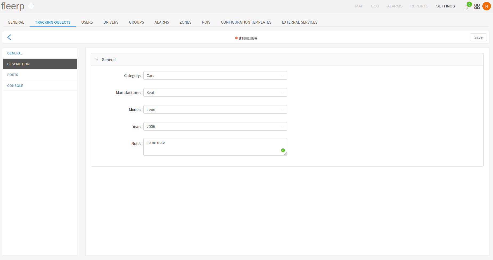

 
---

After changing any of the fields, in order for the new values to be saved, the "Save" button must be
clicked.

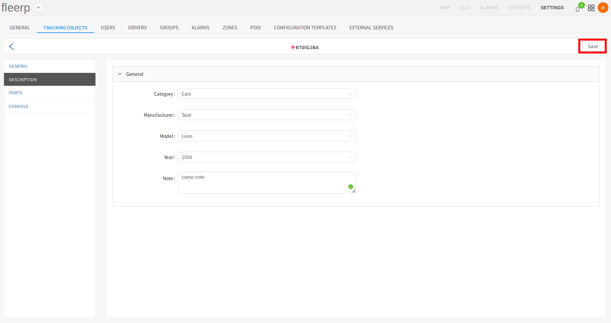

## Console

The console allows the user through a set of commands, specific to every device, to change the device configuration
from a distance. It is important to note that the commands are sent through the already existing GPRS connection with
the device. GPRS commands can not be sent if the device is currently in "Deep sleep" mode, i.e. if the tracking object
is with contact key in off position (in the context of a vehicle). To solve this problem, we have developed functionality
which caches these commands, and sends them as soon as the connection with the device is up.

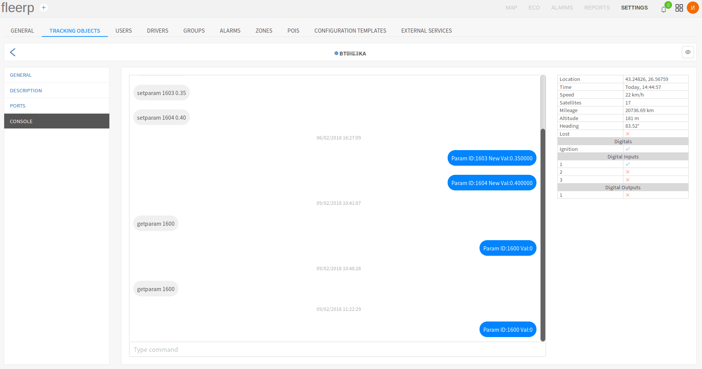

The button on the main bar activates the "Watching" mode. This mode makes it easier to activate the device.

#### Important:
When a give device is set to 'Watching' mode, then all records will be processed immediately.  
This mode is available for certain period of time а hour.

The console is divided in two key components:

- commands window;
- table with real-time data;

### Commands window

The command window is a tool, which can be used for sending new commands, as well as reviewing the whole command
and response history of the current tracking object. The normal console behaviour is as follows: command - response,
command - response etc...

The commands sent from the user are situated in the left part of the commands window:

The command responses are situated in the right part of the commands window:

New commands are typed in the designated field:

If a new command is sent during "Deep sleep" mode of the device, it will be cached and receive pending status. After
the device has renewed the connection with the server, all pending commands will be sent. Commands can be deleted only
if they are currently pending. Already sent commands can not be deleted. A command can be deleted by the red "X" button.

### Table with real-time data

The table with real-time data is an essential part of the instruments of every technician, who installs GPS devices.
It contains vital information about the current state of every device.

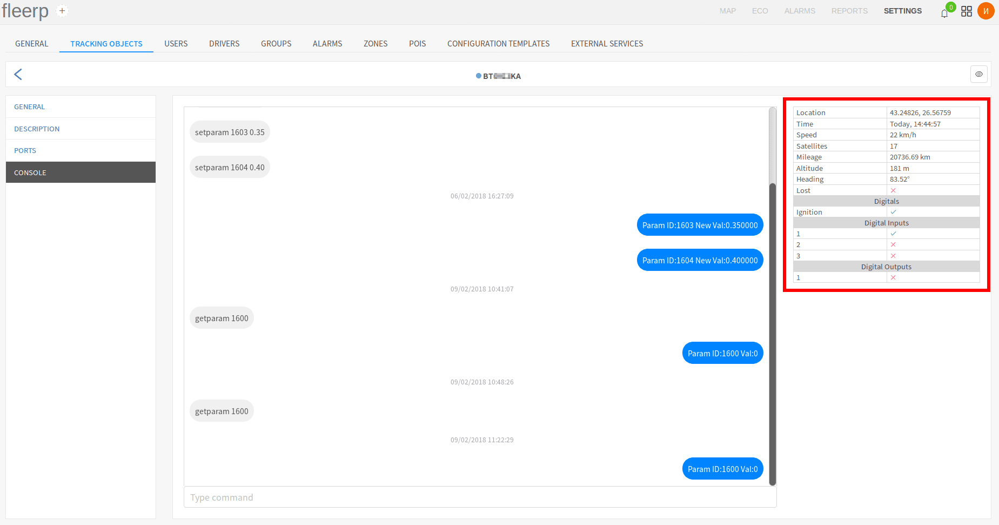

The following parameters can be monitored through it:

- location - geographic longitude and latitude;
- the timestamp of the last record sent from the device to the server;
- current speed;
- count of current locked-in satellites;
- current odometer;
- current altitude;
- current direction of movement (in degrees);
- current state of the connection;
- current state of all configured digital ports;
- current state of all physical digital inputs and outputs on the GPS device;

## Ports

Port configuration is a key part of the integration of a GPS device with the Fleerp system.
Port types are as follows:

- digitals;
- analogs;

### Digital ports

Generally digital ports are used for data, with has exactly two states - on or off.

Example use of digital port:

- vehicle key on/off;
- open/closed door;
- panic button;

For additional information about the digital signal, click [_here_](https://en.wikipedia.org/wiki/Digital_signal).

### Analog ports

On the other hand, analog sensors operate by volt supply, which means they have indefinite states.

Example use of analog port:

- recording battery voltage;
- recording temperature;
- recording fuel level;

For additional information about the analog signal, click [_here_](https://en.wikipedia.org/wiki/Analog_signal).

### Implementation in the Fleerp system

The Fleerp system has a powerful tool for configuring of digital and analog ports, as well as calibrating analogs.

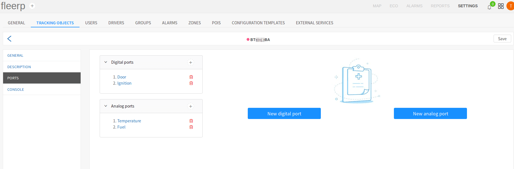

### Adding new port

Configuring of new digital or analog port is accomplished by clicking on the buttons "New digital port" and
"New analog port", or on the "+" buttons, located in the right part of the list with already configured ports:

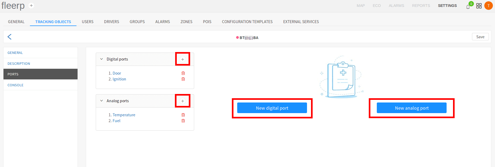

### Editing of a port

Configured ports can be edited by clicking on the port type:

### Deletion of a port

Configured ports can be deleted by clicking on the red trash can next to the desired port:

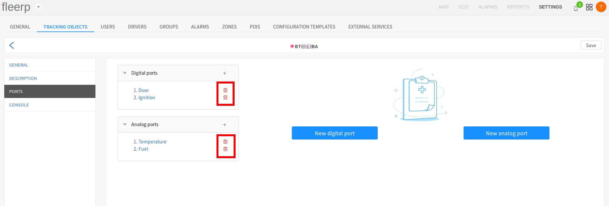

### Saving of changes

In order for the changes to be saved after adding, editing or deleting a port, the "Save" button must be clicked.

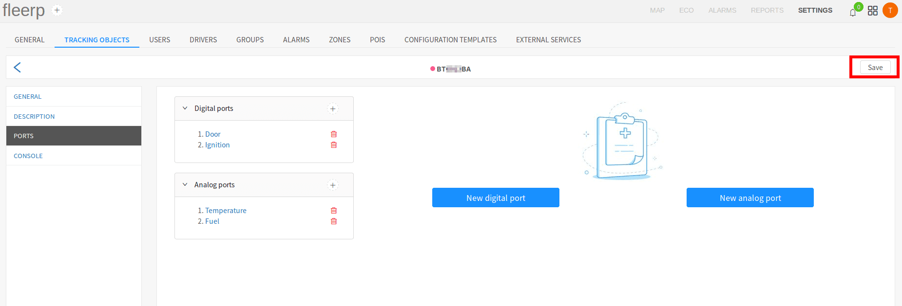

## Create/edit digital port

As the "Create digital port" and "Edit digital port" dialogs are analogous, for the sake
of simplicity, in this example is chosen the edit functionality.

After click on already existing digital port, the "Edit digital port" dialog is shown.

The dialog contains five fields:

- port;
- type;
- port index;
- activity detection;
- inverse logic;

### Port

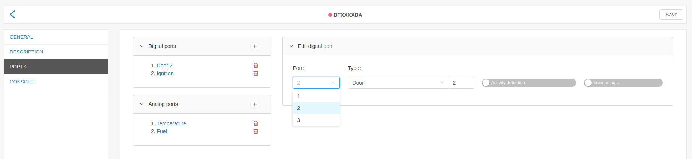

The possible choices in the "Port" field are inserted automatically by the system, according to
the model of the GPS device, used in the concrete tracking object. If the device model supports
3 digital ports, in the "Port" field will be visualized the number 1 trough 3.

 
---

### Type

Type of digital port, can be interpreted as the action, which the port will be listening for, as turning a vehicle
on or opening of a door.

 
---

### Port index

The user has the possibility to create two ports of the same type, but with different index. This functionality is
implemented trough "Port index". One of the applications it has: listening for open/close event of multiple vehicle
doors. 

 
---

### Activity detection:

In the Fleerp system, tracking objects are visualized in three colors *[link](../../../../../web/map/main/legend)*:

- green - when is active;
- red - when is inactive;
- gray - when it did not send data for a long time;

#### Important:

Only one port must be set to "Activity detection", so the application will
visualizes the tracked object as active, inactive or off-line.

#### Example:

For this example, we will assume that we have a vehicle that has traking device installed.
When configuring a port **Ignition** will activate **Activity detection**.
In this situation, when the object is powered by an engine, it will appear in green,
and when the engine is off, it will appear in red.

 
---

### Inverse logic

The user can inverse the logic of a given digital port.

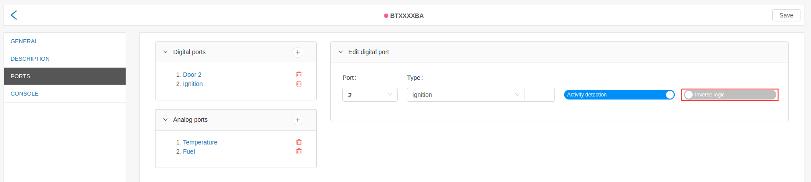

 
---

### End to end example for port of type "Ignition"

If the user wants to configure vehicle ignition, and on the physical GPS device, installed in the
vehicle, the ignition is placed on port 2, therefore in the system Fleerp the configuration must be
the following:

- the selection in field "Port" must be "2";
- the selection in field "Type" must be "Ignition";
- the rest field must be left empty;

## Create/edit analog port

As the "Create analog port" and "Edit analog port" dialogs are analogous, for the sake
of simplicity, in this example is chosen the edit functionality.

After click on already existing analog port, the "Edit analog port" dialog is shown.

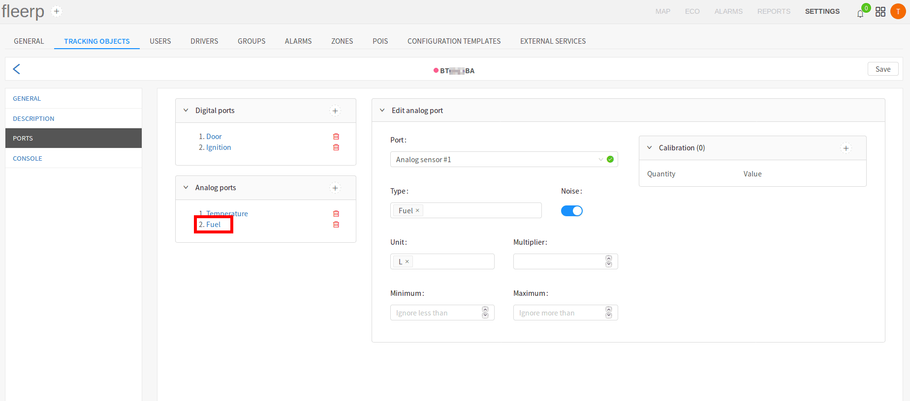

The dialog contains seven fields:

- port;
- type;
- noise:
- unit:
- multiplier;
- minimum;
- maximum;
- calibration;

For additional information about calibration of analog sensor, click [_here_](./analogs/calibration).

 
---

### Port

The possible choices in the "Port" field are inserted automatically by the system, according
to the model of the GPS device, used in the concrete tracking object.

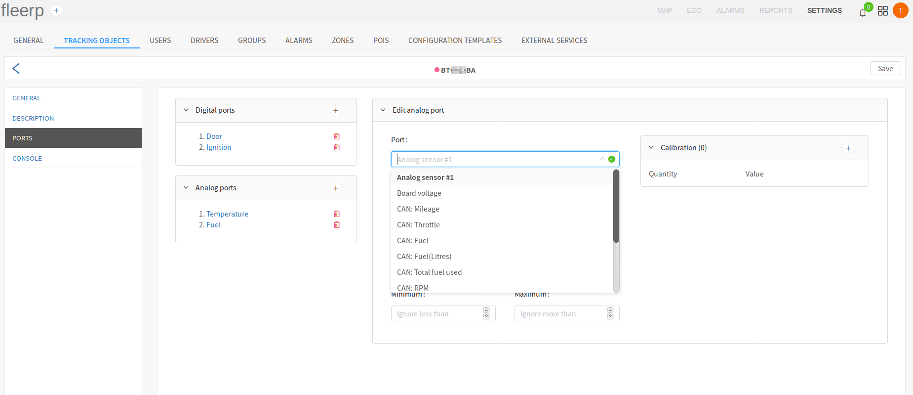

 
---

### Type

Type of analog port, can be interpreted as the resource, which the port will be monitoring,
as fuel, temperature, RPM and others. In addition to the default ones, the user can define
custom port types, by entering them in the type field, followed by "Enter".

 
---

### Noise

The "Noise" button interpolates (smooths out) the line chart of a given analog sensor. All line charts can be seen
in [_reports_](../../../../../web/reports) section.

 
---

### Unit

Example:

- unit of analog port for fuel can be: **liter**, **gallon**, etc;
- unit of analog port for electricity can be: **millivolt**, **volt**, etc;
- unit of analog port for revolutions can be: **RPM (revolutions per minute)**;
- unit of analog port for temperature can be: **celsius** and **fahrenheit**;

In addition to the default ones, the user can define custom port units, by entering them in the unit
field, followed by "Enter".

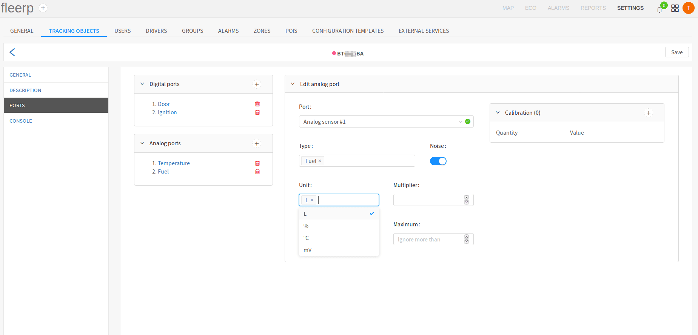

 
---

### Multiplier

Using the "Multiplier" field, the user can multiply the analog sensor reading by the value in the field.

 
---

### Lower and upper limit

Often some analog sensors (as fuel), along with the real readings, return single unreal readings (artifacts).
This rare and at first sight harmless behaviour can cause problems with presenting a line chart before the
authorities. The Fleerp system provides a way for setting lower and upper limit for the readings,
returned by a given analog sensor. This functionality helps getting consistent line charts for the given sensor.

## Calibration of analog sensor

Calibration is an important part of the configuring of an analog sensor. It is important to note
that not all analog sensors need calibration.

The example used in this article contains calibration of analog sensor for fuel:

- generic fuel analog sensor: needs calibration;
- fuel analog sensor that uses CAN port: does not need calibration;

The point of calibration is to train the system, a given voltage read from an analog sensor, to what value
corresponds to. In the fuel context: to what fuel amount (liters, gallons, etc) corresponds given voltage.

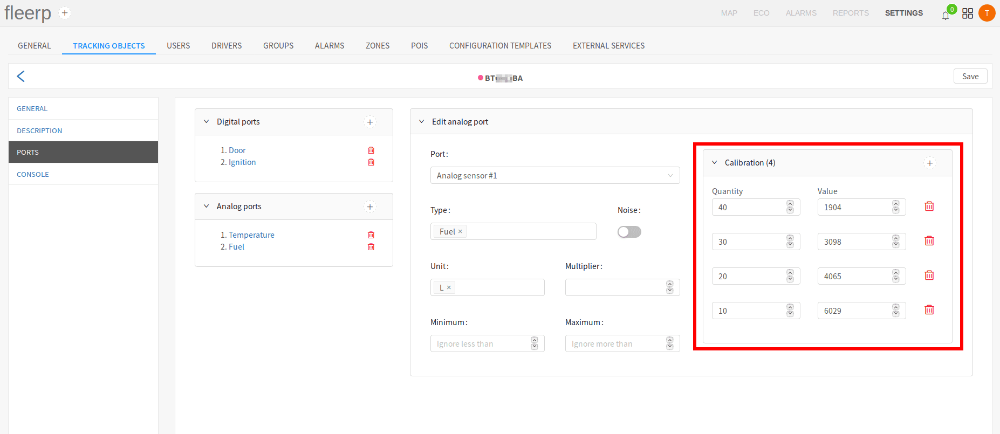

 
---

End to end example for calibration of an analog sensor for fuel, with gas tank capacity of 50 liters and
a 10 liter step.

#### Step 1

On an empty tank, add 10 liters of fuel, and enter the corresponding voltage in the "Value" field. The liter
amount must be entered in the "Quantity" field.

New value is added trough the "+" button in the upper right corner of the calibration screen.

 
---

#### Step 2

Add 10 more liters to the gas tank, and then enter the new values in the system. The new fuel amount is 20 liters.

 
---

#### Step 3

Add 10 more liters to the gas tank, and then enter the new values in the system. The new fuel amount is 30 liters.

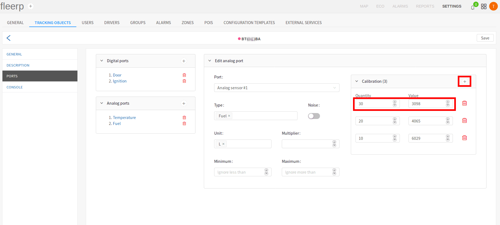

 
---

#### Step 4

Add 10 more liters to the gas tank, and then enter the new values in the system. The new fuel amount is 40 liters.

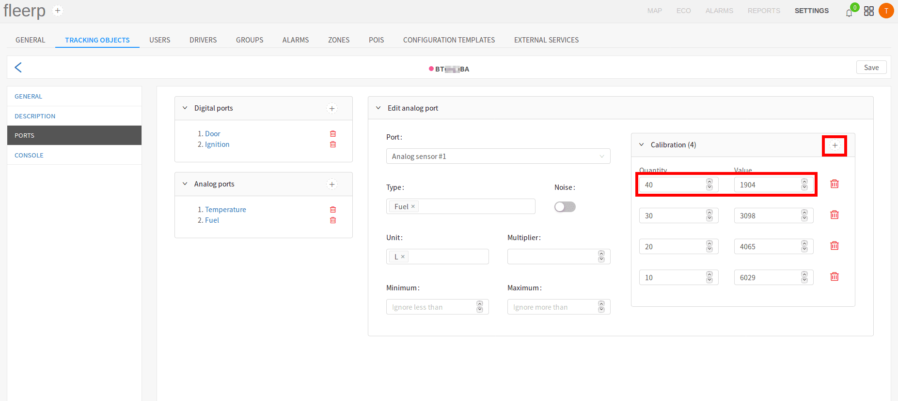

 
---

#### Step 5 - final step

Add 10 more liters to the gas tank, and then enter the new values in the system. The new fuel amount is 50 liters -
the maximum for the current tank.

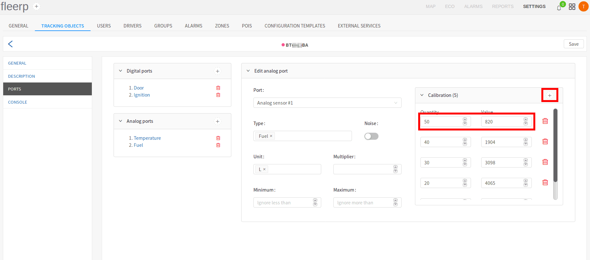

 
---

The smaller the step is, the more accurate the calibration is, e.g. for a 50 liters tank, the calibration
will be much more accurate if the step is 5 liters, instead of 10 liters. For a 500 liter tank, the calibration
will be much more accurate if the step is 50 liters instead of 100, etc.
