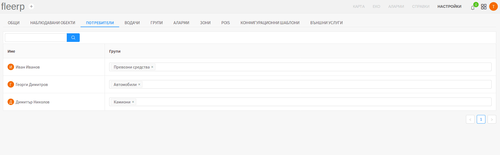

### Потребители

Раздел "ПОТРЕБИТЕЛИ" служи за задаване на права за работа с дадени наблюдавани обекти
на отделните потребители на системата. До раздела има достъп само потребител с администраторски
права.

За целта на примера са дефинирани една главна група "Превозни средства" и две нейни
подгрупи "Автомобили" и "Камиони".

При така разпределени права, потребителят "Георги Димитров" има достъп само до наблюдаваните
обекти, които се намират в група "Автомобили". Потребителят "Димитър Николов" има достъп до
наблюдаваните обекти, които се намират в група "Камиони". Тъй като групи "Автомобили" и
"Камиони" са подгрупи на "Превозни средства", потребителят "Иван Иванов" има достъп до
наблюдаваните обекви в групи "Превозни средства", "Автомобили" и "Камиони".

 
---

### Филтрация по име

Администраторът има възможност да филтрира отделните потребители по име и фамилия.

