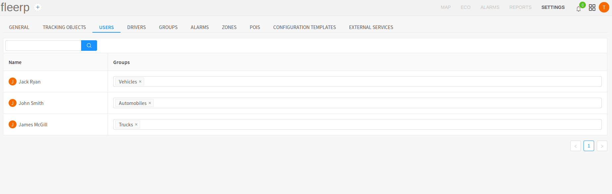
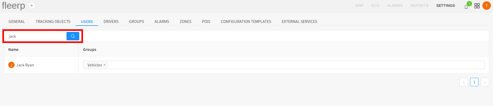

### Users

The "USERS" section allows the customer to set tracking object access rights to different users of the Fleerp system.
This section is only available to a user with administrator rights. These access rights will be applied throughout the
whole system.

For the purpose of this example, are defined three groups - one root group "Vehicles" and two groups "Automobiles" and
"Trucks", which are subgroups of the root group "Vehicles".

With access rights distributed as per the upper image, user "John Smith" has access to only the tracking objects
which belong to group "Automobiles". User "James McGill" has access only to the tracking objects which belong to
the "Trucks" group. As groups "Automobiles" and "Trucks" are subgroups of the root group "Vehicles", user
"Jack Ryan" has access rights to the tracking objects in all three groups.

 
---

### Name filtering

The administrator can filter the users by first name and family name.

