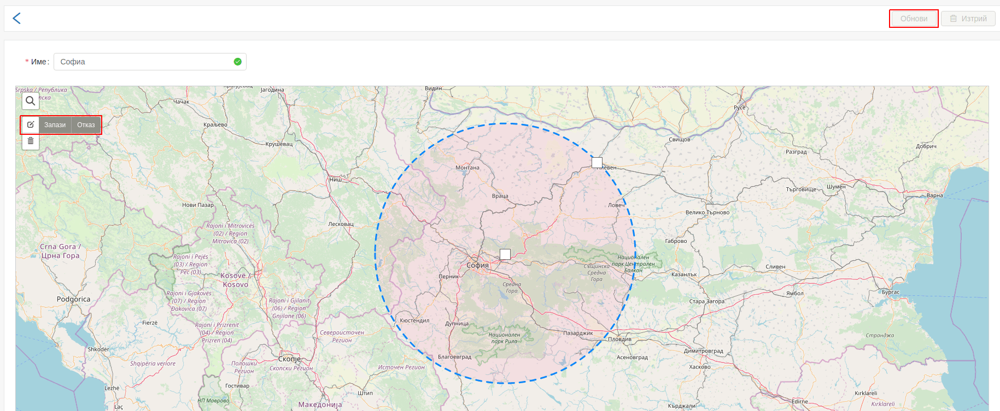

# Редактиране на зона

Редактирането на зона се извършва чрез кликване върху името на дадена зона.

---

С няколко лесни стъпки се извършва редактиране на зона.

## Първа стъпка

Кликване на бутон "Редактирай слоевете" и коригиране на зоната върху картата.

## Втора стъпка

Трябва да се запазят промените с бутон "Запази", който се намира в левият горен ъгъл на картата.

## Трета стъпка

Последната стъпка е кликване на бутон "Обнови".

