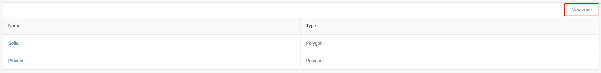
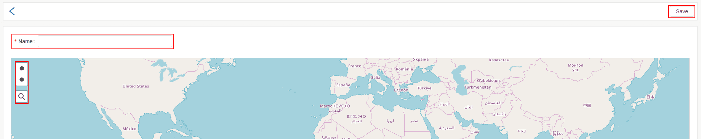
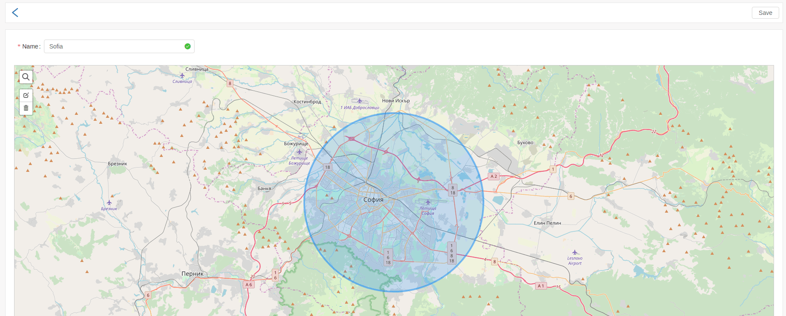

# Zones

The zones in the Fleerp system are a defined perimeter of the map.
Zones are primarily used to configure alarms.
An example of using a zone is when creating a "Zone exit" alarm.
This alarm will be triggered when a tracked object leaves a zone.

Creating, editing, and deleting zones is available from *Settings/Zones*.

---

The list of zones is divided in two columns:

- Name - the name of the zone;
- Type - type of zone, which may be a circle or a polygon;

# New zone

Creating a new zone is done by the "New zone" button.

---

Is required to enter a name and draw a zone.

From the icons in the top left corner is possible choose:

- zone type - circle or polygon;
- search engine - address search on the map;

---

Once the zones has been drawn, it can be edited or deleted if it is drawn inaccurately.
This is done by the buttons in the upper left corner.

When everything has been filled in correctly, should be clicked the "Save" button.
