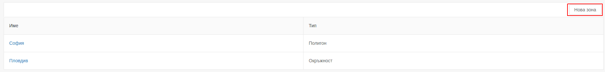
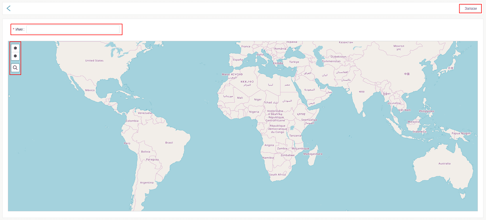
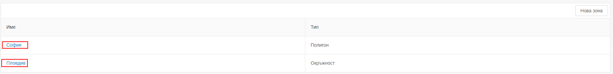

# Зони

В системата Fleerp, зоната представляваа очертан периметър от картата.
Зоните служат основно за конфигуриране на аларми.
Пример за използването на зона е при създаване на аларма "Напускане на зона".
Тази аларма ще се задейства когато даден проследяван обект напусне дадена зона.

Създаването, редактирането и изтриването на зоните е налично от "Настройки/Зони".

---

Имаме списък от създадени зони, който е разделен на две колони:

- Име - името на зоната;
- Тип - типа на зоната, който може да е кръг или полигон;

# Нова зона

Създаването на нова зона се осъществява чрез бутон "Нова зона".

---

Задължително трябва да се въведе име и да се начертае зоната.

От иконките в левият горен ъгъл могат да бъдат избрани:

- типа зони - кръг или полигон;
- търсачка - търсене на адрес на картата;

---

След изчертаване на зоната тя може да бъде редактирана или изтрита, в случай че е начертана неточно.
Това става от бутоните в левият горен ъгъл. 

Когато всичко е попълнено коректно трябва да се кликне бутонът "Запази".

# Редактиране на зона

Редактирането на зона се извършва чрез кликване върху името на дадена зона.

---

С няколко лесни стъпки се извършва редактиране на зона.

## Първа стъпка

Кликване на бутон "Редактирай слоевете" и коригиране на зоната върху картата.

## Втора стъпка

Трябва да се запазят промените с бутон "Запази", който се намира в левият горен ъгъл на картата.

## Трета стъпка

Последната стъпка е кликване на бутон "Обнови".

# Изтриване на зона

Изтриването на зона се извършва чрез кликване върху името на дадена зона.

---

След това с бутон "Изтрий" се премахва дадената зона.

