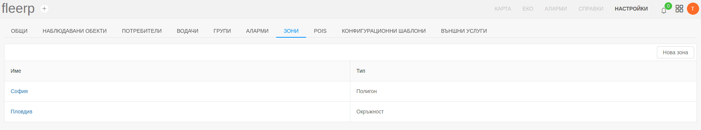

# Зони

В системата Fleerp, зоната представляваа очертан периметър от картата.
Зоните служат основно за конфигуриране на аларми.
Пример за използването на зона е при създаване на аларма "Напускане на зона".
Тази аларма ще се задейства когато даден проследяван обект напусне дадена зона.

Създаването, редактирането и изтриването на зоните е налично от "Настройки/Зони".

---

Имаме списък от създадени зони, който е разделен на две колони:

- Име - името на зоната;
- Тип - типа на зоната, който може да е кръг или полигон;
