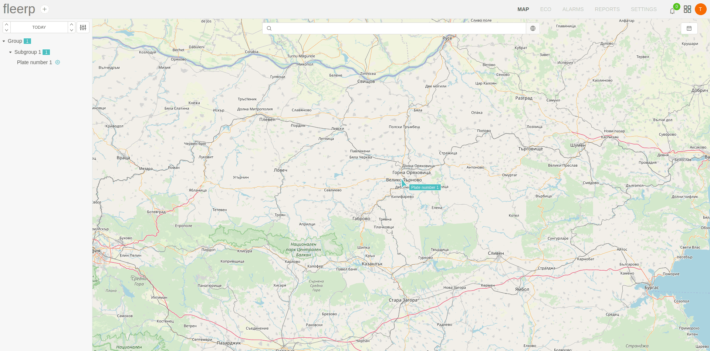

# Web application

The system provides capability for the user to track different categories of devices - from personal
trackers and IoT devices to single vehicles or auto parks.

The provided web application can be accessed with any modern web browser without need of additional installation
of any plugins or extensions.

System features: 
 - Geographical map visualizing position and routes for given tracking device;
 - Eco indicators for style of given driver;
 - Visualization of alarms that occurs on given circumstances;
 - Visualization of reports for various type of information;
 - System settings;
