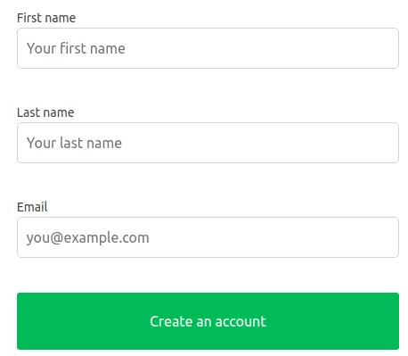
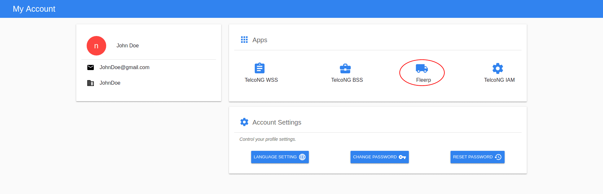

# User registration 

To create user account you have to populate the provided form in the index page of the portal.
The required information is: 
 - First name 
 - Last name
 - Email address  

  
---

After click "**Create an account**" button, further instructions will be received on provided email which includes: 

- Set up password for the account. 
 

 
- If the user email belong to *gmail* or *facebook* account, then the login in could be performed with dedicated buttons instead the need to set up password. 
  

  
---

After profile activation the user would be redirected to the configuration system.

