<h1 align="center">
  Работа с рамкови споразумения
</h1>

Политис предлага възможност за добавяне на рамково споразумение към клиент. Автоматичното издаване на фактури се преустановява при наличие на рамково споразумение. Политис дава възможност да се издава колективна фактура съдържаща множество доставки за клиента.

## Добавяне на рамково споразумение

Добавянето на рамково споразумени се осъществява чрез редакция на клиент. За целта от главното меню се избира *Клиенти*

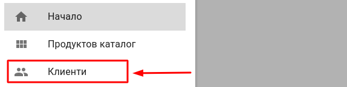

На екрана се визуализира списък със клиенти. От списъка с клиенти може да се направи търсене за даден клиент по следните полета: *ЕИК, ЕГН (за физически лица) и име.*

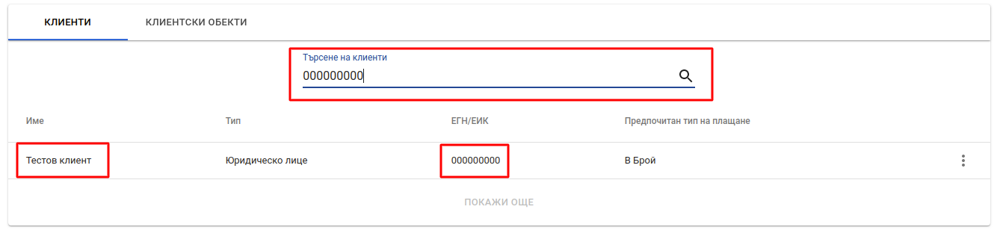

След като клиента, за който трябва да се добави рамково споразумение е намерен от контекстно меню в края на реда се избира опция *Редакция*

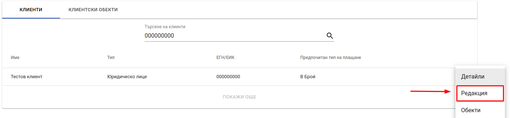

На екрана се визуализира форма за редакция на клиент. В раздел настройки на формата се намира отметка *Рамково споразумение*. При избиране на отметката се появава поле за описание на рамковото споразумение чрез свободен текст.

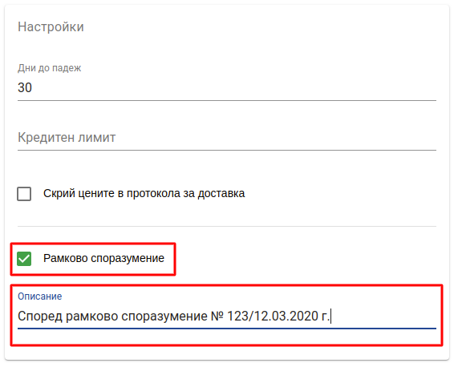

След попълване на описанието за рамковото споразумение се натиска бутон *Запази*   

Описанието на рамковото споразумение се отпечатва като бележка към стоковата разписка за клиента.

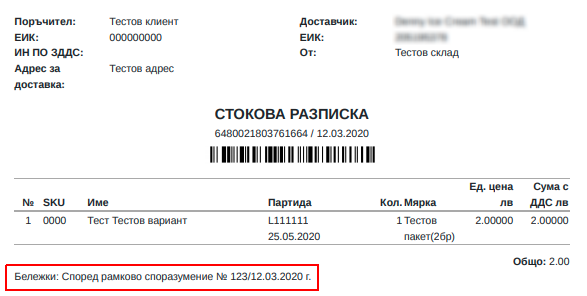

## Издаване на фактури към клиенти с рамково споразумение

За издаването на фактури към клиенти с рамково споразумение от главното меню се избира *Продажби*, след което се избира таб *Нефактурирани доставки*

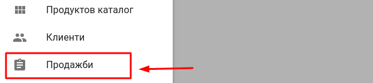

На екрана се визуализира информация за нефактурираните доставки групирани по клиент.

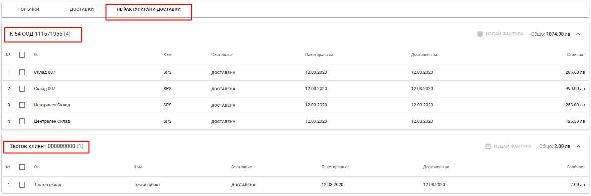

За да се издаде фактура за даден клиент се избират доставките, които трябва да участват в нея чрез отметки, който се намират в началото на всяка доставка. Когато са избрани доставките се натиска бутон *Издай фактура*

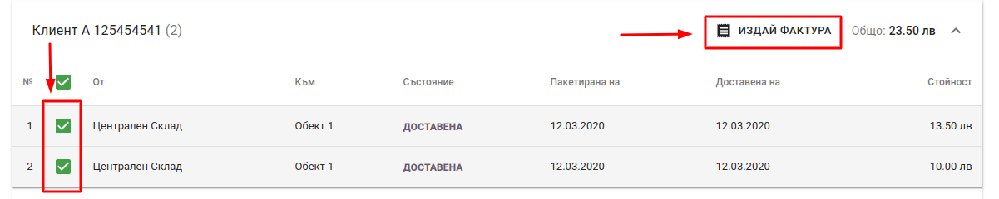

На екрана се визуализира диалогов прозорец с искане за потвърждение на операцията

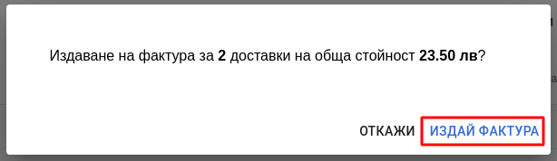

След потвърждение избраните доставки се премахват от екрана с нефактурирани доставки.   

Създадената фактура се добавя към списъка с фактури, от където може да видят детайли за фактура или да се отпечатат оригинал и копие на фактурата.

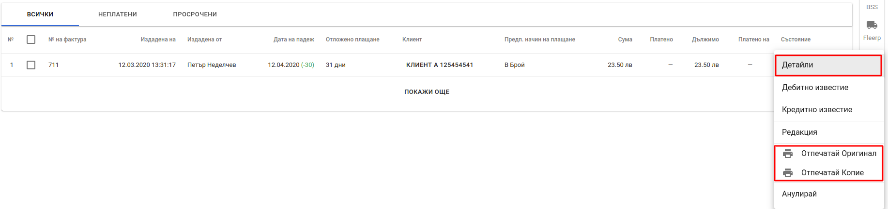

В екрана на детайли се виждат всички редове във фактура, които са обединение на всички редове от избрани доставки. Броят и информация за доставките и поръчките, за които е издадена фактурата се намират вдясно на екрана.

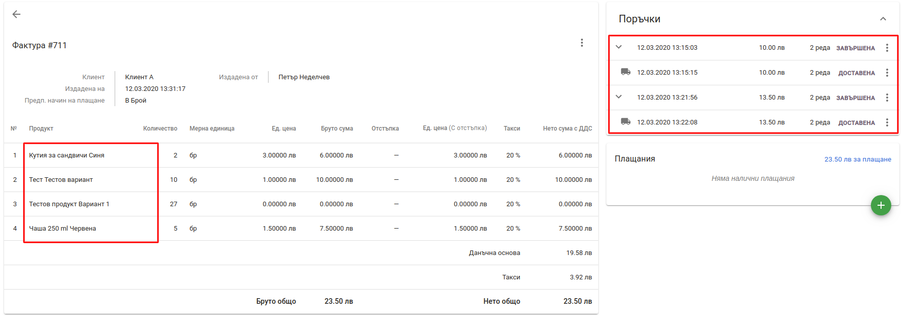