<h1 align="center">
  Разчитане на опаковки с баркод скенер чрез шаблони
</h1>

Politis позволява използването на баркод четци за бързо добавяне на артикули и количества. Използването на баркод четец дава възможност с едно сканиране да се прочете както конкретна опаковка, така и количеството.

### Настройване на шаблони
Шаблоните служат за извличане на информация от баркод като дата на годност, код на доставчик, дата на производство и номер на партида.

За да се настроят шаблони за баркодове към съответен доставчик от главното меню се избира *Настройки*. След това в раздел *Доставчици* се избира операция *Barcode Patterns* за съответния доставчик. На екрана се визуализира списък с шаблони.

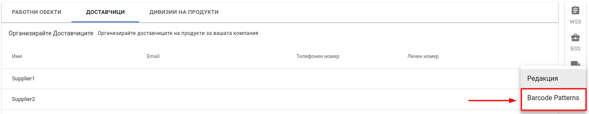

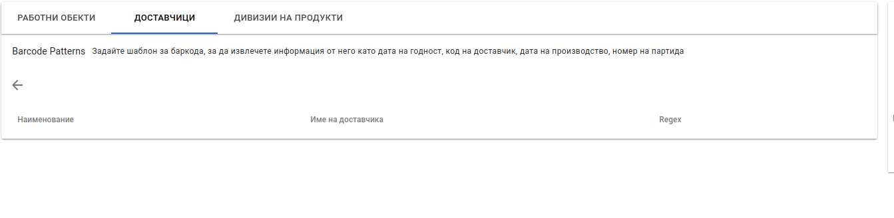

#### Създаване на нов шаблон

Шаблоните за баркодове използват регулярни изрази. <a href="https://javascript.info/regexp-introduction" target="_blank">Прочети повече (Английски)</a>

Създаване на нов шаблон се осъществява чрез натискане на бутона за нов шаблон в долния десен ъгъл.

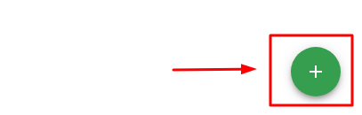

На екрана се визуализира форма за създаване на нов шанлон.

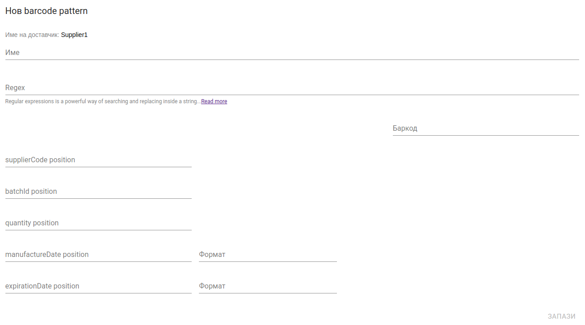

* **Име** - име на шаблона.
* **Regex** - регулярен израз, който описва групите, от които е съставен баркода на доставчика. Това поле е **задължително**.
* **Barcode** - примерен баркод, чрез който се тества зададения регулярен израз
* **supplier code position** - указва на коя позиция е групата, която описва кода при доставчика.
* **batchId possition** - указва на коя позиция е групата, която описва номера на партидата.
* **quantity position** - указва на коя позиция е групата, която описва количеството в пакета.
* **manufacturerDate position** - указва на коя позиция е групата, която описва датата на производство.
* **expirationDate position** - указва на коя позиция е групата, която описва срока на годност на партидата.
* **Формат** - указва формата на датите в баркода. Например: DDMMYY при  стойност на групата 031220 ще се разчете като 3 Декември 2020 г. 

След попълване на необходимите полета се натиска бутон *Запази*. При успешно създаден шаблон на екрана се визуализира списък с шаблони за текущия доставчик.

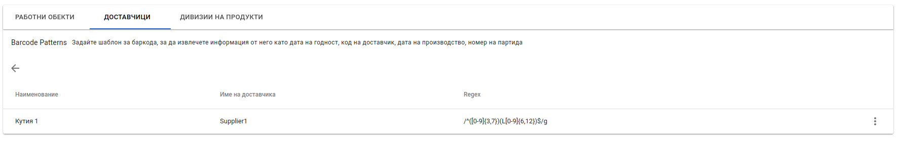

#### Редакция на шаблон

Редакцията на шаблон се осъществява чрез избиране на опция *Редакция* след натискане на бутона (вертикално многоточие), който се намира на края на всеки ред от списъка с шаблони.

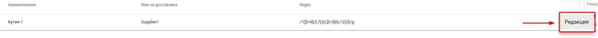

#### Примерни регулярни изрази

Регулярни изрази са последователност от символи, които формират модел за търсене. Регулярните изрази се пишат затворени в дясно наклонени черти */регулярен израз/*. В Politis се използват групи, чрез които се описват отделните части на баркода. Позицията на дадена група се посочва при създаване на нов шаблон. Номерата на позициите са в нарастващ ред започващи от нула (0). Групите, които могат да бъдат описани са следните: Код при доставчик, Номер на партида, Количество, Дата на производство, Срок на годност. В регулярния израз групите се описват чрез обикновени скоби */(Група 1)(Група 2)/*. 

* **Код при доставчик** (от 1 до 999) и **номер на партида** (Започващи с L и номера от 00001 до 99999)  
Примерен регулярен израз: */([0-9]{1,3})(L[0-9]{5})/*. Примерни баркодове: 2L02222, 123L12546, 999L99999.  
[0-9] - групата съдържа цифрите от нула до девет. {1,3} - дължината на групата е от една до три цифри.

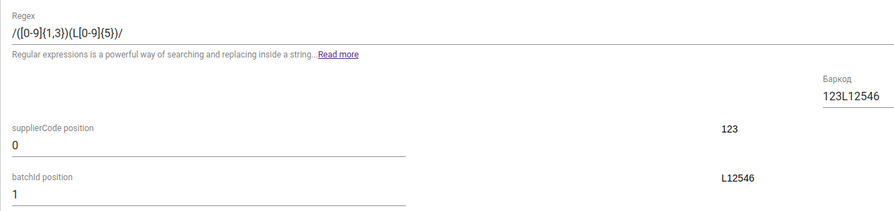

* **Номер на партида** (от 1000 до 9999), **количество** (от 1 до 999), **дата на производство**(формат DDMMYY)  
Примерен регулярен израз: */([0-9]{4})([0-9]{1,3})([0-9]{6})/*. Примерни баркодове: 202510020320, 6987555250119

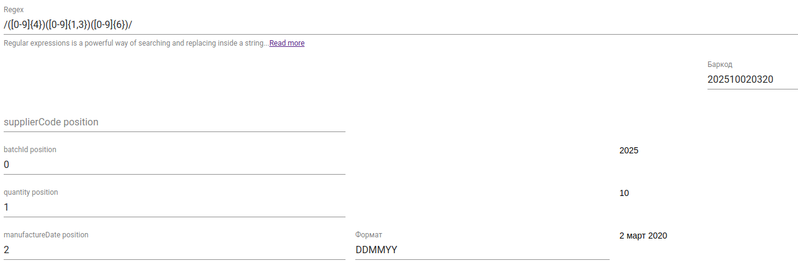

* **Номер на партида** (Започващи с L и малки букви от a до z, цифрите от 0 до 9 с дължина от 5 до 9), **срок на годност**(започващ с D= и с формат YYYYDDMM)  
Примерен регулярен израз: */(L[a-z0-9]{5,9})(D=[0-9]{8})/* Примерни баркодове: Ladr2fd54sD=20202001

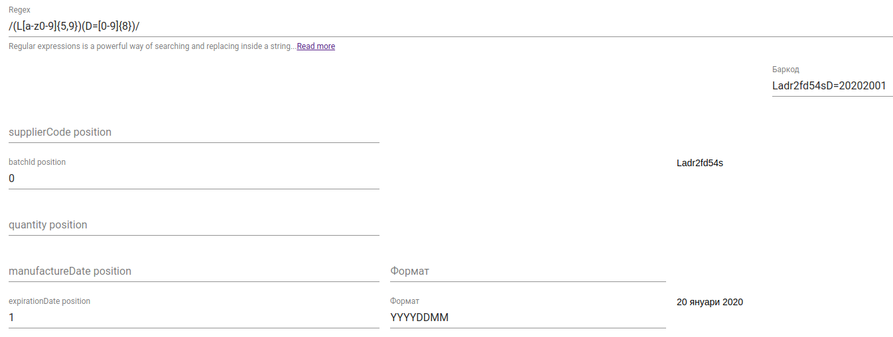

### Примерно използване

За да се използват баркод четци за бързо добавяне на артикули е нужно да се настроят вариантите и/или опаковките на артикулите. При създаване на нов вариант или чрез редакция на съществуващ вариант полетата *Баркод* и/или *Код на доставчик* трябва да се попълнят.

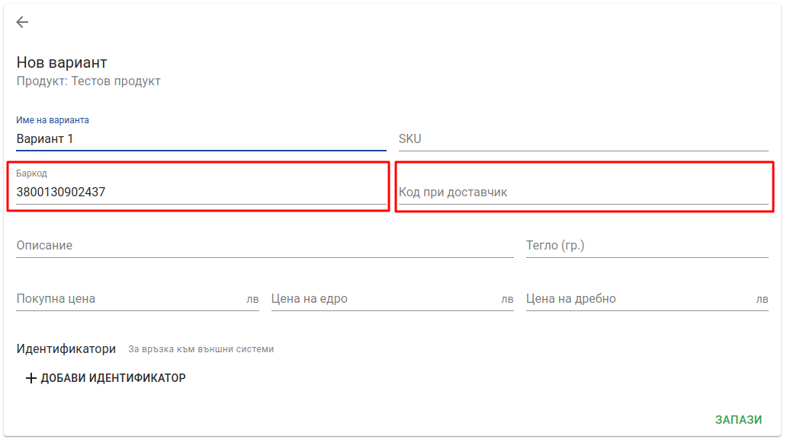
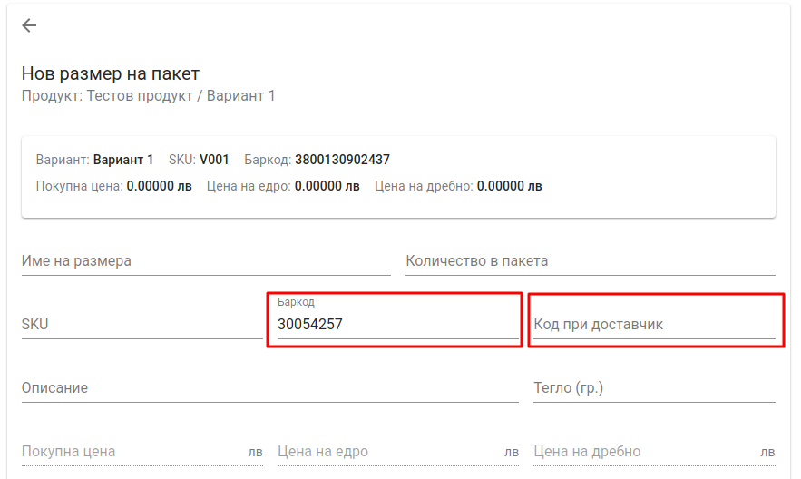

* **Баркод** - баркодът, който се намира на индивидуалната опаковка на всеки продукт или баркодът на груповата опаковка (кутия, кашон, пакет и т.н.)
* **Код при доставчик** - кода, с който е заведен даден артикул при доставчика. Когато доставчика печата допълнителни баркодове върху артикулите съдържащи този код, то той може да бъде извлечен чрез настройване на подходящ шаблон.

След тези настройки артикулите могат да бъдат добавени чрез изполване на баркод четци от Politis мобилно приложение.

<split-panel>
  <panel>
    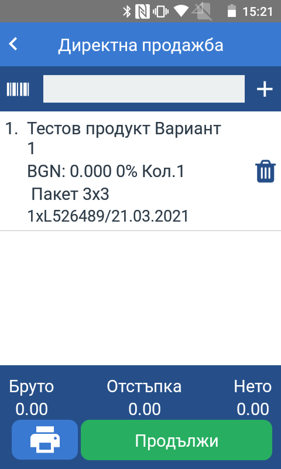
  </panel>
  <panel>
    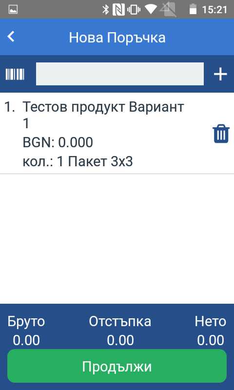
  </panel>
</split-panel>

  
     
<split-panel>
  <panel>
    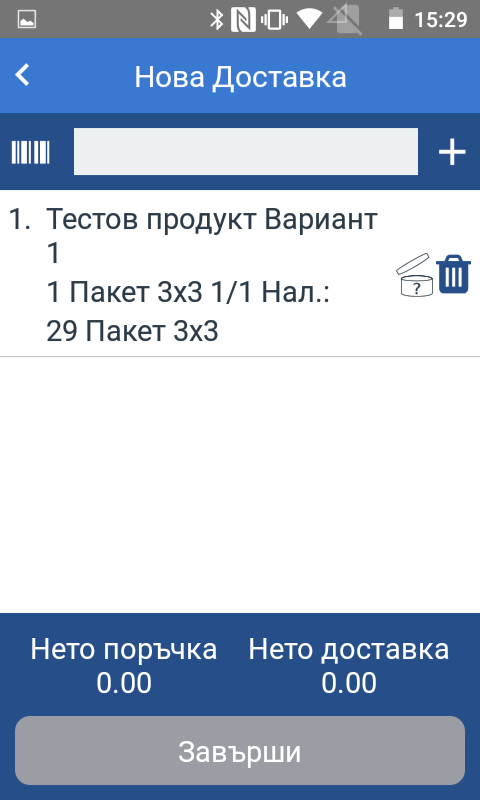
  </panel>
  <panel>
    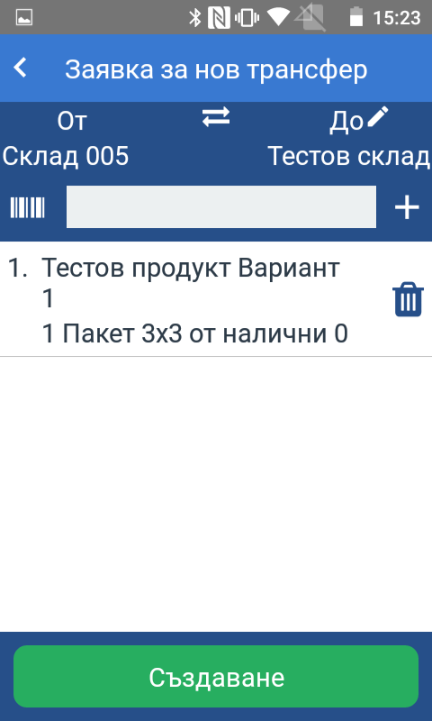
  </panel>
</split-panel>
   
  

<split-panel>
  <panel>
    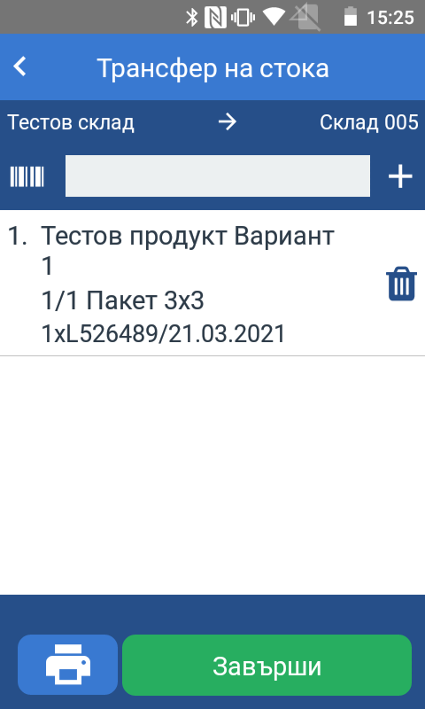
  </panel>
  <panel>
    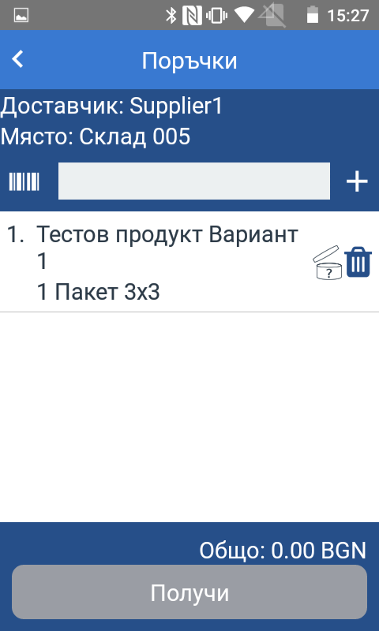
  </panel>
</split-panel>
