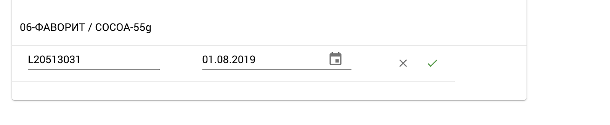

<h1 align="center">
  Batch management
</h1>

POLITIS provides functionality for editing and managing of batches. The following functionalities are available:
1. Editing of identifier and expiration date of the batch;
2. Activation and deactivation of a batch - it forbids the selling from this batch;

### Edit batch

Please select “Batches” from the product catalog.  

<split-panel>
  <panel>
    If the command is successful then it will be displayed a list with batches for the corresponding item:
  </panel>
  <panel>
    
  </panel>
</split-panel>

The batch edit is performed from the "Edit" menu on the same line:

If the command is successful then the line becomes active for editing and is able to change the name as well as the expiration date of the batch.

The editing of the batch ends with pressing to the accept button or when you click on the icon “X” if you don't want the changes to be stored.

### Deactivate batch

The batch deactivation is performed from the menu, by pressing on the “Deactivate” button.

After accepting, the batch is set in deactivated state and the users will not be able to select it when working with documents.
**Note:** The batch deactivation will be reflected on the both sides, Web and Mobile version of Politis.

### Activate batch

Deactivated batch can be activated again when you click on “Activate” on the same row.

The result after performing the operation above is:

After activation, the batch will be available for selection in Web and Mobile version of the app. 
