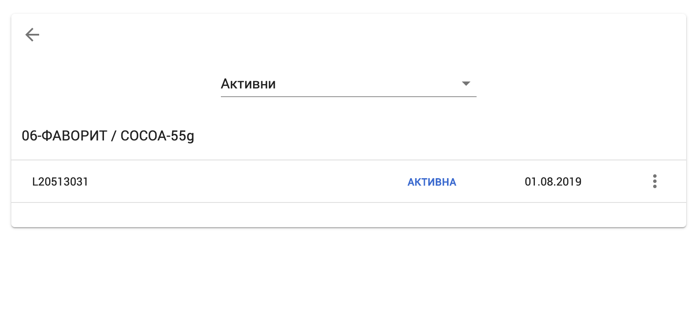
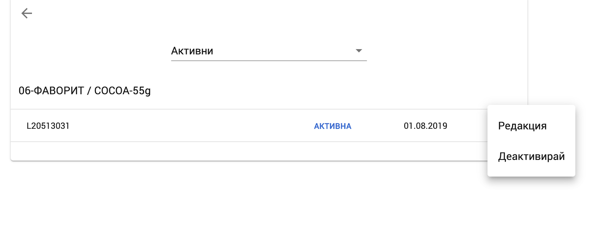

<h1 align="center">
  Управление на партиди
</h1>

### Редакция на Партида

#### Редакция на Партида 

От продуктовия каталог, се избира “Партиди”  

<split-panel>
  <panel>
    При успешна команда се влиза в списъка с партиди за съответния артикул:
  </panel>
  <panel>
    
  </panel>
</split-panel>

Редактирането на партидите се извършва от меню “Редакция” на съответния ред:

