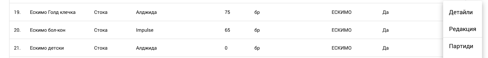
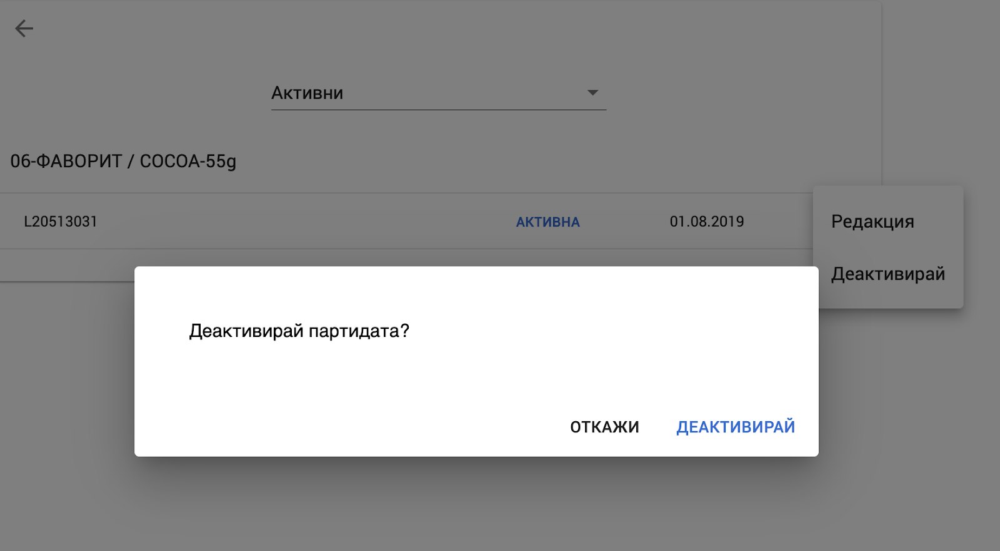
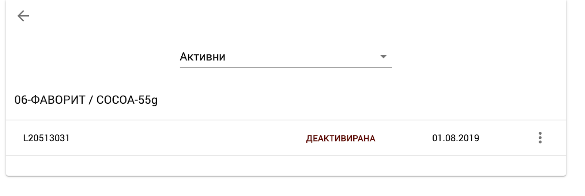
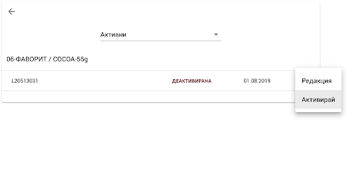
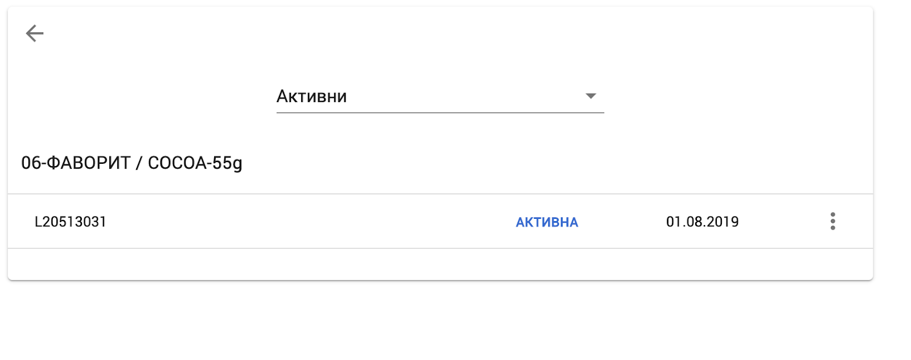

<h1 align="center">
  Управление на партиди
</h1>

POLITIS поддържа функционалност за редакция и управление на партиди. Следните фуционалности са налични:
1. Редакция на идентификатор и срок на годност на партида;
2. Активиране и деактивиране на партида - позволява забраната за продажби от съответната партида;

### Редакция на Партида

От продуктовия каталог, се избира “Партиди”  

<split-panel>
  <panel>
    При успешна команда се влиза в списъка с партиди за съответния артикул:
  </panel>
  <panel>
    
  </panel>
</split-panel>

Редактирането на партидите се извършва от меню “Редакция” на съответния ред:

При успешна команда  реда става активен за редакция и можете да промените името, както и срока на годност на съответната партида.

Редакцията на партидата завършва чрез натискане на бутона за потвърждение или чрез натискане на иконката “X” ако не желаете промените да бъдат запазени.

### Деактивиране на партида

Деактивирането на партида се извършва от менюто за съответната такава, чрез натискане на бутона “Деактивирай”.

След потвърждение, партидата минава в деактивирано състояние и потребителите не могат да я избират при работа с документи. 
**Забележка:** Деактивирането на партида премахва възможността да се избира в Web и Мобилната версия на Politis.

### Активиране на партида

Деактивирана партида може да бъде върната в своето активно състояние, чрез натискане на бутона “Активирай” на съответния ред. 

Резултатът след извършването на операцията е следния: 

След ре-активация партидата ще бъде активна за избор в Web и Мобилната версия на приложението.
