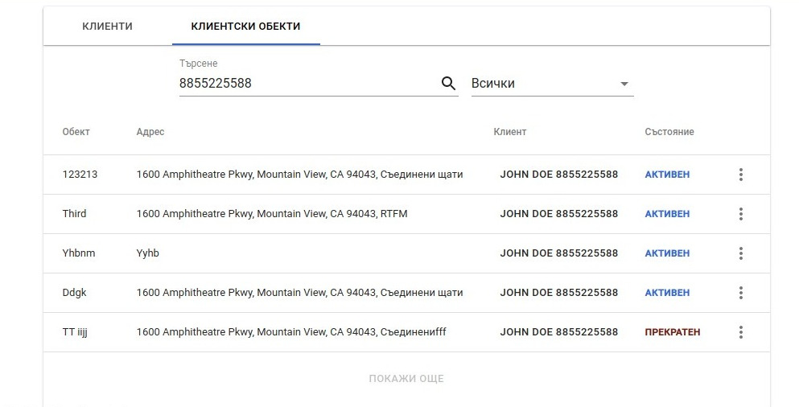
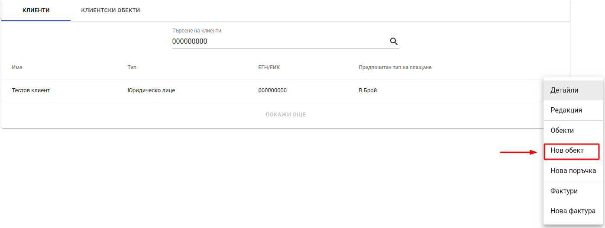
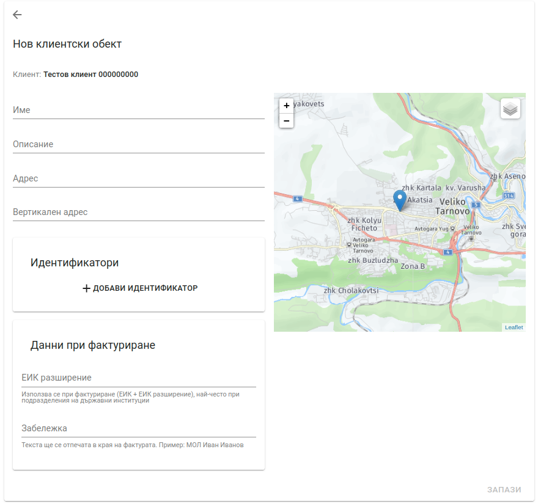
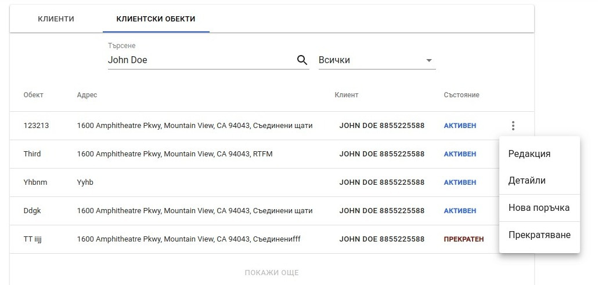
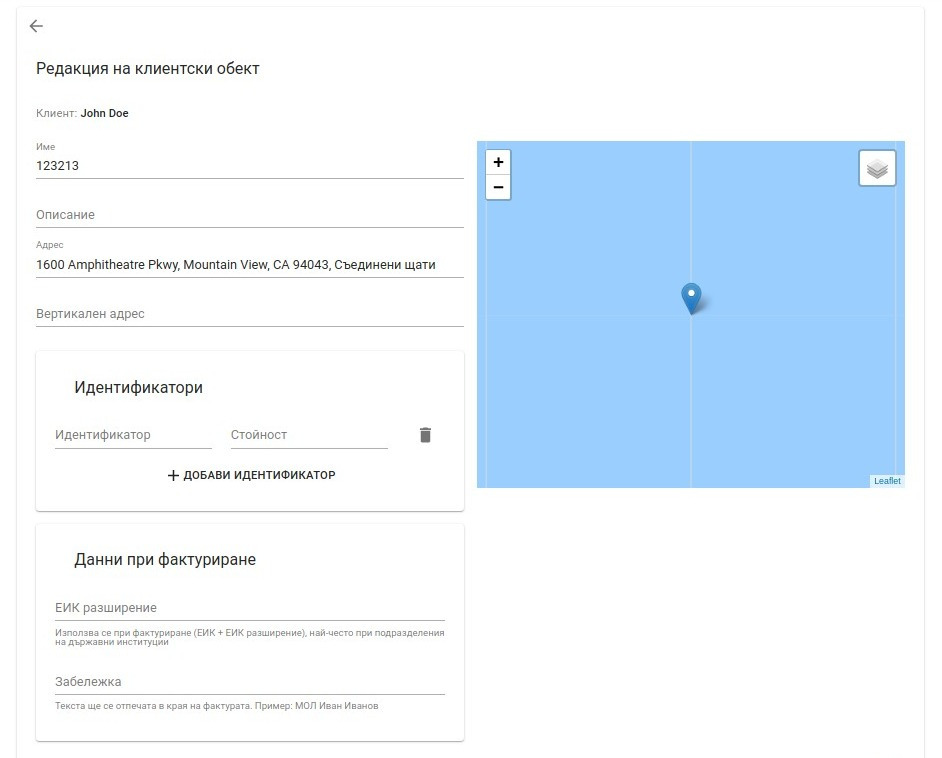
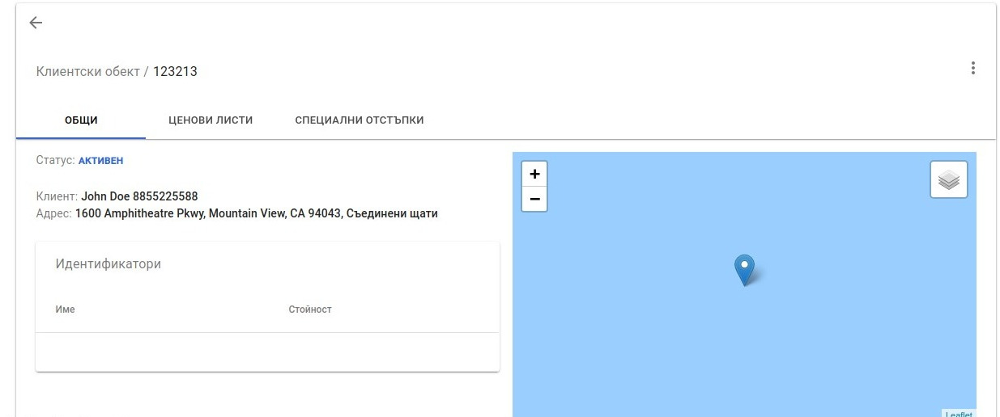
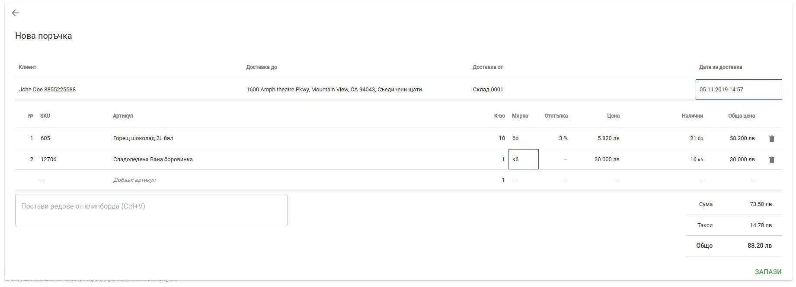
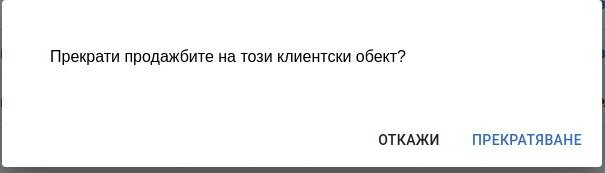

<h1 align="center">
 Клиентски обекти
</h1>

## Списък с клиентски обекти
    
За достъп до списъка с клиентски обекти се избира *Клиенти*  от главното меню и след това таб *Клиентски обекти*. На екрана се визуализират наличните клиентски обекти, които са асоциирани с дадения клиент.   
Списъкът предоставя възможност за търсене по *наименование на клиент* и *ЕГН/ЕИК*, както и филтър по състояние на активен или прекратен обект.

## Добавяне на нов клиентски обект

Добавяне на нов обект към даден клиент е възможно от таб *Клиенти*. За конкретен клиент от списъка с клиенти се избира опция *Нов обект* от контекстното меню.

На екрана се визуализира форма за нов клиентски обект.

Формата предоставя следните полета:

* **Име** - име на клиентския обект.
* **Описание** - допълнителна информация за обекта.
* **Адрес** - адрес на клиентския обект.
* **Вертикален адрес** - допълнителна информация към адреса. Например: етаж, вход.
* **Идентификатори** - идентификатори за връзка с външни системи.
* **Данни при фактуриране**
<bullet></bullet><b>ЕИК разширение</b> - Използва се при фактуриране (ЕИК + ЕИК разширение), най-често при подразделения на държавни институции.
<bullet></bullet><b>Забележка</b> - текста ще се отпечата в края на фактурата. Пример: МОЛ Иван Иванов. В примера МОЛ не е отговорното лице от клиента, което се печата по подразбиране във фактурата, а отговорно лице за клиентския обект.

След попълване на необходимите полета се натиска бутон *Запази*. При успешно създаден клиентски обект на екрана се визуализира списък с всички клиентски обекти към първоначално избрания клиент.

## Операции с клиентски обекти

За всеки намерен клиентски обект са налични набор от операции, които са достъпни от добавеното меню:

### Редактиране

При избор на дадената опция, потребителят е пренасочен към екрана за редакция.

### Детайли

При избор на дадената опция, потребителят е пренасочен към екрана за детайли.

    
### Нова поръчка

Политис дава възможност чрез бърза препратка лесно и безпроблемно да се извърши добавянето на нова поръчка, към избрания клиентски обект. При избор на дадената опция, потребителят е пренасочен към екрана за създаване на нова поръчка.

    
### Прекратяване

Опция, даваща възможност за прекратяване продажбите на даден клиентски обект. При избор на дадената опция, на потребителят е предоставен прозорец за потвърждение на операцията.

