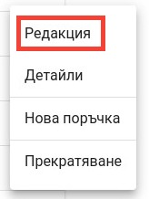
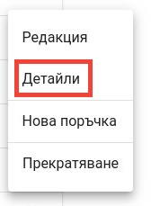
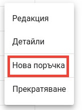
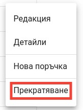

<h1 align="center">
 Клиентски обекти
</h1>

#### Списък с клиентски обекти
    
При избор на таб "Клиентски обекти", потребителят е пренасочен към екрана за визуализация на наличните клиентски обекти, които са асоциирани с дадения клиент.
Предоставена е възможност за търсене както по наименование на клиент, по ЕГН/ЕИК, така и по състояние на активен или прекратен обект.

За всеки намерен клиент са налични набор от операции, които са достъпни от добавеното меню:

#### Редактиране
Опция, даваща възможност за редактиране на съществуващ клиентски обект.

   При избор на дадената опция, потребителят е пренасочен към екрана за редакция.
   

#### Детайли
Опция, даваща възможност за преглед на детайли за даден клиентски обект.

   При избор на дадената опция, потребителят е пренасочен към екрана за детайли.
   
    
#### Бърза препратка
POLITIS дава възможност чрез бърза препратка лесно и безпроблемно да се извърши добавянето на нова поръчка, чрез съответната опция от менюто.

   При избор на дадената опция, потребителят е пренасочен към екрана за създаване на нова поръчка.
   
    
#### Прекратяване
Опция, даваща възможност за прекратяване продажбите на даден клиентски обект.

    
   При избор на дадената опция, на потребителят е предоставен прозорец за потвърждение на операцията.
   
