<h1 align="center">
 Клиенти
</h1>

## Добавяне на нов клиент

Политис предоставя функционалности свързани с управление на клиенти. За достъп до функционалностите се избира секция *Клиенти* в главното меню.

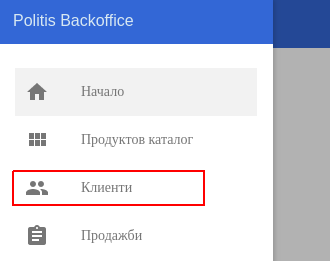

Нов клиент се добавя с помощта на бутон, който се намира в долния десен ъгъл на екрана.
 

След натискането на бутона на екрана се зарежда форма за нов клиент.   

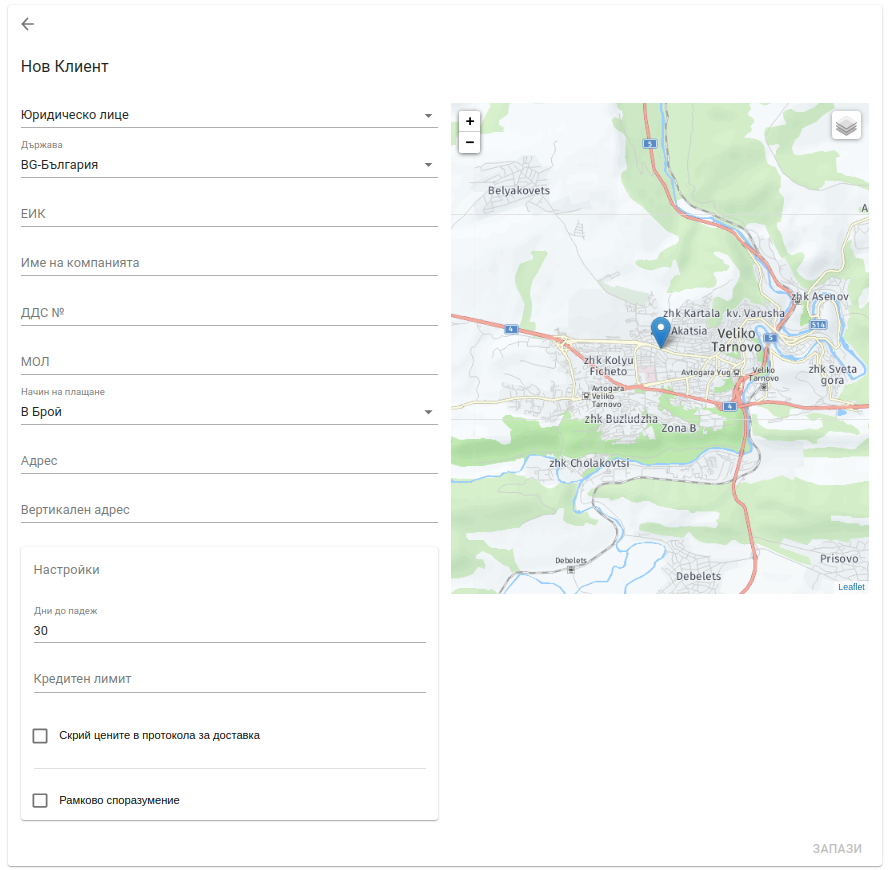

Формата предоставя следните полета:

* **Тип на клиента** - възможните типове клиенти са: *Юридическо лице* и *Физическо лице*.
* **Държава** - държава на регистрация на клиента.
* **ЕИК** - Единен Идентификационен Код за търговците и техните клонове, и клоновете на чуждестранните търговци, вписани в търговския регистър на Република България. **Това поле е задължително**. 
* **Име на компанията** -  наименование на юридическо лице в търговския регистър.
* **ДДС №** - за вписаните по зДДС юридически лица. За Република България ДДС номера се получава като към ЕИК се добави префикс BG. За юридически лица в Европейския Съюз това поле отговаря на VIES (ВИЕС) номер.
* **МОЛ** -  материално отговорно лице.
* **Начин на плащане** - предпочитан начин на плащане. От падащ списък може да се избере една от следните възможности - *В брой, По банков път, По интернет, С кредитна карта*.
* **Адрес** - адрес по регистрация на юридическото лице.
* **Вертикален адрес** - допълнителна информация за адреса. Например: вход, етаж.
* **Настройки**  
<bullet></bullet> <b>Дни до падеж</b> - тази настройка указва дните за разсрочено плащане при фактуриране. По подразбиране това поле има стройност 30 дни.
<bullet></bullet> <b>Кредитен лимит</b>  - сумата от всички неплатени фактури на клиента не може да надхвърля кредитния лимит. По подразбиране кредитния лимит е безкраен.  
<bullet></bullet> <b>Скрии цените в протокола за доставка</b>  - когато тази опция е избрана в документ <i>Стокова разписка</i> няма да се отпечатат цените на артикулите, общата сума и отстъпките.   
<bullet></bullet> <b>Рамково споразумение</b> - автоматичното издаване на фактури се преустановява при наличие на рамково споразумение. За повече информация относно тази настройка <link to="/politis/guide/agreement-policy/agreement-policy/" name="Работа с рамкови споразумения" />

  

Всички налични за системата клиенти се визуализират в таб *Клиенти*.

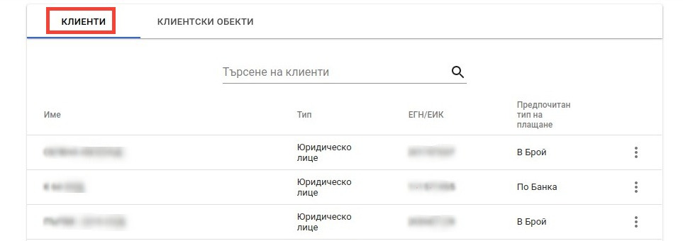

Списъкът с клиенти дава възможност за търсене на клиент по следните параметри:   

<bullet></bullet> <b>Име на клиента</b>

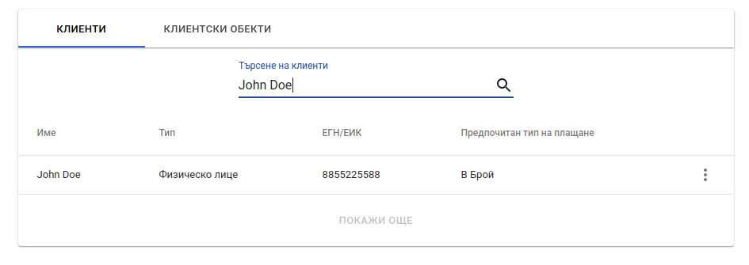

<bullet></bullet> <b>ЕГН/ЕИК на клиента</b>

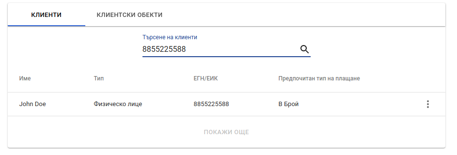

## Операции с клиенти

За всеки намерен клиент са налични набор от операции, които са достъпни от контекстното меню:

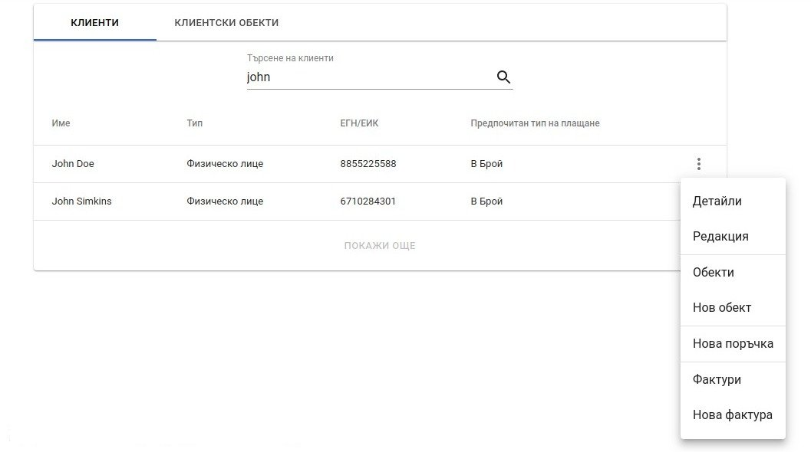

### Детайли

Опция, даваща възможност за преглед на детайли за дадения клиент: *ценови листи, специални отстъпки, контакти, детайлни продажби и посещения на обекта*.

При избор на дадената опция, потребителят е пренасочен към екрана за детайли.

 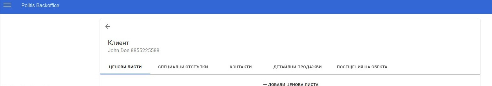
    
### Редакция

Опция, даваща възможност за редакция на вече създаден клиент. При избор на дадената опция, потребителят е пренасочен към екрана за редакция на клиент.

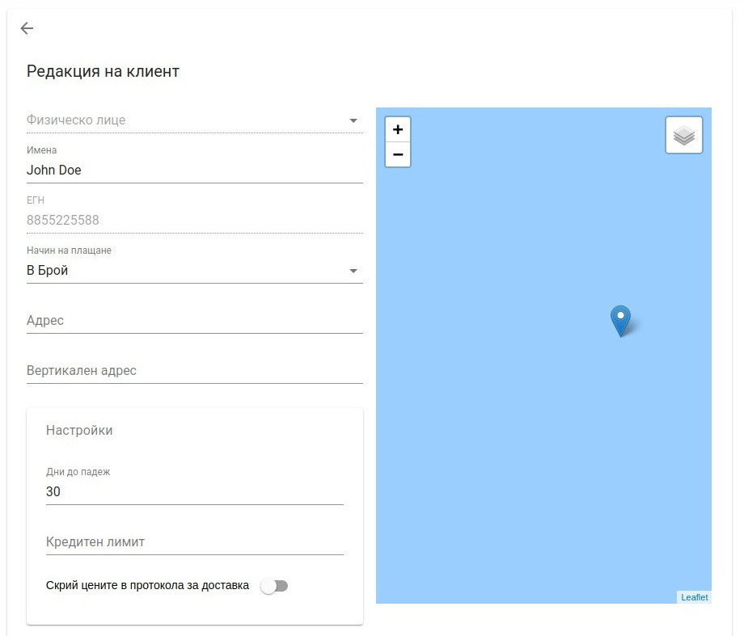

### Обекти

Опция, даваща възможност за преглед на наличните клиентски обекти. При избор на дадената опция, потребителят е пренасочен към екрана за визуализация на наличните клиентски обекти, които са асоциирани с дадения клиент.

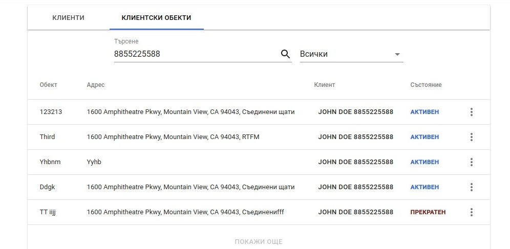

### Нов обект

Опция, даваща възможност за създаване на нов обект. При избор на дадената опция, потребителят е пренасочен към екрана за създаване на нов обект.

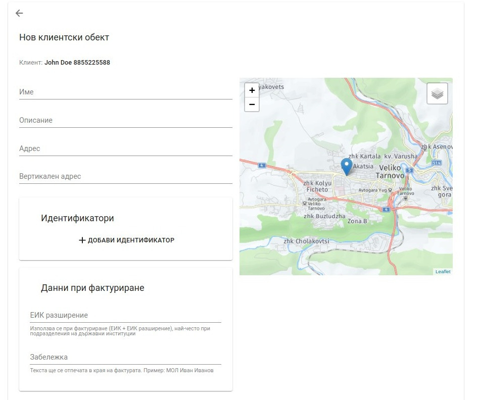

### Нова поръчка

Опция, даваща възможност за създаване на нова поръчка. При избор на дадената опция, потребителят е пренасочен към екрана за създаване на нова поръчка.

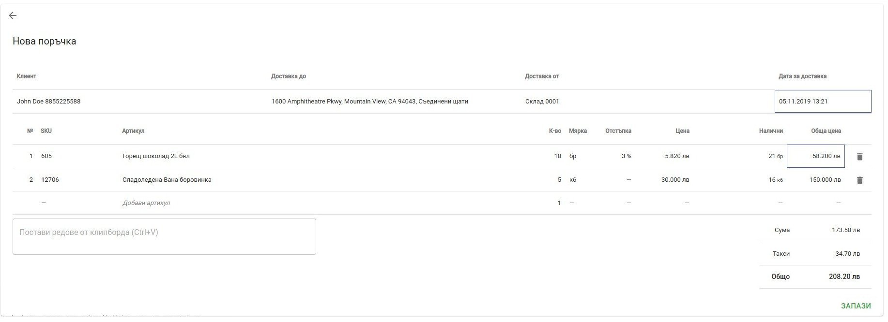
    
След попълване на информацията и запазване на поръчката, потребителят е пренасочен към екран с детайли,
където може да направи допълнителен преглед на продуктите и при преценка да потвърди или анулира поръчката.

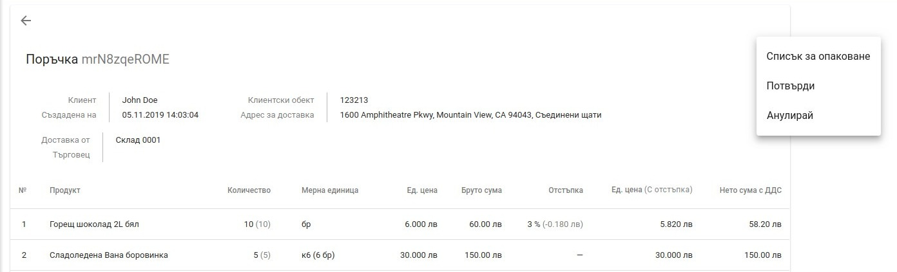

### Фактури
Опция, даваща възможност за визуализация на фактури за дадения клиент. При избор на дадената опция, потребителят е пренасочен към екрана за визуализация на фактури, издадени към дадения клиент.

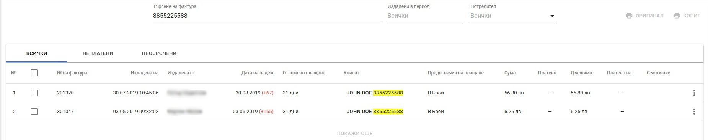

### Нова фактура
Опция, даваща възможност за създаване на нова фактура. При избор на дадената опция, потребителят е пренасочен към екрана за създаване на нова фактура.

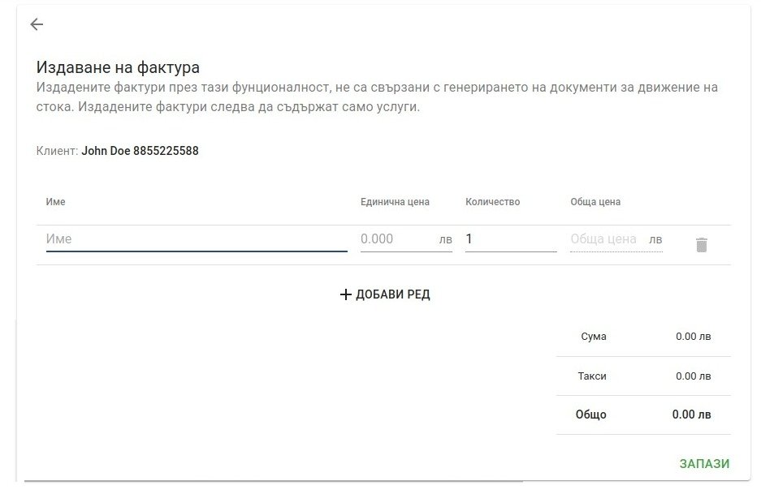
!