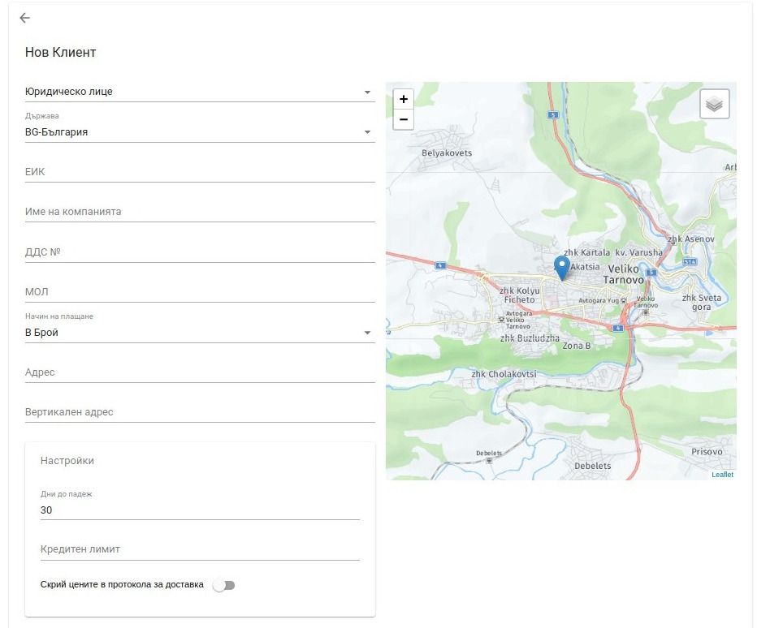
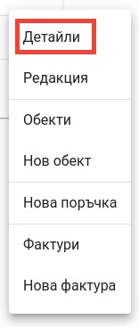
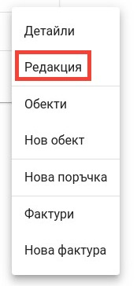
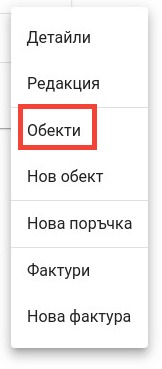
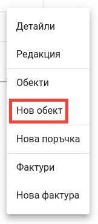
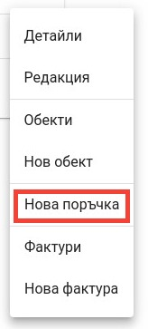
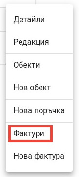
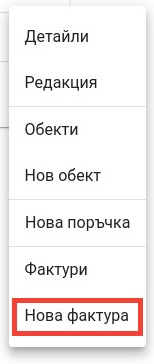

<h1 align="center">
 Клиенти
</h1>

#### Добавяне на нов клиент

Приложението POLITIS предоставя функционалности свързани с управление на клиенти. За достъп до функционалностите се избира секция "Клиенти" в главното меню.

С помощта на добавения бутон в долната част на екрана е възможно да се извърши добавянето на нов клиент.

След натискането му потребителят ще бъде пренасочен към екран където може да добави клиента.

Всички налични за системата клиенти се визуализират в таб "Клиенти".

За улеснение на потребителя е предвидена възможност за търсене на даден клиент по следните критерии:
* Име на клиента

* ЕГН/ЕИК на клиента

За всеки намерен клиент са налични набор от операции, които са достъпни от добавеното меню:

#### Детайли
Опция, даваща възможност за преглед на детайли за дадения клиент: ценови листи, специални отстъпки, контакти, детайлни продажби и посещения на обекта.

   При избор на дадената опция, потребителят е пренасочен към екрана за детайли.
   
    
#### Редакция
Опция, даваща възможност за редакция на вече създаден клиент.

   При избор на дадената опция, потребителят е пренасочен към екрана за редакция на клиент.
   

#### Обекти
Опция, даваща възможност за преглед на наличните клиентски обекти.   

    
   При избор на дадената опция, потребителят е пренасочен към екрана за визуализация на наличните клиентски обекти,
   които са асоциирани с дадения клиент.
   

#### Нов обект
Опция, даваща възможност за създаване на нов обект.    

   При избор на дадената опция, потребителят е пренасочен към екрана за създаване на нов обект.
   

#### Нова поръчка
Опция, даваща възможност за създаване на нова поръчка.    

   При избор на дадената опция, потребителят е пренасочен към екрана за създаване на нова поръчка.
   
    
   След попълване на информацията и запазване на поръчката, потребителят е пренасочен към екран с детайли,
   където може да направи допълнителен преглед на продуктите и при преценка да потвърди или анулира поръчката.
   

#### Фактури
Опция, даваща възможност за визуализация на фактури за дадения клиент.   

   При избор на дадената опция, потребителят е пренасочен към екрана за визуализация на фактури, издадени към дадения клиент.
   

#### Нова фактура
Опция, даваща възможност за създаване на нова фактура.    

   При избор на дадената опция, потребителят е пренасочен към екрана за създаване на нова фактура.
   
